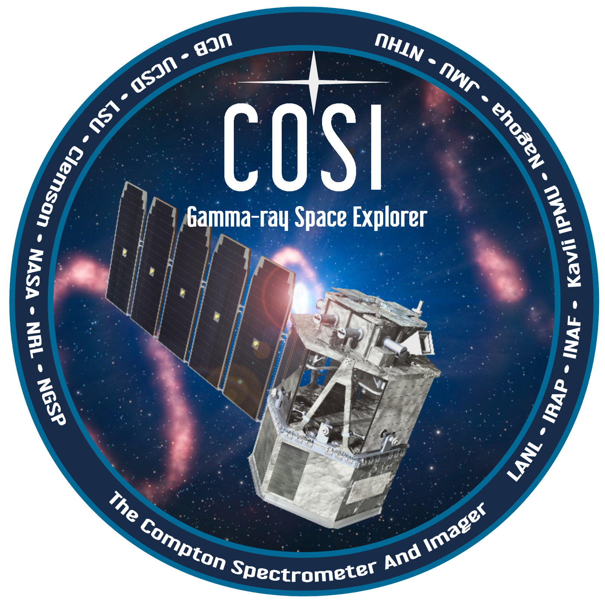

  
# Welcome to COSI Data Challenge 3!

## Table of Contents

- [Introduction](#introduction)
- [Getting Started](#getting-started)
- [System Requirements](#system-requirements)
- [Getting Help](#getting-help)
- [Backgrounds](#backgrounds)
- [Earth Occultation](#earth-occultation)
- [Polarization](#polarization)
- [Releases](#releases)
- [Computing Resources](#computing-resources)
- [Simulation Tools](#simulation-tools)
- [Executive Summary of Current and Past Challenges](#executive-summary-of-current-and-past-challenges)
- [Useful Reference Guides](#useful-reference-guides)
- [Data Challenges](#data-challenges)
- [Known Caveats](#known-caveats)
- [Citing](#citing)

## Introduction
Welcome to the third COSI data challenge (DC3)! The COSI data challenges are released on a yearly basis in preparation for the launch of the COSI Small Explorer (SMEX) class mission in 2027 ([Tomsick+23](https://ui.adsabs.harvard.edu/abs/2023arXiv230812362T/abstract)). They are based on simulated data, which is intended to closely mimic the real flight data. Every year the data challenges have increasingly more realistic source and background models, and they are analyzed with increasingly complete and matured analysis tools. In general there are two main goals of the data challenges:

1. Facilitate development of the COSI data pipeline and analysis tools.
   - With routine feedback from scientists. 
   - Alongside development of the expected source models by the science team. 
2. Provide resources to the astrophysics community to become familiar with COSI data.
   - Excellent training for science team in preparation for first analyses after launch.
   - Public releases help with community building before COSI data is released. 

## Getting Started 
The only software requirement for DC3 is [cosipy](https://github.com/cositools/cosipy). A general introduction into cosipy, including installation instructions, can be found in the [cosipy-intro](cosipy-intro) directory. For a general introduction into analyzing data from a Compton telescopes and the Compton data space also see [Compton-telescope-data-analysis-intro](Compton-telescope-data-analysis-intro). Note that cosipy is part of the larger COSITools, which is a broad collection of COSI data analysis tools, documentation, and verification data sets. COSITools can be installed by following the installation instructions [here](https://github.com/cositools/cosi-setup). This also includes MEGAlib, which is the main software program used for running simulations. However, unless you need MEGAlib and/or COSITools for other reasons, it's highly recommended to just install cosipy.    

This year's data challenge is based on 3 months of exposure time, for an equatorial orbit at an altitude of 550 km, with a zenith pointing. The simulated data products are provided in fits file format, and are hosted on wasabi. Details of the simulations, simulated data, and information for accessing the data products can be found in the [data-products](https://github.com/cositools/cosi-data-challenge-2/tree/main/data-products) directory. 

The input models and challenges for DC3 were provided by the COSI science teams. There are challenges for the different science groups: GRBs, Positrons, Nucleosynthesis, Galactic, and Extragalactic. These are described in detail in the [Data Challenges](#data-challenges) section below.  

In summary, to get started with DC3, install cosipy, familiarize yourself with the data products, and then start working through the data challenges, as described below. 

## System Requirements
One of our goals in developing cosipy is to make it easily accesible to all users. **All of the data challenges starting with DC2 should be doable on a laptop with at least 16 GB of RAM**. We are still working on optimizing the code, and so please let us know if you are running into memory issues.

## Getting Help
Please submit a new issue in the [cosipy](https://github.com/cositools/cosipy) git repository if you have issues with the code. If you have general feedback, or need further assistance, please reach out to the COSI Data Challenge team lead, Chris Karwin ([christopher.m.karwin@nasa.gov](mailto:christopher.m.karwin@nasa.gov)), the cosipy implementation lead, Israel Martinez-Castellanos ([israel.martinezcastellanos@nasa.gov](israel.martinezcastellanos@nasa.gov)), and the pipeline development lead Carolyn Kierans ([carolyn.a.kierans@nasa.gov](carolyn.a.kierans@nasa.gov)).

## Backgrounds
In general, observations in the MeV band are hindered by high backgrounds (both instrumental and astrophysical). In order to ensure that COSI accomplishes its main science goals, it is therefore crucial to have a firm understanding of these backgrounds. Although we are still in the early stages of development, with DC2 we have made significant progress in characterizing the background emission for COSI. Further details can be found in the [backgrounds](backgrounds) directory. 

For analyzing data in DC2, the backgrounds are modeled using the actual injected backgrounds themselves. This is the ideal case, where the backgrounds are perfectly known, which of course is not very realistic. In future data challenges we will be developing tools for estimating backgrounds when they are not perfectly known, as will be the case for the actual observations. 

## Earth Occultation

## Polarization

## Releases

- Data challenge 1, March 2023: [cosi-data-challenge-1](https://github.com/cositools/cosi-data-challenge-1)
- Data challenge 2, March 2024: [cosi-data-challenge-2](https://github.com/cositools/cosi-data-challenge-2)
- Data challenge 3, March 2025: **cosi-data-challenge-3 (latest release)**
- Data challenge 4: Planned for March 2026
- Data challenge 5: Planned for March 2027 (final challenge before launch :rocket:!)

## Computing Resources

  
The simulations for the COSI data challenges are ran on high performance computing clusters. Most notably, we have made extensive use of NASA's [Discover cluster](https://www.nccs.nasa.gov/systems/discover), the [MOGON](https://mogonwiki.zdv.uni-mainz.de/docs/introduction/what_is_mogon) cluster in Mainz, and Clemson University's [Palmetto](https://docs.rcd.clemson.edu/palmetto/) cluster. 

## Simulation Tools
The simulations employ [MEGAlib](https://github.com/zoglauer/megalib) via the Python-based COSI simulation pipepline, [cosi-sim](https://github.com/cositools/cosi-sim). Details regarding the specific MEGAlib versions and configuration files can be found in each respective data challenge directory. Model inputs for the simulations and the corresponding data challenges come from the COSI science team. All of the models used for past data challenges can be found in the source library of the cosi-sim tools ([link](https://github.com/cositools/cosi-sim)).   

## Executive Summary of Current and Past Challenges 
- **[Data Challenge 1](https://github.com/cositools/cosi-data-challenge-1):**
  - Focused on the 2016 COSI Balloon flight.
  - Release includes real flight data for the Crab.
  - Main goal is to learn the fundamentals of analyzing Compton data with COSI.
  - The analysis tools used for DC1 are only preliminary (referred to as cosipy classic).
    - Developed by Thomas Siegert for analysis of the 2016 balloon data. 
  - Contains 3 straightforward examples of COSI’s science goals:
    - Extracting energy spectra from the Crab, Cen A, Cygnus X-1, and Vela.
    - Imaging bright point sources, such as the Crab and Cygnus X-1.
    - Imaging diffuse emission from the positron-electron annihilation 511 keV and Al-26 1.8 MeV gamma-ray lines.
- **[Data Challenge 2](cosi-data-challenge-2):**
  - Focused on COSI SMEX mission.
  - First (alpha) release of cosipy. 
  - Data challenges for all the main science groups (none for dark matter and solar).
  - All models and challenges provided by respective COSI science teams.
  - Uses 3 months of observations, for an equatorial orbit at 550 km, with a zenith pointing. 
  - All BG components are included, except for SAA passage (i.e. trapped cosmic rays).
    - BG also includes time variability from changing geomagnetic cutoff.
  - We simulated 12 background components, and 30 unique sources, running 49 different source simulations in total (using multiple models for some of the sources).
  - Contains 7 main tutorials demonstrating all the tools/methods needed for completing the challenges, included as part of the cosipy release:
    - dataIO
    - GRB localization
    - GRB spectral fit
    - Crab spectral fit
    - 511 spectral fit
    - Crab imaging
    - 511 imaging
- **Data Challenge 3**
  - Focused on COSI SMEX mission.
  - Data challenges for all the main science groups (including dark matter and solar), covering all of COSI's primary science objectives. 
  - All models and challenges provided by respective COSI science teams.
  - Used 3 months of observations, for an equatorial orbit at 530 km.
  - Simulations include rocking of instruement:
    - Pointing changes between +/- 22 degrees every 12 hrs, with 8 minute transition time. 
  - Used detailed COSI SMEX mass model.
  - Simulated all background components in low-Earth orbit, including variability from geomagnetic cutoff, long-term buildup, and full SAA passage.
    - Background includes the Galactic diffuse continuum for the first time. 
  - New methods in both MEGAlib and cosipy to account for Earth occultation with a non-zenith pointing. 
  - First time including polarization.
  - Numerous improvements to cosipy:
    - First version of source injector.
    - New implementation of Earth occultation in detector response.
    - First polarization tools.
    - New methods to estimate the background for continuum sources, line sources, and transient sources.
    - Refinements and further developments of imaging class.
    - New Extended source response class.
## Useful Reference Guides
- **[Introduction to Compton telescope data analysis](Compton_telescope_data_analysis_intro)**
- **[Introduction to cosipy](cosipy-intro)** 
- **[Summary of background simulations](backgrounds)** 

## Data Challenges
We have created example jupyter notebooks demonstrating all of the tools that will be needed to complete this year's data challenges. They are available as part of the cosipy release, and listed below:   

Example 1: [dataIO](https://github.com/cositools/cosipy/tree/main/docs/tutorials/DataIO)  
Example 2: [GRB localization](https://github.com/cositools/cosipy/tree/main/docs/tutorials/ts_map)  
Example 3: [GRB spectral fit](https://github.com/cositools/cosipy/tree/main/docs/tutorials/spectral_fits/continuum_fit/grb)  
Example 4: [Crab spectral fit](https://github.com/cositools/cosipy/tree/main/docs/tutorials/spectral_fits/continuum_fit/crab)  
Example 5: [511 spectral fit](https://github.com/cositools/cosipy/tree/main/docs/tutorials/spectral_fits/extended_source_fit)  
Example 6: [Crab imaging](https://github.com/cositools/cosipy/tree/main/docs/tutorials/image_deconvolution/Crab/ScAttBinning)  
Example 7: [511 imaging](https://github.com/cositools/cosipy/tree/main/docs/tutorials/image_deconvolution/511keV/ScAttBinning)  

If you haven't worked with Jupyter before, you can find some help [here](https://github.com/cositools/cosi-data-challenge-2/tree/main/cosipy-intro/notebook_help.md)

As a very first step, try working through some of the example notebooks. Specific challenges for the different science topics are described below. You can start with whichever topic you are most interested in. Each challenge will refer you to a specific example notebook that will demonstrate the basic tools needed to complete the respective challenge. If you have completed the main challenges and are interested in further challenges, see the **Extra Challenges** section at the bottom of this page. 

All input models used for the simulations can be found in the DC2 source library of the COSI simulation pipeline, available [here](https://github.com/cositools/cosi-data-challenges/tree/main/cosi_dc/Source_Library/DC2/sources). This includes all the information about the injected sources, and it can be used for checking the results of the data challenges. 

**Orientation and Background Files:**  
All challenges use the same files:  
orientation file: 20280301_3_month.ori  
background file: total_bg_3months_unbinned_data.fits.gz

## GRBs
 The tools needed to complete these challenges are demonstrated in the [GRB spectral fit](https://github.com/cositools/cosipy/tree/main/docs/tutorials/spectral_fits/continuum_fit/grb) and [GRB localization](https://github.com/cositools/cosipy/tree/main/docs/tutorials/ts_map) examples. 

The burst time for each GRB is specified with the data file. This is the minimum information needed to complete the challenges.   

**Data Files:**  
SMEXv12.Continuum.HEALPixO3_10bins_log_flat.binnedimaging.imagingresponse.nonsparse_nside8.area.good_chunks_unzip.h5  
GRB080723557_unbinned_data.fits.gz (t = 1836758310.0 s)   
GRB090206620_unbinned_data.fits.gz (t = 1842597410.0 s)  
GRB130425327_unbinned_data.fits.gz (t = 1842417609.0 s)  
GRB090227772_unbinned_data.fits.gz (t = 1840166979.0 s)  
GRB090228204_unbinned_data.fits.gz (t = 1841042855.0 s)  
GRB101216721_unbinned_data.fits.gz (t = 1841710622.0 s)  
GRB080725541_unbinned_data.fits.gz (t = 1837379302.0 s)  
GRB081101491_unbinned_data.fits.gz (t = 1837992600.0 s)  
GRB081122614_unbinned_data.fits.gz (t = 1838665305.0 s)  
GRB081223419_unbinned_data.fits.gz (t = 1839467340.0 s)  
GRB180128215_unbinned_data.fits.gz (t = 1835487315.119 s)  
GRB200415A_unbinned_data.fits.gz (t = 1835487385.0265 s)  

**Input Models:**  
Spectra are either Band function or Comptonized spectrum fits from GBM. Long GRB lightcurves are downloaded directly from GBM. Short GRB realistic lightcurves are downloaded from GBM & binned using Bayesian blocks. Short GRB constant lightcurves are constant over the duration of the GRB. Magnetar giant flare lightcurves are downloaded from GBM & binned using Bayesian blocks. GRBs occur randomly in time throughout the duration of the 3 month exposure. GRB positions were chosen to have incidence angles between 0 and 30 degrees with a range of azimuthal angles.

**Goals:**
1) Determine source locations.
2) Determine time interval of each event and create lightcurve.
3) Fit spectra.
4) Identify event type (GRB vs MGF).

## Positrons
The tools needed to complete these challenges are demonstrated in the [511 imaging](https://github.com/cositools/cosipy/tree/main/docs/tutorials/image_deconvolution/511keV/ScAttBinning) and [511 spectral fit](https://github.com/cositools/cosipy/tree/main/docs/tutorials/spectral_fits/extended_source_fit) notebooks. 

**Data Files:**  
SMEXv12.511keV.HEALPixO4.binnedimaging.imagingresponse.nonsparse_nside16.area.h5  
psr_gal_511_DC2.h5  
511_thick_disk_3months_unbinned_data.fits.gz  
511_thick_disk10x_3months_unbinned_data.fits.gz  
511_thin_disk_3months_unbinned_data.fits.gz  
511_thin_diskx10_3months_unbinned_data.fits.gz  

Note: binned data products are also available for the 511 components. The file names are the same as listed above, but with "binned" instead of "unbinnned" and ".hdf5" instead of ".fits.gz". The binning matches the detector response, and has a time bin size of 7202.125 seconds. 

**Input Models:** 

Spatial:  
Simple Gaussian spatial models with a thin or thick disk. The bulge is based off of the model in Skinner et al. 2014 (and used in Siegert et al. 2016) and includes a narrow and broad buldge, and a central point source. The disk descriptions follow Skinner for the thin disk (3 deg scale height) and Siegert for the thick disk (10.5 deg scale height).

Spectral:   
Each spatial component has two spectral components: 1) A line at 511 keV. This has a 2 keV FWHM width for the bulge components, and 3 keV FWHM for the disk emission. 2) the ortho-positronium (OPs) continuum emission (as described by Ore 1949). The relative fluxes of the OPs and 511 are scaled such that the positronium fraction for the disk is 85% and the fraction for the bulge is 95%.

Both models are included at 1x and 10x nominal flux.

Note: For the DC2 analysis we will only consider the line emission. The ortho-positronium continuum will be included starting with DC3. 

**Goals:**
1) Make full sky image of 511 keV. 
2) Determine scale height of disk emission.
3) Extract the line spectra of the bulge and disk emissions.

## Nucleosynthesis 

### Al26
The tools needed to complete these challenges are demonstrated in the [511 imaging](https://github.com/cositools/cosipy/tree/main/docs/tutorials/image_deconvolution/511keV/ScAttBinning) and [511 spectral fit](https://github.com/cositools/cosipy/tree/main/docs/tutorials/spectral_fits/extended_source_fit) notebooks. 

**Data Files:**   
SMEXv12.1809keV.HEALPixO4.binnedimaging.imagingresponse.nonsparse_nside16.area.h5  
psr_gal_Al26_DC2.h5  
Al26_R5000_z1000_M60_3months_unbinned_data.fits.gz   
Al26_R5000_z1000_M60_3months_10xflux_unbinned_data.fits.gz  
Al26_R5000_z0200_M30_3months_unbinned_data.fits.gz  
Al26_R5000_z0200_M30_10xflux_3months_unbinned_data.fits.gz  

Note: binned data products are also available for the Al26 components. The file names are the same as listed above, but with "binned" instead of "unbinnned" and ".hdf5" instead of ".fits.gz". The binning matches the detector response, and has a time bin size of 7202.125 seconds. 

**Input Models:**   

There are two realisations from the same doubly exponential disk model for Al26 line emission (1808.63 keV) in the Galaxy. The three-dimensional model is

$$&rho;(R,z,&phi;) = L / (4 &pi; R_s^2  z_s) \times \mathrm{exp}(-R/R_s) \times \mathrm{exp}(-|z|/z_s)$$
where L is the total luminosity of Al26 in the Galaxy, i.e. $L = M/m \times p/&tau;$, with $m = 26 u$ the atomic mass of Al26 nuclei, $p = 0.9976$ is the branching ratio to emit a photon, and $&tau; = 1.05$ Myr is the lifetime of Al26. This gives a quasi-persistent luminosity for a "living" Al26 mass $M$. The values $R_s$ and $z_s$ are the scale radius and scale height, respectively. The radial coordinate is given by $R$, i.e. $R = \sqrt{(x-x_0)^2 + (y-y_0)^2}$, and $z$ is the vertical coordinate, $z = z' - z_0$, where $x_0 = 8.178$, $y_0 = 0$, and $z_0 = -0.019$ are the coordinates of the Galactic center seen from Earth. All distance and size units are in kpc. The line of sight integration is performed so that the flux per pixel (here: cartesian pixel grid with 3 deg resolution) is in units of ph/cm2/s/sr.

Model 1: Al26_R5000_z0200_M30   
$M = 3$ $M_\odot\$ $\implies L = 4.162 \times 10^{42}$ ph/s $\implies F = 1.278 \times 10^{-3}$ ph/cm2/s  
$R_s = 5.0$   
$z_s = 0.2$   

Model 2: R5000_z1000_M60  
$M = 6$ $M_\odot\$ $\implies L = 8.324 \times 10^{42}$ ph/s $\implies F = 1.800 \times 10^{-3}$ ph/cm2/s  
$R_s = 5.0$  
$z_s = 1.0$  

The two models with 10 times the ejecta mass (i.e. $M \implies 10 \times M$) result in 10 times the flux.

**Goals:**
1) Distinction between the two models of roughly equal flux. Can we measure the scale height and radius in projected (Galactic) coordinates,
and can we do a profile likelihood with different 3D models to recover the input scale dimensions?
2) What does the reconstructed image look like, and can we determine the scale dimensions from a fit to the reconstructed image?

### Ti44
The tools needed to complete these challenges are demonstrated in the [Crab spectral fit](https://github.com/cositools/cosipy/tree/main/docs/tutorials/spectral_fits/continuum_fit/crab) and [GRB localization](https://github.com/cositools/cosipy/tree/main/docs/tutorials/ts_map) notebooks.

**Data Files:**   
SMEXv12.44Ti.HEALPix04.E_1150_1164keV.binnedimaging.imagingresponse.nonsparse_nside16.area.h5
psr_gal_Ti44_E_1143_1171keV_DC2.h5  
psr_gal_Ti44_E_1150_1164keV_DC2.h5  
Ti44_CasA_3months_unbinned_data.fits.gz  
Ti44_CasA_x50_3months_unbinned_data.fits.gz  
Ti44_G1903_3months_unbinned_data.fits.gz  
Ti44_G1903_x10_3months_unbinned_data.fits.gz  
Ti44_SN1987A_3months_unbinned_data.fits.gz  
Ti44_SN1987A_x50_3months_unbinned_data.fits.gz  
Ti44_SNsurprise_3months_unbinned_data.fits.gz  
Ti44_SNsurprise_x50_3months_unbinned_data.fits.gz  

Note: There are two different response files with a slightly different width of the energy bin (one being more broad than the other). An additional goal of this data challenge is to determine which response file works better in the analysis.   

**Input Models:**   
There are four models of supernova remnants with only the Ti44 line emission (1157.02 keV) included. The line is a broadened Gaussian with a Doppler broadening of 5000 km/s, corresponding to roughly 8.2 keV (1 sigma value). For this data challange, only the fluxes are important, so that we see if we detect the sources. The sources are: Cas A, SN1987A, G1.9+0.3, and SNsurprise.

**Goals:**  
1) Identification of Ti44 sources in the Milky Way.
2) Creating TS maps in only the Ti44 line.
3) Fitting the spectrum of a Gaussian line at inferred positions.
4) Identifty the SN surprise. 

## Galactic 
The tools needed to complete the Galactic challenges are demonstrated in the [Crab spectral fit](https://github.com/cositools/cosipy/tree/main/docs/tutorials/spectral_fits/continuum_fit/crab), [Crab imaging](https://github.com/cositools/cosipy/tree/main/docs/tutorials/image_deconvolution/Crab/ScAttBinning), and [GRB localization](https://github.com/cositools/cosipy/tree/main/docs/tutorials/ts_map) notebooks.

**All challenges should use the same detector response file:**
SMEXv12.Continuum.HEALPixO3_10bins_log_flat.binnedimaging.imagingresponse.nonsparse_nside8.area.good_chunks_unzip.h5

### CygX1

**Data Files:**  
cygX1_soft_3months_unbinned_data.fits.gz  
cygX1_hard_3months_unbinned_data.fits.gz  
cygX1_hard-soft_3months_unbinned_data.fits.gz  

**Input Models:**   
The two spectral models for Cyg X1 are best fit models of time averaged INTEGRAL data 
([Cangemi et al 2021](https://ui.adsabs.harvard.edu/abs/2021A%26A...650A..93C/abstract)), 
given for hard and soft states.

**Goals:**  
1) Check how well COSI can detect the source in the hard/soft state.
2) Test how well COSI can be used as a monitor to detect a spectral transition between states.

### CygX3

**Data Files:**  
cygX3_FSXR_3months_unbinned_data.fits.gz  
cygX3_transition_3months_unbinned_data.fits.gz  
cygX3_FSXR_54percent-transition_46percent_3months_unbinned_data.fits.gz  

**Input Models:**   
There are 6 different spectral models for Cyg X3 based on time averaged INTEGRAL data 
in [Cangemi+21](https://www.aanda.org/articles/aa/pdf/2021/01/aa37951-20.pdf), and the average time spent in each state is summarized below:

Quiescent:  6%  
Transition  46%  
FHXR:       10%  
FIM:        22%  
FSXR:       54%    
Hypersoft:  12%  

In DC2 we consider that the time is split between the Transition (46%) and FSXR (54%) states. 
 
**Goals:**  
1) Check if COSI can achieve a decent measurement of the average spectrum over its lifetime, 
and if so, check if we can detect the spectral changes on shorter time scales. 

### 1E1740.7-2942

**Data Files:**  
1E1740_compton-powerlaw_3months_unbinned_data.fits.gz  
1E1740_two_components_3months_unbinned_data.fits.gz  

**Input Models:**   
The 2 spectral models for 1E1740.7-2942 (also know as great annihilator) are the best fit models
 of INTEGRAL data obtained by [Bouchet+09](https://iopscience.iop.org/article/10.1088/0004-637X/693/2/1871/pdf):
 - compton-powerlaw: thermal comptonization + powerlaw
 - two components: two components of thermal comptonization with different temperatures
Both models represent the INTEGRAL data well but strongly differ at the highest energies.

**Goals:**  
1) Test if COSI can distinguish between the two models.

### GRS 1758-258

**Data Files:**  
GRS1758_3months_unbinned_data.fits.gz

**Input Models:**   
Best fit comptonization model of epoch2 from [Pottschmidt+06](https://arxiv.org/pdf/astro-ph/0509006.pdf).

**Goals:**  
1) Measure spectrum. 

### PSR J1513-5908 (B1509-58)

**Data Files:**  
PSRB1509_3months_unbinned_data.fits.gz

**Input Models:**   
Pulse profile and spectrum from [Kuiper+15](https://doi.org/10.1093/mnras/stv426). The source is divided into 3 energy bands:  
Band1: 100-250 keV  
Band2: 250-750 keV  
Band3: 0.75-10 MeV  

**Goals:**  
1) Detection and measurement of phase-integrated spectrum.

### PSR J1846-0258

**Data Files:**  
PSRJ1846_3months_unbinned_data.fits.gz

**Input Models:**   
Pulse profile and spectrum from [Kuiper+18](https://doi.org/10.1093/mnras/stx3128).

**Goals:**  
1) Detection and measurement of phase-integrated spectrum.

### Crab DC2

**Data Files:**  
Crab_DC2_3months_unbinned_data.fits.gz

**Input Models:**   
The pulse profile is from [Kuiper+01](https://doi.org/10.1051/0004-6361:20011256). The spectrum(pulsar + nebula) is from [Petry+09](https://doi.org/10.1051/0004-6361/200912844). The source is divided into 5 energy bands:  
Band1: 100-315 keV  
Band2: 315-750 keV  
Band3: 0.75-1 MeV  
Band4: 1-3 MeV  
Band5: 3-10 MeV  

**Goals:**  
1) Detection and measurement of phase-integrated spectrum.

### Crab DC1

**Data Files:**  
crab_3months_unbinned_data.fits.gz

**Input Models:**   
This is the same input model that was used for DC1. 

**Goals:**  
1) Localize source.
2) Measure spectrum.
3) Image source.

## Extragalactic
The tools needed to complete the Extragalactic challenges are demonstrated in the [Crab spectral fit](https://github.com/cositools/cosipy/tree/main/docs/tutorials/spectral_fits/continuum_fit/crab) notebook.

**All challenges should use the same detector response file:**
SMEXv12.Continuum.HEALPixO3_10bins_log_flat.binnedimaging.imagingresponse.nonsparse_nside8.area.good_chunks_unzip.h5

### 3C 273

**Data Files:**   
3C273_3months_unbinned_data.fits.gz  
3C273_10xFlux_3months_unbinned_data.fits.gz  

**Input Models:**   
The baseline model can be found in Madsen et al 2015.

**Goals:**  
1) Determine flux and spectral index in the COSI band.

### 3C 279

**Data Files:**  
3C279_low100_3months_unbinned_data.fits.gz  
3C279_high100_3months_unbinned_data.fits.gz  

**Input Models:**   
The spectral data are 3C279 low and high, which represent the low and high states of the source, and the flux is increased by 100x its nominal value.

**Goals:**  
1) Determine if COSI can identify spectral curvature and changes during flares. The low state has two spectral components due to synchrotron self-Compton and external Compton, while the high state is dominated by synchrotron self-Compton.

### 4C+21.35

**Data Files:**  
4C21p35_3months_unbinned_data.fits.gz

**Input Models:**   
Need more info.

**Goals:**  
1) Detect flaring continuum source. 
2) Measure spectrum and lightcurve. 

## Extra Challenges
Below we provide more advanced data challenges for interested users. The ultimate goal of these challenges would be to eventually integrate the methods and tools into the cosipy source code. 

### Extended 
These challenges will require using the tools already available in cosipy to develop new functionality. 
1) Develop method for calculating light curves.
2) Develop method for calculating SEDs.
3) Example notebook demonstrating simultaneous fit of multiple point sources.
4) Develop source injector.
5) Test construction of TS map with multiple sources (of varying relative intensities). 

### Advanced
These challenges will require developing new fundamental tools, which should fit into the cosipy framework.
1) Allow for time-dependent spectral fits.
2) Develop tools for time-resolved analysis.
3) Implement parallel computing.
4) Implement GPU computing.
5) Minimize memory usage. 

## Known Caveats 
1) As can be seen in the spectral fit tutorials, we are not able to perfectly recover the input models (e.g. the Crab spectrum), although the results are very close. This is the case even though we are using an ideal background. We think that this may be due to the fact that our response currently uses a coarse pixelation. Another possibility is that it may be related to a poorly characterized response for high off-axis angles. This is something that still needs to be investigated further. **NB: Our current response only uses 0.5% of the statistics that will be used for the actual analysis with the satellite data**.

## Citing 
If you make use of any of the data products from the COSI data challenges in a publication, please provide a link to this page. 
