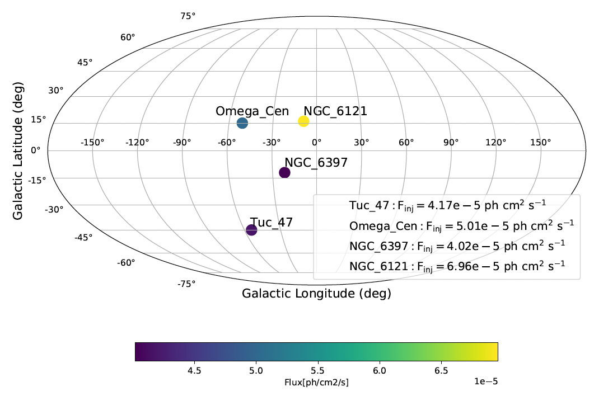

<div align="center">
  
# Welcome to COSI Data Challenge 3!

<p align="center">

</p>

<div align="left">


## Table of Contents

- [Introduction](#introduction)
- [Getting Started](#getting-started)
- [System Requirements](#system-requirements)
- [Getting Help](#getting-help)
- [Reference Guides](#reference-guides)
- [Data Challenges](#data-challenges)
- [Known Caveats and Limitations](#known-caveats-and-limitations)
- [Releases](#releases)
- [Citing](#citing)

## Introduction
Welcome to the third COSI Data Challenge (DC3)! The COSI Data Challenges are released on a yearly basis in preparation for the launch of the COSI Small Explorer (SMEX) class mission in 2027 ([Tomsick+23](https://ui.adsabs.harvard.edu/abs/2023arXiv230812362T/abstract)). They are based on simulated data, which is intended to closely mimic the real flight data. Every year the Data Challenges have increasingly more realistic source and background models, and they are analyzed with increasingly complete and matured analysis tools. In general there are two main goals of the Data Challenges:

1. Facilitate development of the COSI data pipeline and analysis tools
   - With routine feedback from scientists
   - Alongside development of the expected source models by the science team 
2. Provide resources to the astrophysics community to become familiar with COSI data
   - Excellent training for science team in preparation for first analyses after launch
   - Public releases help with community building before COSI data is released

## Getting Started 
The only software requirement for DC3 is [cosipy](https://github.com/cositools/cosipy). A general introduction into cosipy, including installation instructions, can be found in the [cosipy-intro](cosipy-intro/README.md) directory. For a general introduction into analyzing data from Compton telescopes see [Compton-telescope-data-analysis-intro](Compton-telescope-data-analysis-intro/README.md). Note that cosipy is part of the larger COSITools, which is a broad collection of COSI data analysis tools, documentation, and verification data sets. COSITools can be installed by following the installation instructions [here](https://github.com/cositools/cosi-setup). This also includes MEGAlib, which is the main software program used for running simulations. However, unless you need MEGAlib and/or COSITools for other reasons, it's highly recommended to just install cosipy.    

This year's Data Challenge is based on 3 months of exposure time, for an equatorial orbit at an altitude of 530 km, with a pointing that rocks between $\pm 20^\circ$ from the Earth zenith. The simulated data products are provided in FITS file format, and are hosted on Wasabi. Details of the simulations, simulated data, and information for accessing the data products can be found in the [data-products](data-products/README.md) directory. 

The input models and challenges for DC3 were provided by the COSI science teams. There are challenges for the different science groups: GRBs, Positrons, Nucleosynthesis, Galactic, Extragalactic, and Dark Matter. These are described in detail in the [Data Challenges](#data-challenges) section below.  

Users are encouraged to post feedback on the [Discussions](https://github.com/cositools/cosi-data-challenges/discussions) page. This can include solutions to specific challenges, questions, issues, etc.

In summary, to get started with DC3, install cosipy, familiarize yourself with the [data-products](data-products/README.md), and then start working through the [Data Challenges](#data-challenges), as described below. 

## System Requirements
One of our goals in developing cosipy is to make it easily accesible to all users. **All of the Data Challenges should be doable on a laptop with at least 16 GB of RAM**. We are still working on optimizing the code, and so please let us know if you are running into memory issues.

## Getting Help
Please submit a new issue in the [cosipy](https://github.com/cositools/cosipy) git repository if you have issues with the code. If you have general feedback, or need further assistance, please reach out to the COSI Data Challenges team lead, Chris Karwin ([ckarwin@clemson.edu](mailto:ckarwin@clemson.edu)), the cosipy implementation lead, Israel Martinez-Castellanos ([israel.martinezcastellanos@nasa.gov](israel.martinezcastellanos@nasa.gov)), and the pipeline development lead Carolyn Kierans ([carolyn.a.kierans@nasa.gov](carolyn.a.kierans@nasa.gov)).

## Reference Guides
- **[Introduction to Compton telescope data analysis](Compton-telescope-data-analysis-intro/README.md)**
- **[Introduction to cosipy](cosipy-intro/README.md)**
- **[Simplified 2D tutorials](https://github.com/israelmcmc/gammaraytoys/tree/main/docs/tutorials)** (from the **[Gamma-ray Toys](https://github.com/israelmcmc/gammaraytoys/tree/main)** repository)
- **[Summary of background simulations](backgrounds/README.md)**
- **[Dealing with Earth occultation](earth-occultation/README.md)** 
- **[Introduction to polarization](polarization/README.md)** 

## Data Challenges
We have created example Jupyter notebooks demonstrating all of the tools that will be needed to complete this year's data challenges. They are available as part of the cosipy release, and listed below: <br /> 

Example 1: [dataIO](https://github.com/cositools/cosipy/tree/main/docs/tutorials/DataIO) <br />
Example 2: [detector response](https://github.com/cositools/cosipy/blob/develop/docs/tutorials/response/DetectorResponse.ipynb) <br />
Example 3: [GRB localization (TS maps)](https://github.com/cositools/cosipy/tree/main/docs/tutorials/ts_map) <br />
Example 4: [GRB spectral fit](https://github.com/cositools/cosipy/tree/main/docs/tutorials/spectral_fits/continuum_fit/grb) <br />
Example 5: [Crab spectral fit](https://github.com/cositools/cosipy/tree/main/docs/tutorials/spectral_fits/continuum_fit/crab) <br />
Example 6: [511 spectral fit](https://github.com/cositools/cosipy/tree/main/docs/tutorials/spectral_fits/extended_source_fit) <br />
Example 7: [Crab imaging](https://github.com/cositools/cosipy/tree/main/docs/tutorials/image_deconvolution/Crab/ScAttBinning) <br />
Example 8: [511 imaging](https://github.com/cositools/cosipy/tree/main/docs/tutorials/image_deconvolution/511keV/GalacticCDS) <br />
Example 9: [Source injector](https://github.com/cositools/cosipy/tree/develop/docs/tutorials/source_injector) <br />
Example 10: [Polarization (ASAD method)](https://github.com/cositools/cosipy/blob/develop/docs/tutorials/polarization/ASAD_method.ipynb) <br />
Example 11: [Continuum background estimation](https://github.com/cositools/cosipy/blob/develop/docs/tutorials/background_estimation/continuum_estimation/BG_estimation_example.ipynb) <br />
Example 12: [Line background estimation](https://github.com/cositools/cosipy/blob/develop/docs/tutorials/background_estimation/line_background/line_background_estimation_example_notebook.ipynb) <br />

If you haven't worked with Jupyter before, you can find some help [here](https://github.com/cositools/cosi-data-challenge-2/tree/main/cosipy-intro/notebook_help.md).

As a very first step, try working through some of the example notebooks. It is highly recommended to start with the [dataIO](https://github.com/cositools/cosipy/tree/main/docs/tutorials/DataIO) notebook, as this describes the general handling of COSI data, and it is needed for almost all other notebooks. Specific challenges for the different science topics are described below. You can start with whichever topic you are most interested in. Each challenge will refer you to a specific example notebook that will demonstrate the basic tools needed to complete the respective challenge. If you have completed the main challenges and are interested in exploring other models, you can employ the source injector (see the [Source injector](https://github.com/cositools/cosipy/tree/develop/docs/tutorials/source_injector) example). If you are interested in getting more involved in the cosipy development, see the [Known Caveats and Limitations](#known-caveats-and-limitations) section at the bottom of this page, as well as the bottom of the [cosipy-intro](cosipy-intro/README.md), which outlines some of the priority areas for the next stages of development. 

All input models used for the simulations can be found in the DC3 source library of the COSI simulation pipeline, available [here](https://github.com/cositools/cosi-sim/tree/main/cosi_sim/Source_Library/DC3). This includes all the information about the injected sources, and it can be used for checking the results of the data challenges. 

**Configuration Files:** <br />
The configuration for the data binning is specified via yaml files, as demonstrated in the [dataIO](https://github.com/cositools/cosipy/tree/main/docs/tutorials/DataIO) tutorial (and others). **The data binning must match the response binning, and so the yaml configuration files must be updated accordingly when working with DC3 data.** The [detector response](https://github.com/cositools/cosipy/blob/develop/docs/tutorials/response/DetectorResponse.ipynb) tutorial shows how to determine the response binning. The main difference with the DC3 response files is that the phi binning is now 6 degrees compared to 5 degrees for DC2. We are currently working on refining how paramaters are configured in cosipy, and this will be updated starting with DC4.  

**Orientation Files:** <br />
Two orientation files are available: <br />
DC3_final_530km_3_month_with_slew_15sbins_GalacticEarth_SAA.ori  <br />
DC3_final_530km_3_month_with_slew_1sbins_GalacticEarth_SAA.ori  <br />
The 1 second binning may be optimal for analyzing transients on short time scales, but generally the 15 second binning should be sufficient and is considered the default. 

**Background Modeling:** <br />
DC3 includes all of the background components. Compared to the background estimates from DC2, we have now included the full SAA passage, as well as the Galacic diffuse continuum emission. Further details of the background models and simulations be found in the [backgrounds](backgrounds/README.md) directory. The available background files are listed in the [data-products](data-products/README.md) directory. We provide a file with the total background, as well as separate files for the individual background components. For convenience, we have also provided the binned total background for each of the different response files. 

For analyzing data in DC3, the starting point is to model the backgrounds using the actual simulated backgrounds themselves. This is the ideal case, where the backgrounds are perfectly known, which of course is not very realistic. To simplify the analysis, it is sometimes helpful to start with just a single background component (e.g. albedo photons), and then move on to the total background after everything is working. The next step is to estimate the backgrounds. **With DC3 we have new methods to estimate the background for both line and continuum sources**. The background estimation tool for line emission can be used for both point sources and extended sources. An example tutorial can be found in the [line background estimation](https://github.com/cositools/cosipy/blob/develop/docs/tutorials/background_estimation/line_background/line_background_estimation_example_notebook.ipynb) notebook. The background estimation tool for continuum emission is currently only available for point sources. An example tutorial is available in the [continuum background estimation](https://github.com/cositools/cosipy/blob/develop/docs/tutorials/background_estimation/continuum_estimation/BG_estimation_example.ipynb) notebook. We stress that both of these background estimation algorithms are only first versions, and further development and testing is still needed. More details are provided in the respective example tutorials. 

**Data Challenges for the different science topics can be found below (click to expand):**

<details>
  <summary>GRBs</summary>
  
## GRB Data Challenges
 
The Key Objectives for GRB science with COSI are:
1. Detect short GRBs following neutron star mergers, which are a known source of gravitational waves
2. Constrain geometries and emission processes with polarization

The tools needed to complete these challenges are demonstrated in the [GRB spectral fit](https://github.com/cositools/cosipy/tree/main/docs/tutorials/spectral_fits/continuum_fit/grb), [GRB localization](https://github.com/cositools/cosipy/tree/main/docs/tutorials/ts_map), and [Polarization (ASAD method)](https://github.com/cositools/cosipy/blob/develop/docs/tutorials/polarization/ASAD_method.ipynb) examples. 

### DC3 Goals:
- Localize a GRB and fit the spectrum
- Measure polarization (fraction and angle) of a GRB
- Localize a MGF and fit the spectrum
- Measure the polarization (fraction and angle) of a MGF
- Check if the magnetar short burst is detectable, and if detectable localize and fit the spectrum
- _Stretch goal:_ Develop a classification technique to distinguish a GRB or MGF

We have simulated 12 GRBs, 6 Magnetar Giant Flares (MGFs), and 1 magnetar short burst within the 3 months of observation time. GRB bn090424592 is the brightest of the bursts we’ve simulated and it may be easiest to start with. Access to the response files and the simulated source and background files, including the full Wasabi path, is detailed in the [data-products](data-products/README.md) page.

**The challenges will use the following detector response files:** 
- ResponseContinuum.o3.e100_10000.b10log.s10396905069491.m2284.filtered.nonsparse.binnedimaging.imagingresponse_nside8.area.good_chunks.h5.gz <br />
 - ResponseContinuum.o3.pol.e200_10000.b4.p12.s10396905069491.m441.filtered.nonsparse.binnedpolarization.11D_nside8.area.good_chunks.h5.gz (for polarization) <br />
Note: the second response file is used for polarization analysis and has fewer energy bins.
 
 **Data Files:** <br />
 GRB_bn081207680_3months_unbinned_data_filtered_with_SAAcut.fits.gz <br />
 GRB_bn090424592_3months_unbinned_data_filtered_with_SAAcut.fits.gz <br />
 GRB_bn100612726_3months_unbinned_data_filtered_with_SAAcut.fits.gz <br />
 GRB_bn110605183_3months_unbinned_data_filtered_with_SAAcut.fits.gz <br />
 GRB_bn131122490_3months_unbinned_data_filtered_with_SAAcut.fits.gz <br />
 GRB_bn140329295_3months_unbinned_data_filtered_with_SAAcut.fits.gz <br />
 GRB_bn161004964_3months_unbinned_data_filtered_with_SAAcut.fits.gz <br />
 GRB_bn170405777_3months_unbinned_data_filtered_with_SAAcut.fits.gz <br />
 GRB_bn180504136_3months_unbinned_data_filtered_with_SAAcut.fits.gz <br />
 GRB_bn180703876_3months_unbinned_data_filtered_with_SAAcut.fits.gz <br />
 GRB_bn080802386_flux150_3months_unbinned_data_filtered_with_SAAcut.fits.gz <br />
 GRB_bn080802386_flux300_3months_unbinned_data_filtered_with_SAAcut.fits.gz <br />
 GRB_MGF051103_3months_unbinned_data_filtered_with_SAAcut.fits.gz <br />
 GRB_MGF070201_3months_unbinned_data_filtered_with_SAAcut.fits.gz <br />
 GRB_MGF070222_3months_unbinned_data_filtered_with_SAAcut.fits.gz <br />
 GRB_MGF180128A_3months_unbinned_data_filtered_with_SAAcut.fits.gz <br />
 GRB_MGF200415A_3months_unbinned_data_filtered_with_SAAcut.fits.gz <br />
 GRB_MGF231115A_3months_unbinned_data_filtered_with_SAAcut.fits.gz <br />
 MgtBurst_bright_complex_10x_3months_unbinned_data_filtered_with_SAAcut.fits.gz <br />
 
 **Input Models:** <br />
 All input models can be found [here](https://github.com/cositools/cosi-sim/tree/main/cosi_sim/Source_Library/DC3/sources/GRBs).
 
The simulated GRBs occur randomly within the 3-month orientation file, with their positions chosen such that they have incidence angles under $60^\circ$. The spectra are described with Band functions, and the parameters are based on fits to GBM data. Likewise, the lightcurves are also from GBM data. The fluxes were chosen such that some GRBs have a minimum detectable polarization (MDP) below their polarization fraction, and some have a MDP above. The models are specified below, including the polarization fraction (PF), and the polarization angle (PA) given in IAU convention. We also provide burst times, which is needed for the analysis:
 - bn081207680: PF = 0, PA = $0^\circ$, t = 1836496300.0 s
 - bn090424592: PF = 0.1, PA = $110^\circ$, t = 1837507002.0 s
 - bn100612726: PF = 0.2, PA = $35^\circ$, t = 1839617230.0 s
 - bn110605183: PF = 0.3, PA = $50^\circ$, t = 1841896404.0 s
 - bn131122490: PF = 0.4, PA = $175^\circ$, t = 1842123855.0 s
 - bn140329295: PF = 0.5, PA = $95^\circ$, t = 1837652924.0 s
 - bn161004964: PF = 0.6, PA = $10^\circ$, t = 1842948485.0 s
 - bn170405777: PF = 0.7, PA = $160^\circ$, t = 1841915858.0 s
 - bn180504136: PF = 0.8, PA = $45^\circ$, t = 1836985181.0 s
 - bn180703876: PF = 0.9, PA = $25^\circ$, t = 1838652949.0 s
 - bn080802386: PF = 0.8, PA = $90^\circ$, t = 1835493492.2 s <br />
Note: The two short GRBs (bn080802386) are unrealistically bright and are intended to be used for the polarization tutorial.
 
 Information for the MGFs, including reference papers (PF = 1, PA = $90^\circ$ for all sources):
 - MGF051103 ([Svinkin+21](https://www.nature.com/articles/s41586-020-03076-9)): t = 1835533723.498 s
 - MGF070201 ([Ofek+08](https://www.nature.com/articles/s41586-020-03076-9)): t = 1835537496.0 s
 - MGF070222 ([Svinkin+16](https://www.nature.com/articles/s41586-020-03076-9)): t = 1835491681.0 s
 - MGF180128A ([Trigg+24](https://www.nature.com/articles/s41586-020-03076-9)): t = 1835488380.0 s
 - MGF200415A ([Svinkin+21](https://www.nature.com/articles/s41586-020-03076-9)): t = 1835488530.0 s
 - MGF231115A ([Trigg+25](https://www.nature.com/articles/s41586-020-03076-9)): t = 1835533696.0 s
 
 Information for magnetar short burst:
 - MgtBurst_bright_complex_10x: no polarization, t = 1835640345.022513 s
   - SGR 1935+2154 ([Li+21](https://www.nature.com/articles/s41550-021-01302-6)) - a bright burst with a complex light curve. Flux has been increased by a factor of 10.  


</details>

<details>
  <summary>Positrons</summary>
  
## Positron Data Challenges
The Key Objectives for the COSI positron science goal are:
1. Identify potential individual positron sources in the Galaxy
2. Determine the scale-height of the Galactic disk
3. Study the annihilation mechanism and the differences between the Galactic disk and the Galactic bulge
4. Investigate the energy at which positrons are created

For DC3, we have challenges associated with **1–3** of the Key Objectives.

The tools needed to complete these challenges are demonstrated in the [511 imaging](https://github.com/cositools/cosipy/blob/v0.3.x/docs/tutorials/image_deconvolution/511keV/GalacticCDS) and [511 spectral fit](https://github.com/cositools/cosipy/tree/main/docs/tutorials/spectral_fits/extended_source_fit) notebooks. 

### DC3 Goals:
- Image individual positron sources in the Galaxy 
- Generate a full sky image of the Galactic diffuse 511 keV emission
- Determine the scale height of the 511 keV disk
- Compare line width and ortho-Ps fraction in bulge and disk
- Measure the Doppler shift in the disk
- _Stretch goal:_ cross-correlate the measured 511 keV emission with <sup>26</sup>Al map (1809 keV emission) to constrain propagation distances

We have developed models for the 511 keV and ortho-positronium emission from <sup>26</sup>Al and <sup>44</sup>Ti $\beta$+ decay in our Galaxy, which includes the propagation of positrons and Galactic rotation to give a spatially-dependent annihilation spectrum, with three different bulge models that agree with INTEGRAL/SPI measurements. We have also simulated 3 extragalactic sources, 4 globular clusters, and the Vela supernova remnant, as detailed below. Note, these individual sources only have the 511 keV line emission and no contribution from the ortho-positronium continuum.  Access to the response files and the simulated source and background files, including the full Wasabi path, is detailed in the [data-products](data-products/README.md) page

**The challenges will use the following detector response files:** 
- Response511.o4.e509_513.s20881894470591.m2555.filtered.nonsparse.binnedimaging.imagingresponse_nside16.area.good_chunks.h5.gz <br />
- ResponseContinuum.o3.e100_10000.b10log.s10396905069491.m2284.filtered.nonsparse.binnedimaging.imagingresponse_nside8.area.good_chunks.h5.gz <br />
- extended_source_response_511_merged.h5.gz (precomputed 511 extended source response file)
- extended_source_response_continuum_merged.h5.gz (precomputed continuum extended source response file)

The line response is for analyzing the 511 keV line emission, and the continuum response is for analyzing the orthopositronium continuum. Currently, these two components cannot be analyzed simultaneously, as desribed in the [Known Caveats and Limitations](#known-caveats-and-limitations) section. The pre-computed extended source responses should be used for imaging in Galactic coordinates and the 511 spectral fit notebook when analyzing extended sources (i.e. positrons from <sup>26</sup>Al or <sup>44</sup>Ti).

### Positrons from <sup>26</sup>Al and <sup>44</sup>Ti

**Data Files:** <br />
Positrons_from_26Al_line_3months_unbinned_data_filtered_with_SAAcut.fits.gz <br />
Positrons_from_26Al_cont_3months_unbinned_data_filtered_with_SAAcut.fits.gz <br />
Positrons_from_44Ti_line_3months_unbinned_data_filtered_with_SAAcut.fits.gz <br />
Positrons_from_44Ti_cont_3months_unbinned_data_filtered_with_SAAcut.fits.gz <br />
Vela_SNR_511_3months_unbinned_data_filtered_with_SAAcut.fits.gz <br />

**Galactic Input Models:**  <br />
The spatial distribution of positrons from <sup>26</sup>Al and <sup>44</sup>Ti decay is derived from the propagation of positrons in our Galaxy, where the initial positions of positrons follows the NE2001 model from [Cordes & Lazio 2002](https://arxiv.org/abs/astro-ph/0207156). The model fits the distribution of massive stars in our Galaxy, with an assumed fraction of 2% for both <sup>26</sup>Al and <sup>44</sup>Ti in the bulge. The positron propagation method is described in [Alexis et al. 2014](https://ui.adsabs.harvard.edu/abs/2014A%26A...564A.108A/abstract). The positron rate due to <sup>26</sup>Al is set to $2.6 \times 10^{42}$ e+/s based on INTEGRAL/SPI measurements at 1809 keV [Diehl et al. 2006](https://ui.adsabs.harvard.edu/abs/2006Natur.439...45D/abstract),  and the rate from <sup>44</sup>Ti decay is assumed to be $3\times 10^{42}$ e+/s (see section 2.3 of [Alexis et al. 2014](https://ui.adsabs.harvard.edu/abs/2014A%26A...564A.108A/abstract)).

The spectrum for these diffuse models have two separate components: the 511 keV annihilation line and the ortho-positronium continuum (i.e. files containing “cont”). These were obtained from the model of [Guessoum et al 2005](https://ui.adsabs.harvard.edu/abs/2005A%26A...436..171G/abstract) with a computed spectrum for each phase of the interstellar medium, based on the spatial distribution described above. The spectral model was corrected by the Galactic rotation using the model of [Fich, Blitz and Stark 1989](https://ui.adsabs.harvard.edu/abs/1989ApJ...342..272F/abstract) for R > 3 kpc and a solid rotation model for R < 3 kpc.

The imaged spatial distribution should resemble the initial model, shown here for the 511 keV emission from <sup>26</sup>Al decays, and the resulting measured full-Galaxy 511 keV flux should be $3.2 \times 10^{-4}\ \mathrm{ph \ cm^{-2} \ s^{-1}}$ for <sup>26</sup>Al, and $3.7 \times 10^{-4}\ \mathrm{ph \ cm^{-2} \ s^{-1}}$ for <sup>44</sup>Ti. The flux in the inner Galactic region ($\pm$ 30 deg) should be $1.3 \times 10^{-4}\ \mathrm{ph \ cm^{-2} \ s^{-1}}$ for <sup>26</sup>Al, and $1.4 \times 10^{-4}\ \mathrm{ph \ cm^{-2} \ s^{-1}}$ for <sup>44</sup>Ti. 

<p align="center">

</p>

<div align="left">

**Vela Input Models:**  <br />
The 511 keV photon flux from the Vela SNR is estimated assuming that all positrons from $1 \times 10^{-4}$ $M_\odot\$ of <sup>44</sup>Ti decay are trapped within the remnant by magnetic fields. We assume a 511 keV flux of $3.5 \times 10^{-4} \mathrm{ph \ cm^{-2} \ s^{-1}}$ and a spatial distribution the follows total ROSAT all-sky survey X-ray emission. This is NOT a point source, but ~8 deg in extent.

### Bulge Emission
**Data Files:** <br />
Narrow_Bulge_511_3months_unbinned_data_filtered_with_SAAcut.fits.gz <br />
Broad_Bulge_511_3months_unbinned_data_filtered_with_SAAcut.fits.gz <br />
NFW_511_3months_unbinned_data_filtered_with_SAAcut.fits.gz <br />

We've simulated 3 bulge models seperate from the disk but recommend you add either the NFW or narrow + broad bulge to the disk simulations above for a representative all-sky distribution. The broad bulge and narrow bulge spatial models are based on the Boxy bulge ([Freudenreich 1998](https://ui.adsabs.harvard.edu/abs/1998ApJ...492..495F/abstract)) and nuclear bulge ([Launhardt et al. 2002](https://ui.adsabs.harvard.edu/abs/2002A%26A...384..112L/abstract)). These are consistent with the INTEGRAL/SPI spatial model components referred to as the broad and narrow bulge in ([Skinner et al. 2014](https://pos.sissa.it/228/054/) and [Siegert et al. 2016](https://ui.adsabs.harvard.edu/abs/2016A%26A...586A..84S/abstract)). The NFW<sup>2</sup> model is derived from dark matter models and is based on the spatial distribution presented in ([Siegert et al. 2024](https://ui.adsabs.harvard.edu/abs/2024MNRAS.528.3433S/abstract)). Each bulge model has a 511 keV component and ortho-Ps continuum, as expected from low-energy positron annihilation ($f_{Ps}$ ~ 1). Images of the narrow, broad, and NFW<sup>2</sup> models are shown below. 

<p float="left">
  
   
  
</p>

### Extragalactic Sources

**Data Files:** <br />
LMC_Gaussian_511_3months_unbinned_data_filtered_with_SAAcut.fits.gz <br />
LMC_Gaussian_511_x100_3months_unbinned_data_filtered_with_SAAcut.fits.gz <br />
M31_Gaussian_511_3months_unbinned_data_filtered_with_SAAcut.fits.gz <br />
M31_Gaussian_511_x100_3months_unbinned_data_filtered_with_SAAcut.fits.gz <br />
Virgo_Gaussian_511_3months_unbinned_data_filtered_with_SAAcut.fits.gz <br /> 
Virgo_Gaussian_511_x100_3months_unbinned_data_filtered_with_SAAcut.fits.gz <br />

**Input Models:**  <br />
The fluxes for extragalactic sources (LMC, M31, Virgo) are estimated by assuming that the 511 keV photon flux is proportional to the stellar mass of the source. Using a Milky Way 511 keV flux of $2.8 \times 10^{-3} \  \mathrm{ph \ cm^{-2} \ s^{-1}}$ ([Siegert+16](https://www.aanda.org/articles/aa/full_html/2016/02/aa27510-15/aa27510-15.html)) and total stellar mass of $5.4 \times 10^{10} \  M_\odot$ ([McMillan+16](https://academic.oup.com/mnras/article/465/1/76/2417479)), we assume the 511 keV flux of each extragalactic source follows the same ratio. The stellar masses are:

The stellar masses are: <br />
LMC: $1 \times 10^{10} \ M_\odot\$ ([Erkal+19](https://academic.oup.com/mnras/article/487/2/2685/5491315)) <br />
M31: $1.25 \times 10^{11} \ M_\odot\$ ([Tamm+12](https://www.aanda.org/articles/aa/full_html/2012/10/aa20065-12/aa20065-12.html)) <br />
Virgo: $1.2 \times 10^{14} \ M_\odot\$ ([Fouque+01](https://www.aanda.org/articles/aa/abs/2001/33/aa1326/aa1326.html)) <br />

We also include each source at 100x the nominal flux, in order to ensure that they are above COSI's 511 keV line sensitivity.

### Globular Clusters

**Data Files:** <br />
Globular_Cluster_Tuc_47_3months_unbinned_data_filtered_with_SAAcut.fits.gz <br />
Globular_Cluster_Omega_Cen_3months_unbinned_data_filtered_with_SAAcut.fits.gz <br />
Globular_Cluster_NGC_6397_3months_unbinned_data_filtered_with_SAAcut.fits.gz <br />
Globular_Cluster_NGC_6121_3months_unbinned_data_filtered_with_SAAcut.fits.gz <br />

**Input Models:**  <br />
The 511 keV photon flux for the brightest 4 globular clusters is estimated based on the 0.1 - 100 GeV luminosity from the Globular clusters, and the nuclear bulge and boxy bulge emission in the Milky Way [Bartels et al 2018a](https://ui.adsabs.harvard.edu/abs/2018NatAs...2..819B/abstract). The GeV luminosity of the Bulge is compared to the 511 keV luminosity of the bulge [Bartels et al 2018b](https://ui.adsabs.harvard.edu/abs/2018MNRAS.480.3826B/abstract). This GeV luminosity vs 511 keV luminosity correlation is applied to the GeV excess observed from globular clusters [Zhang et al 2016](https://ui.adsabs.harvard.edu/abs/2016MNRAS.459...99Z/abstract) in the Galaxy to estimate the 511 keV flux of the globular clusters. The flux values shown here are 3x the values estimated from the correlation in order to make them within COSI's sensitivity limit within the 3 month observation period.

The simulated 511 keV flux for the GCs are: <br />
$4.17 \times 10^{-5} \  \mathrm{ph \ cm^{-2} \ s^{-1}}$ for Tuc 47 <br />
$5.01 \times 10^{-5} \  \mathrm{ph \ cm^{-2} \ s^{-1}}$ for Omega Cen <br />
$4.02 \times 10^{-5} \  \mathrm{ph \ cm^{-2} \ s^{-1}}$ for NGC 6397 <br />
$6.96 \times 10^{-5} \  \mathrm{ph \ cm^{-2} \ s^{-1}}$ for NGC 6121 <br />

<p align="center">

</p>

<div align="left">
  
</details>

<details>
  <summary>Nucleosynthesis</summary>
  
## Nucleosynthesis Data Challenges
The Key Objectives for the COSI nucleosynthesis science goal are:
1. Reveal the history of core collapse supernova activity in the Galaxy
2. Determine the role of the evolution of massive stars in creating the elements
3. Detect nuclear line emission from young supernova remnants in the Galaxy
4. Probe explosion physics in the core of supernovae

The tools needed to complete most of these challenges are demonstrated in the [511 imaging](https://github.com/cositools/cosipy/tree/main/docs/tutorials/image_deconvolution/511keV/ScAttBinning) and [511 spectral fit](https://github.com/cositools/cosipy/tree/main/docs/tutorials/spectral_fits/extended_source_fit) notebooks. For the <sup>44</sup>Ti data challenge you will need the [Crab spectral fit](https://github.com/cositools/cosipy/tree/main/docs/tutorials/spectral_fits/continuum_fit/crab), [Crab imaging](https://github.com/cositools/cosipy/tree/main/docs/tutorials/image_deconvolution/Crab/ScAttBinning), and [GRB localization](https://github.com/cositools/cosipy/tree/main/docs/tutorials/ts_map) notebooks since Cas A is modeled as a point source.

### DC3 Goals:
- Image the <sup>26</sup>Al (1.8 MeV) diffuse emission
- Fit the spectral shape of the Galactic 1.8 MeV line and detect the Doppler shift of the line in the disk
- Image the <sup>60</sup>Fe diffuse emission at 1173 keV and 1332 keV
- Fit the two <sup>60</sup>Fe decay lines to find the total mass of <sup>60</sup>Fe in the Galaxy
- Extract the <sup>26</sup>Al/<sup>60</sup>Fe ratio and its uncertainty
- Detect the <sup>26</sup>Al and <sup>60</sup>Fe emission from the Cygnus region and measure widths of the gamma-ray line emissions
- Determine the mass of <sup>44</sup>Ti in Cas A from the 1157 keV line emission
- _Stretch goal:_ Cross-correlate the <sup>26</sup>Al 1.8 MeV spatial distribution with the 511 keV emission from Galactic positron annihilation
- _Stretch goal:_ Detect and characterize the different non-gaussian line profiles of the <sup>44</sup>Ti 1157 keV line for Cas A

We have modeled the diffuse emission from <sup>26</sup>Al and <sup>60</sup>Fe in our Galaxy assuming they follow the distribution of massive stars and are in agreement with INTEGRAL/SPI observations. We have also included a model for the <sup>26</sup>Al and <sup>60</sup>Fe emission from the Cygnus region. We have simulated the <sup>44</sup>Ti decay from Cas A with 5 different spectral line profiles to test the resolving power of COSI. Access to the response files and the simulated source and background files, including the full Wasabi path, is detailed in the [data-products](data-products/README.md) page

**The challenges will use the following detector response files:** 
- Response26Al.o4.e1805_1812.s10036231691364.m1045.filtered.nonsparse.binnedimaging.imagingresponse_nside16.area.good_chunks.h5.gz
- extended_source_response_Al26_merged.h5.gz
- Response60FeHigh.o4.e1329_1336.s10201526728102.m1287.filtered.nonsparse.binnedimaging.imagingresponse_nside16.area.good_chunks.h5.gz
- Response60FeLow.o4.e1170_1176.s9552269354945.m1188.filtered.nonsparse.binnedimaging.imagingresponse_nside16.area.good_chunks.h5.gz
- extended_source_response_Fe60_low_merged.h5.gz
- extended_source_response_Fe60_high_merged.h5.gz
- Response44Ti.o4.e1154_1160.s9607532021290.m1215.filtered.nonsparse.binnedimaging.imagingresponse_nside16.area.good_chunks.h5.gz
- extended_source_response_Ti44_merged.h5.gz 

Each gamma-ray line has a different response, and the response files are labeled with each isotope. Note that <sup>60</sup>Fe has two separate response files for the two decay lines at 1173 keV and 1332 keV. Currently, these two line components cannot be analyzed simultaneously, as desribed in the [Known Caveats and Limitations](#known-caveats-and-limitations) section. The pre-computed extended source responses should be used for imaging in Galactic coordinates and the spectral fit notebook when analyzing extended sources (i.e. <sup>26</sup>Al or <sup>60</sup>Fe).

### <sup>26</sup>Al and <sup>60</sup>Fe diffuse emission

**Data Files:** <br /> 
26Al_NE2001_3months_unbinned_data_filtered_with_SAAcut.fits.gz <br />
60Fe_NE2001_3months_unbinned_data_filtered_with_SAAcut.fits.gz <br />

**Input Models:**  <br />
The spatial distribution of the 1809 keV line from <sup>26</sup>Al decay and the 1173 keV and 1332 keV lines from <sup>60</sup>Fe decay in our Galaxy follow the NE2001 model from [Cordes & Lazio 2002](https://arxiv.org/abs/astro-ph/0207156). The model fits the distribution of massive stars in our Galaxy, with an assumed fraction of 2% for both <sup>26</sup>Al and <sup>60</sup>Fe in the Galactic bulge. This value is a compromise between SPI observations and results of studies of star formation rate in this region. The flux of <sup>26</sup>Al is consistent with measurements from SPI with a total mass of 2.7 $M_\odot\$ in our Galaxy ([Diehl et al. 2006](https://ui.adsabs.harvard.edu/abs/2006Natur.439...45D/abstract)). The flux of <sup>60</sup>Fe is computed assuming a total mass of 3.5 $M_\odot\$ (see [Wang+20](https://ui.adsabs.harvard.edu/abs/2020ApJ...889..169W/abstract) and [Siegert+23](https://ui.adsabs.harvard.edu/abs/2023A%26A...672A..54S/abstract)). The shape of the line in each spatial bin takes into account the turbulence of the interstellar medium and the Galactic rotation using the model of [Fich, Blitz and Stark 1989](https://ui.adsabs.harvard.edu/abs/1989ApJ...342..272F/abstract) for R > 3 kpc and a solid rotation model for R < 3 kpc.

### Cygnus Region
   
**Data Files:** <br /> 
26Al_Cyg_Region_3months_unbinned_data_filtered_with_SAAcut.fits.gz <br />
60Fe_Cyg_Region_3months_unbinned_data_filtered_with_SAAcut.fits.gz <br />

**Input Models:**  <br />
The characteristics of the <sup>26</sup>Al emission from the Cygnus region are obtained from INTEGRAL/SPI observations described in [Martin+09](https://ui.adsabs.harvard.edu/abs/2009A%26A...506..703M/abstract), while predictions for the <sup>60</sup>Fe lines are derived from the calculation of [Martin+10](https://ui.adsabs.harvard.edu/abs/2010A%26A...511A..86M/abstract). The spatial distribution, for both <sup>26</sup>Al and <sup>60</sup>Fe, is modeled with a $3^\circ$ $\sigma$ Gaussian shape centered at $l = 81^\circ, b = 1^\circ$. The 1.8 MeV line flux is $3.9 \times 10^{-5} \ \mathrm{ph \ cm^{-2} \ s^{-1}}$, and it is centered at 1808.8 keV with a width of 1.6 keV FWHM due to the interstellar turbulence. The flux of <sup>60</sup>Fe is $2.7 \times 10^{−6}\ \mathrm{ph \ cm^{-2} \ s^{-1}}$ for the both lines, and centroids are 1173.3 keV and 1332.6 keV with a width of 1.04 keV and 1.18 keV FWHM, respectively.

### <sup>44</sup>Ti line profiles from Cas A
   
**Data Files:** <br /> 
CasAsymmetric_3months_unbinned_data_filtered_with_SAAcut.fits.gz <br />
CasAunresolved_3months_unbinned_data_filtered_with_SAAcut.fits.gz <br />
CasApartiallyresolved_3months_unbinned_data_filtered_with_SAAcut.fits.gz <br />
CasAfullyresolved_3months_unbinned_data_filtered_with_SAAcut.fits.gz <br />
CasAG16distribution_3months_unbinned_data_filtered_with_SAAcut.fits.gz <br />

**Input Models:**  <br />
The five Cas A simulations all have slightly different line profiles and are meant to test the spectral features recovery capabilities of COSI with a low-resolution response file. The source is modeled as a point source at $l = 111.7^\circ, b = -2.1^\circ$, and each spectral model has a flux of $3 \times 10^{-4} \ \mathrm{ph \ cm^{-2} \ s^{-1}}$ at 1157 keV, which is 10$\times$ the flux value provided by  [Siegert+15](http://dx.doi.org/10.1051/0004-6361/201525877) and [Weinberger+20](https://doi.org/10.1051/0004-6361/202037536). The symmetric model is a single Gaussian at 1157 keV. The unresolved, partially resolved, and fully resolved simulations assume the emission is from two <sup>44</sup>Ti clumps whose bulk center of motion is at rest, but the doppler shifts of two clumps are at different levels of spectral separation. The blueshifted clump contains 2/3 of the total <sup>44</sup>Ti yield, and the redshifted clump contains the other 1/3. The doppler broadening of each clump is the same across the three models. The goal is to detect a statistically significant deviation from the Gaussian model in each of the three cases. 

Additionally, the G16 model simulates a complex distribution of clumps as detected in [Grefenstette+16](http://dx.doi.org/10.3847/1538-4357/834/1/19), where 11 spectral features from 11 different clumps are simulated with varying fluxes and doppler shifts. The <sup>44</sup>Ti flux for the G16 is set to 1.66x the measured flux at 68 and 78 keV, matching the SPI observations of Cas A. The goal remains the same: to detect a statistically significant deviation from the Gaussian model.

 
</details>

<details>
  <summary>Galactic</summary>
  
  ## Galactic Data Challenges
There is one Key Objective for Galactic science with COSI:
1. Constrain geometries and emission processes in Galactic black holes <br />

While the main science goals for COSI are not directly related to many Galactic sources, there is no doubt that COSI’s unique energy range will bring compelling new observations. We start exploring COSI’s Galactic science capabilities in DC3.

The tools needed to complete the Galactic challenges are demonstrated in the [Crab spectral fit](https://github.com/cositools/cosipy/tree/main/docs/tutorials/spectral_fits/continuum_fit/crab), [Crab imaging](https://github.com/cositools/cosipy/tree/main/docs/tutorials/image_deconvolution/Crab/ScAttBinning), [GRB localization](https://github.com/cositools/cosipy/tree/main/docs/tutorials/ts_map), and [Polarization (ASAD method)](https://github.com/cositools/cosipy/blob/develop/docs/tutorials/polarization/ASAD_method.ipynb) notebooks.  The [511 spectral fit](https://github.com/cositools/cosipy/tree/main/docs/tutorials/spectral_fits/extended_source_fit)  notebook can be used to analyze the Galactic diffuse continuum extended source.

### DC3 Goals:
- Perform the image and spectral fit of the Crab
- Perform the image and spectral fit for GRS 1758-258
- Test whether COSI would be able to distinguish between the two models of 1E1740.7-2942
- Measure MeV gamma-ray flux during the Gamma-ray binary flare event from PSR B1259-63 and determine the duration of flare periods
- Fit for the average Cyg X3 spectrum over the 3 months of observation and attempt to detect the spectral changes on shorter time scales
- Check the detection sensitivity in the Cyg X1 soft state and hard state
- Measure the polarization of Cyg X1 in the hard state
- Measure the spectra and polarization of transient sources MAXI J1820+070 and J1348-063
- Establish analysis methods for detecting periodic sources like LS 5039
- Obtain an orbital light curve folded with the binary period for LS 5039
- Detect the magnetar 1RXS J170849.0-400901, including its pulsation, polariztion, and spectrum
- Characterize how the the Galactic diffuse continuum emission as a background component impacts the sensitivity for point sources in the Galactic plane
- Image the Galactic diffuse continuum emission in the COSI energy band
- Measure the spectrum of the Galactic diffuse continuum emission, extracting it from the rest of the background
- _Stretch goal:_ Make a time cut for the Cyg X1 soft and hard states and combine the two simulations to create a spectral transition, and determine COSI’s ability to detect this transition.

We have simulated 10 Galactic point sources: 3 steady-state sources (Crab, GRS 1758-258, 1E1740.7-2942) for spectral analysis, 3 transient/variable sources (PSR B1259-63 has a single flare, Cyg X3 has 6 state transitions,  and LS 5039 is periodic), and 4 sources with polarization (Cyg-X1, MAXI J1820+070, J1348-630, and 1RXS J170849.0-400901). Note that all of the polarized sources are variable as well. We also have a simulation of the Galactic diffuse emission, which can be included as an additional background component, or directly analysed as a source. Access to the response files and the simulated source and background files, including the full Wasabi path, is detailed in the [data-products](data-products/README.md) page.

**The challenges will use the following detector response files:** <br />
- ResponseContinuum.o3.e100_10000.b10log.s10396905069491.m2284.filtered.nonsparse.binnedimaging.imagingresponse_nside8.area.good_chunks.h5.gz <br />
- ResponseContinuum.o3.pol.e200_10000.b4.p12.s10396905069491.m441.filtered.nonsparse.binnedpolarization.11D_nside8.area.good_chunks.h5.gz <br />
- extended_source_response_continuum_merged.h5.gz <br />

Note: the second response file is used for polarization analysis and the extended source response should be used to analyze the Galactic diffuse continuum when imaging or performing the spectral fit.

### Steady-state sources
**Data Files:** <br /> 
crab_standard_3months_unbinned_data_filtered_with_SAAcut.fits.gz  <br />
Crab_Flat_Spectrum_3months_unbinned_data_filtered_with_SAAcut.fits.gz  <br />
GRS175_3months_unbinned_data_filtered_with_SAAcut.fits.gz  <br />
1E1740_compow_3months_unbinned_data_filtered_with_SAAcut.fits.gz  <br />
1E1740_twocompt_3months_unbinned_data_filtered_with_SAAcut.fits.gz  <br />

**Crab Input Models:**  <br />
The standard Crab model is the same as DC1 and DC2. The point source is located at  $l = 184.56^\circ, b = -5.78^\circ$, has a total integrated flux of $4.9 \times 10^{-2}\ \mathrm{ph \ cm^{-2} \ s^{-1}}$ (0.1 - 10.0 MeV), and is define by spectral model from [Jourdain et al. 2020](https://iopscience.iop.org/article/10.3847/1538-4357/aba8a4). There is also a simpler Crab simulation used mainly for testing purposes with a flat spectrum (“Crab_Flat”) and the same flux.

**GRS 1758-258 Input Models:**  <br />
The spectral model for the microquasar GRS 1758-258 near the Galactic center is based on the best fit comptonization model of epoch2 from [Pottschmidt+06](https://arxiv.org/pdf/astro-ph/0509006.pdf). This is the same model as used in DC2. The source is located at $l = 4.51^{\circ}, b=-1.36^{\circ}$, with a flux of $3.495 \times 10^{-3}\ \mathrm{ph \ cm^{-2} \ s^{-1}}$. 

**1E1740.7-2942 Input Models:**  <br />
The 2 spectral models for microquasar 1E1740.7-2942 (also known as the Great Annihilator) are the best fit models of INTEGRAL data obtained by [Bouchet+09](https://iopscience.iop.org/article/10.1088/0004-637X/693/2/1871/pdf). The "compow" simulation is a thermal comptonization + powerlaw model, while the "twocompt" simulation has two components of thermal comptonization with different temperatures. Both models represent the INTEGRAL data well but strongly differ at the highest energies. The source is located close to the Galactic center at $l = 359.1^{\circ}, b = -0.1^{\circ}$ with a total integrated flux of $4.23 \times 10^{-3}\ \mathrm{ph \ cm^{-2} s^{-1}}$ for the compow model and $3.13 \times 10^{-3}\ \mathrm{ph \ cm^{-2} s^{-1}}$ for the twocompt model.

### Transient/Variable sources 

**Data Files:** <br /> 
PSRB1259_3months_unbinned_data_filtered_with_SAAcut.fits.gz <br />
PSRB1259_10x_3months_unbinned_data_filtered_with_SAAcut.fits.gz <br />
cygX3_3months_unbinned_data_filtered_with_SAAcut.fits.gz <br />
LS5039_3months_unbinned_data_filtered_with_SAAcut.fits.gz <br />
LS5039_10x_3months_unbinned_data_filtered_with_SAAcut.fits.gz <br />

**PSR B1259-63 Input Models:**  <br />
PSR B1259-63 is a binary gamma-ray system consisting of a radio pulsar and a massive Be-type star. The next periastron passage will be November 19th, 2027, making this a prime target for COSI. The model for DC3 is based on the work in [Abdo+11](https://doi.org/10.1088%2F2041-8205%2F736%2F1%2Fl11) (see Model 1 in the bottom of Figure 5). The flare is simulated as a constant emission for 30 days (T > 1839487305.0). We have included two flux scenarios: the nominal value from [Abdo+11](https://doi.org/10.1088%2F2041-8205%2F736%2F1%2Fl11) is $6.13 \times 10^{-4} \ \mathrm{ph \ cm^{-2} s^{-1}}$, and we have included 10x enhanced flux for easier analysis. The source is located at $l = 304.2^{\circ}, b = -0.99^{\circ}$.

**Cyg X3 Input Models:**  <br />
In DC3 we have simulated 6 different spectral models for Cyg X3 ($l = 79.8^{\circ}, b= 0.7^{\circ}$) which are combined to create a source which transitions through each state during the 3 months of observation. The spectra are described by best-fit eqpair models of time-averaged INTEGRAL data from  [Cangemi+21](https://www.aanda.org/articles/aa/pdf/2021/01/aa37951-20.pdf).
We have assumed a succession of the different states (in this order and for the specified approximate durations):

<pre>
Percent of time of observed state    ->    time in days (2 year mission)  -> time in days (DC3)
Quiescent:  6.                                    47                                  5.4
Transition  46.                                   335                                 41.4
FHXR:       10.                                   73                                  9.0
FIM:        22.                                   161                                 19.8 
FSXR:       5.4                                   28                                  4.8
Hypersoft:  12.                                   86                                  10.8
</pre>

Since DC3 simulates 3 months of exposure, we reduced the time spent in each state accordingly and increased the fluxes by a factor of 7.9 to obtain the same total number of photons as we would in 2 yrs of observations. Note: The background rates should also be scaled up in the same way to preserve the expected S/N ratio!

**LS 5039 Input Models:**  <br />
LS 5039 is a TeV gamma-ray binary system with an orbital period of about 3.9 days. MeV gamma-ray emission was reported by COMPTEL ([Collmar+14](http://adsabs.harvard.edu/abs/2014A%26A...565A..38C)). The input spectrum was generated by interpolating the X-ray spectrum ([Yoneda+21](https://iopscience.iop.org/article/10.3847/1538-4357/ac0ae1/meta)) and MeV spectrum ([Collmar+14](http://adsabs.harvard.edu/abs/2014A%26A...565A..38C)), averaged over the orbital period. Orbital modulation is based on the orbital light curve from [Collmar+14](http://adsabs.harvard.edu/abs/2014A%26A...565A..38C). We also include a model with 10x the flux to ensure that it can be detected with only 3 months of exposure used for DC3. 

### Polarized Sources

**Data Files:** <br />
cygX1_soft_3months_unbinned_data_filtered_with_SAAcut.fits.gz <br />
cygX1_hard_3months_unbinned_data_filtered_with_SAAcut.fits.gz <br />
MAXIJ1820_3months_unbinned_data_filtered_with_SAAcut.fits.gz <br />
MAXIJ1348_3months_unbinned_data_filtered_with_SAAcut.fits.gz <br />
1RXSJ170849_3months_unbinned_data_filtered_with_SAAcut.fits.gz <br />

**Cyg X1 Input Models:**  <br />
The two spectral models for Cyg X1 ($l = 71.3^{\circ}, b = 3.1^{\circ}$) are best fit eqpair models of time averaged INTEGRAL data ([Cangemi+21]( https://ui.adsabs.harvard.edu/abs/2021A%26A...650A..93C/abstract))  given for hard and soft states respectively. Both hard and soft states are simulated for the full 3 months, but the user can make a time cut and combine as needed to define a spectral transition. The hard state polarization model is based on the measurements of [Rodriguez+2015](https://ui.adsabs.harvard.edu/abs/2015ApJ...807...17R/abstract). At low energy (0.1 - 0.4 MeV) the polarization fraction is 5% with an angle of 40 degrees (IAU convention). At high energy (0.4 - 10 MeV) the polarization fraction is 75% with the same angle. The soft spectral state assumes an energy-independent polarization of 20%, again at the same 40 degree angle.

**MAXI J1820+070 and J1348-630 Input Models:**  <br />
The spectral models for two black hole X-ray binaries, MAXI J1820+070 and MAXI J1348-630, are based on INTEGRAL data (Fig 3 of [Cangemi+23](https://ui.adsabs.harvard.edu/abs/2023A%26A...669A..65C/abstract)), in the hard state. The polarimetric models corresponds to the measurements shown in Table 3 of the same paper. The input polarization models are divided into a low energy component (0.1 - 0.4 MeV) and a high energy component (0.4 - 10 MeV). MAXI J1820+070 and  MAXI J1348-630 remained in the hard state for 60 days and 7 days, respectively, and for DC3 we have the sources 'on' for these respective times and off for the rest of the time. Therefore, MAXI J1820+070 has a nominal flux of $1.4 \times 10^{-1}\ \mathrm{ph \ cm^{-2} \ s^{-1}}$ (0.1 - 0.4 MeV) and $6.0 \times 10^{-3}\ \mathrm{ph \ cm^{-2} \ s^{-1}}$ (0.4 - 10 MeV) until T = 1840671300, and then drops to zero. MAXI J1348-630 has a flux of $8.6 \times 10^{-2}\ \mathrm{ph \ cm^{-2} \ s^{-1}}$ (0.1 - 0.4 MeV) and $2.3 \times 10^{-3}\ \mathrm{ph \ cm^{-2} \ s^{-1}}$ (0.4 - 10 MeV) until T = 1836092100.

**1RXS J170849.0-400901:**  <br />
The magnetar 1RXS J170849.0-400901 is a bright periodic source, with a spectrum (nuFnu) rising above 10 keV that is well constrained by INTEGRAL-IBIS, and an extreme polarization in soft X-rays with a strong energy dependence ([Zane+23](https://iopscience.iop.org/article/10.3847/2041-8213/acb703)). The models that we use are based on [Hartog+08](https://www.aanda.org/articles/aa/abs/2008/37/aa09772-08/aa09772-08.html).

The spectrum is a log parabola in the MeV energy range:

```
spec = norm * var**(-alpha-beta*np.log(var)),
where var = x/pivot
```

The assumed parameters are:
* alpha = 1.637
* beta = 0.261
* norm = 1.68e-6 ph/cm2/s/keV
* pivot = 143.276 keV

The polarization is assumed energy independent in the COSI band with a phase-integrated polarization degree of 80% (PA=-60 deg).

The Lightcurve is periodic with the following parameters:
* Period: P = 11.00502461 s
* Period derivative: Pdot = 1.95E-11 s/s
* Pulsed Fraction: PF = 0.5

The Pulsed fraction is defined as (Fmax - Fmin)/(Fmax + Fmin), with F being the flux.

### Galactic diffuse continuum

**Data Files:** <br />
GalTotal_SA100_F98_3months_unbinned_data_filtered_with_SAAcut.fits.gz

**Input Models:**  <br />
The Galactic diffuse continuum emission is modeled using the v57 release of the GALPROP cosmic ray (CR) propagation and interstellar emissions framework [(Porter+22)](https://iopscience.iop.org/article/10.3847/1538-4365/ac80f6). GALPROP self-consistently calculates spectra and abundances of Galactic CR species and associated diffuse emissions (gamma rays, X-rays, and radio) in 2D and 3D. The v57 release includes a set of steady-state emission model examples that reproduce the latest CR data. There are six models in total, categorized according to the CR source and interstellar radiation field (ISRF) model used for the prediction. There are 3 CR source models (SA0, SA50, SA100) and two ISRF models (R12, F98). The CR source density models are based on the distribution of injected CR power, with SA0 describing an axisymmetric disk (following the radial distribution of pulsars), SA50 describing a 50/50% split of the injected CR luminosity between disk-like and spiral arms, and SA100 describing pure spiral arms. All models have the same exponential scale height of 200 pc. The two ISRF models employ different spatial densities for both the stars and the dust but produce intensities very similar to those of the data for near- to far-infrared wavelengths at the location of the solar system (see [Porter+17](https://iopscience.iop.org/article/10.3847/1538-4357/aa844d) and references therein). For the neutral gas distributions (atomic and molecular), a 3D model from [Johannesson+18](https://iopscience.iop.org/article/10.3847/1538-4357/aab26e) is employed. These GALPROP models include the total emission, which is dominated by inverse Compton radiation, but also has a small contribution from Bremsstrahlung towards the upper energy bound. As our representative case, for DC3 we simulate the SA100-F98 model. 

This is the first data challenge to include the Galactic diffuse continuum, and our corresponding goals this year are straight forward. Future data challenges will look more into the different model variations and key parameters. 

**Note that the Galactic diffuse continuum emission is also part of the standard background model for COSI, which will be employed for most analyses.**


</details>

<details>
  <summary>Extragalactic</summary>
  
## Extragalactic Data Challenges
There is one Key Objective for Extragalactic science with COSI:
1. Constrain geometries and emission processes in Active Galactic Nuclei (AGN) <br />

While the main science goals for COSI are not directly related to many extragalactic sources, there is no doubt that COSI’s unique energy range will bring compelling new observations. We start exploring COSI’s extragalactic science capabilities in DC3. 


The tools needed to complete the Extragalactic challenges are demonstrated in the [Crab spectral fit](https://github.com/cositools/cosipy/tree/main/docs/tutorials/spectral_fits/continuum_fit/crab) and [Polarization (ASAD method)](https://github.com/cositools/cosipy/blob/develop/docs/tutorials/polarization/ASAD_method.ipynb) notebooks.

### DC3 Goals:
- Perform the image and spectral fit of NGC 1068 to determine the flux in the COSI band and the coronal cut-off energy
- Perform the image and spectral fit of NGC 4151 to determine the flux in the COSI band and the coronal cut-off energy
- Test whether COSI would be able to distinguish between the different NGC 4151 spectral models
- Measure MeV gamma-ray flux during the 4C+21.35 flare and determine the duration of the flaring period
- Fit the 4C+21.35 spectrum in the flaring and non-flaring state
- Perform the image and spectral fit of 3C 279
- Measure the polarization fraction and angle of 3C 279 in the hard state

We have simulated 4 extragalactic sources: 2 are steady state sources (NGC 1068 and NGC 4151), 1 transient source (4C+21.35), and 1 polarized source (3C 279). Access to the response files and the simulated source and background files, including the full Wasabi path, is detailed in the [data-products](data-products/README.md) page.

**All challenges should use the same detector response files:** <br />
- ResponseContinuum.o3.e100_10000.b10log.s10396905069491.m2284.filtered.nonsparse.binnedimaging.imagingresponse_nside8.area.good_chunks.h5.gz <br />
- ResponseContinuum.o3.pol.e200_10000.b4.p12.s10396905069491.m441.filtered.nonsparse.binnedpolarization.11D_nside8.area.good_chunks.h5.gz <br />

Note: the second response file is used for polarization analysis.

### Steady state sources

**Data Files:** <br />
NGC_1068_3months_unbinned_data_filtered_with_SAAcut.fits.gz
NGC_4151_bright_3months_unbinned_data_filtered_with_SAAcut.fits.gz <br />
NGC_4151_EC200_3months_unbinned_data_filtered_with_SAAcut.fits.gz <br />
NGC_4151_EC1000_3months_unbinned_data_filtered_with_SAAcut.fits.gz <br />
NGC_4151_faint_3months_unbinned_data_filtered_with_SAAcut.fits.gz <br />

**NGC 1068 Input Models:**  <br />
The simulation for NGC 1068 is based on the spectral analysis in [Bauer+2015](https://ui.adsabs.harvard.edu/abs/2015ApJ...812..116B/abstract). The source is located at $l = 17.2^{\circ}, b = -51.9^{\circ}$, and is modeled as a power law with a photon index of 1.92 and an exponential cut off at 200 keV. The intrinsic flux reported in [Bauer+2015](https://ui.adsabs.harvard.edu/abs/2015ApJ...812..116B/abstract) for the 2-10 keV band is $8.9 \times ^{-10} \ \mathrm{erg \ cm^{-2} \ s^{-1}}$, and we have simulated a total integrated flux of $1.5 \times 10^{-3}\ \mathrm{ ph \ cm^{-2} \ s^{-1}}$ (0.1 – 10 MeV).


**NGC 4151 Input Models:**  <br />
NGC 4151 is a Seyfert galaxy which hosts one of the brightest AGN. For DC3, we have included 4 different spectral models for NGC 4151 which are all defined as a powerlaw with exponential cut-off. From NuSTAR observations, with the flux calibrated in the 20-30 keV range, we have simulated two different cut-off energies based on the analysis presented in [Keck+ 2015](https://ui.adsabs.harvard.edu/abs/2015ApJ...806..149K/abstract): <br />
- NGC_4151_ec200: Gamma=1.75, Ecut=200 keV <br />
- NGC_4151_ec1000: Gamma=1.75, Ecut=1000 keV <br />

From INTEGRAL observations there are two cut-off energies and two power-law gamma factors to model two different states as presented in  [Lubinski+ 2010](https://ui.adsabs.harvard.edu/abs/2010MNRAS.408.1851L/abstract):
- NGC_4151_bright: Gamma=1.71, Ecut=264 keV <br />
- NGC_4151_faint: Gamma=1.81, Ecut=1000 keV <br />

The source is located at $l = 155.1^{\circ}, b = 75.1^{\circ}$ and has an integrated flux ranging from $6.8 \times 10^{-4}\ \mathrm{ph \ cm^{-2} \ s^{-1}}$ (NGC_4151_faint) to $3.7 \times 10^{-3}\ \mathrm{ph \ cm^{-2} \ s^{-1}}$ (NGC_4151_ec1000).

### Transient source

**Data Files:** <br />
4C21p35_noflare_3months_unbinned_data_filtered_with_SAAcut.fits.gz <br />
4C21p35_flare_3months_unbinned_data_filtered_with_SAAcut.fits.gz <br />

**4C+21.35 Input Models:**  <br />
We have included a simulation of quasar 4C+21.35 which has both a quiescent state simulation (noflare) and a flaring state in separate files. The lightcurve describing the quiescent flux and the flare is based on Fermi-LAT data, where the flaring state is initiated when the reported flux is 3x greater than the 16-years average flux. The normalization is derived from the integrated flux in the COSI energy band, based on an extrapolation of the Fermi-LAT log parabola function. The two states come with two different spectra: both powerlaws with different indices, where the non-flaring state has and index of 1.6, and the flaring state has an index of 2.5. The flaring state has variable flux between 1838089680 < T < 1840422465, and is zero elsewhere, and the non-flaring state is the opposite, as seen in the light curve below. Combine these files to represent a 4C+21.35 flare with a different spectral model in the flaring state.

<p align="center">

</p>

<div align="left">


### Polarized source

**Data Files:** <br />
3C279_3months_unbinned_data_filtered_with_SAAcut.fits.gz

**3C 279 Input Models:**  <br />
The spectral model for the DC3 simulation of quasar 3C 279 represents the high state of the source, where we have used a flux 100x its nominal value. The spectra is described is based on the model in [Zhang+15](https://ui.adsabs.harvard.edu/abs/2015ApJ...804...58Z/abstract), with a total integrated flux of $1.2 \times 10^{-2} \ \mathrm{ph cm^{-2} s^{-1}}$. This is the same model as DC2, but we now include polarization. We have assumed a polarization fraction of 19.62% based on the results from [Zhang+15](https://ui.adsabs.harvard.edu/abs/2015ApJ...804...58Z/abstract), and a randomly chosen polarization angle of 45 degrees (in IAU convention). The source is located at $l = 305.1^{\circ}, b = 57.1^{\circ}$.


  
</details>

<details>
  <summary>Dark Matter</summary>
  
## Dark Matter Data Challenges

While the main science goals for COSI are not directly related to dark matter, there is no doubt that COSI’s unique energy range will bring compelling new observations. We start exploring COSI’s dark matter science capabilities in DC3. 

The tools needed to complete these challenges are demonstrated in the [511 imaging](https://github.com/cositools/cosipy/tree/main/docs/tutorials/image_deconvolution/511keV/ScAttBinning) and [511 spectral fit](https://github.com/cositools/cosipy/tree/main/docs/tutorials/spectral_fits/extended_source_fit) notebooks.

### DC3 Goals:
- Image the two photon (gg) spatial distribution (either NFW or Burkert models)
- Fit for the spectra of the gg or eeg annihilation model
- Confirm that COSI is sensitive to the different spatial distributions modeled in the Burkert and NFW profiles, for either the gg or eeg model
- Estimate COSI’s sensitivity to annihilating WIMPs

**Data Files:** <br />
eeg_Bur_3months_unbinned_data_filtered_with_SAAcut.fits.gz <br />
eeg_NFW_3months_unbinned_data_filtered_with_SAAcut.fits.gz <br />
gg_Bur_3months_unbinned_data_filtered_with_SAAcut.fits.gz <br />
gg_NFW_3months_unbinned_data_filtered_with_SAAcut.fits.gz <br />

**Input Models:**  <br />
We consider cases where two dark matter (DM) particles annihilate into either two photons (gg) or an e+e− pair with a FSR (final state radiation) photon (eeg). We use profile parameters describing the NFW or Burkert profile taken from [Cirelli+10](https://arxiv.org/abs/1012.4515), and the fragmentation function for the eeg case is from [Coogan+19](https://arxiv.org/abs/1907.11846), assuming a scalar mediator. For each of these models, we assume a DM mass of 3 MeV and an annihilation cross section of $1 \times 10^{-30} \ \mathrm{cm^{3} s^{-1}}$.


  
</details>

## Known Caveats and Limitations
The items listed here are some of the priorities for DC4 development. These can be considered as extra/advanced challenges, and anybody is welcomed to work on them, with the ultimate goal of implementing the software solutions into cosipy. Also see the bottom of the [cosipy-intro](cosipy-intro) for a related discussion on the next steps of development.

- **Image deconvolution does not consider Earth occultation or SAA passage when computing the point source response on the fly.** To include these effects, use a precomputed point source response file instead. 
- **It is not currently possible to simultaneously fit continuum and line components.** We have separate response files for different emission components (i.e. continuum, 511 keV, Aluminum-26, etc.), and with the current binned analysis setup in cosipy, the data binning needs to match the response binning, and thus only a single component can be analyzed at a time. Possible solutions to this include:
  - Creating a single response for all components
  - Creating a class that automatically matches an input model with the corresponding response
  - Reparameterizing the response in such a way that prevents this issue 
- **Methods need to be developed to determine the response for broadened and offset line emission.** These methods should utilize the baseline response files (e.g. 511 keV, Aluminum-26, Iron-60, etc.), and allow for analyzing any arbitrary line emission.
- **The background estimation tools need to be further tested and developed.** With DC3 we have provided first versions for estimating continuum and line backgrounds. These methods need to be tested, stressed, and further developed. Additionally, we still need background estimation tools for transient sources.
- **The way in which parameters are configured needs to be refined, and callable scripts need to be added.** By callable scripts we are referring to command-line options that will perform common task, such as producing light curves and spectra.  
- **The tools still need to be stressed to find limitations.** The COSI pipeline team has been rapidly developing the cosipy library in preparation for the satellite mission. Our aim is to make this library robust, sustainable, and highly user-friendly. Through more and more user interactions and feedback, we can better learn where the code is working well, and where it breaks down.

## Releases
Previous, current, and planned releases are summarized below (click to expand):

<details>
  <summary>Data Challenge 1 (<a href="https://github.com/cositools/cosi-data-challenge-1">link</a>): March 2023</summary>

  - Focused on the 2016 COSI Balloon flight.
  - Release includes real flight data for the Crab.
  - Main goal is to learn the fundamentals of analyzing Compton data with COSI.
  - The analysis tools used for DC1 are only preliminary (referred to as cosipy classic).
    - Developed by Thomas Siegert for analysis of the 2016 balloon data. 
  - Contains 3 straightforward examples of COSI’s science goals:
    - Extracting energy spectra from the Crab, Cen A, Cygnus X-1, and Vela.
    - Imaging bright point sources, such as the Crab and Cygnus X-1.
    - Imaging diffuse emission from the positron-electron annihilation 511 keV and Al-26 1.8 MeV gamma-ray lines.  
</details>

<details>
  <summary>Data Challenge 2 (<a href="https://github.com/cositools/cosi-data-challenges/tree/data_challenge_2.0">link</a>): March 2024</summary>
  
  - Focused on COSI SMEX mission.
  - First (alpha) release of cosipy. 
  - Data challenges for all the main science groups (none for dark matter and solar).
  - All models and challenges provided by respective COSI science teams.
  - Uses 3 months of observations, for an equatorial orbit at 550 km, with a zenith pointing. 
  - All background components are included, except for SAA passage (i.e. trapped cosmic rays).
    - Background also includes time variability from changing geomagnetic cutoff.
  - We simulated 12 background components, and 30 unique sources, running 49 different source simulations in total (using multiple models for some of the sources).
  - Contains 8 main tutorials demonstrating all the tools/methods needed for completing the challenges, included as part of the cosipy release:
    - dataIO
    - detector response
    - GRB localization (TS maps)
    - GRB spectral fit
    - Crab spectral fit
    - 511 spectral fit
    - Crab imaging
    - 511 imaging  
</details>

<details>
  <summary>Data Challenge 3 (current release): April 2025</summary>
  
 - Focused on COSI SMEX mission.
  - Data challenges for all the main science groups (including dark matter), covering all of COSI's primary science objectives. 
  - All models and challenges provided by respective COSI science teams.
  - Used 3 months of observations, for an equatorial orbit at 530 km.
  - Simulations include rocking of instrument:
    - Pointing changes between +/- 22 degrees every 12 hrs, with 8 minute transition time. 
  - Used detailed COSI SMEX mass model.
  - Simulated all background components in low-Earth orbit, including variability from geomagnetic cutoff, long-term buildup, and full SAA passage.
    - Background also includes the Galactic diffuse continuum for the first time. 
  - New methods in both MEGAlib and cosipy to account for Earth occultation with a non-zenith pointing. 
  - First time including polarization.
  - Restructuring and refinement of the cosi-data-challenges repository.
  - Simulated 45 unique sources, running 75 different source simulations in total (using multiple models for some of the sources).
  - Numerous improvements to cosipy:
    - First version of source injector.
    - New implementation of Earth occultation in point source response.
    - First polarization tools.
    - New methods to estimate the background for continuum sources and line sources.
    - Refinements and further developments of imaging class.
    - New extended source response class.
  - Contains 4 new tutorials (in addition to the ones released with DC2) demonstrating the tools/methods needed for completing the challenges, included as part of the cosipy release:
    - Source injector
    - Polarization (ASAD method)
    - Continuum background estimation
    - Line background estimation  
</details>

<details>
  <summary>Data Challenge 4: Planned for March 2026</summary>
 
  - Currently under development following the release of DC3. 

</details>

<details>
  <summary>Data Challenge 5: Planned for March 2027</summary>
  
  - Final release before launch :rocket:!

</details>

## Citing 
If you make use of any of the data products from the COSI Data Challenges in a publication, please provide a link to this page and cite [Zoglauer+23](https://arxiv.org/abs/2102.13158), [Martinez-Castellanos+23](https://pos.sissa.it/444/858), and the zenodo release: https://doi.org/10.5281/zenodo.15126188. 
