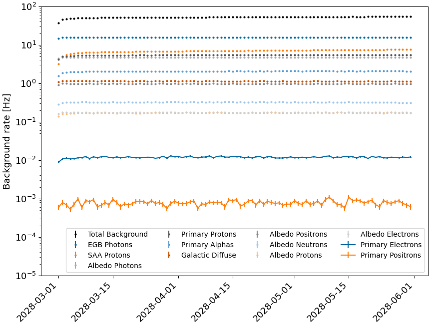
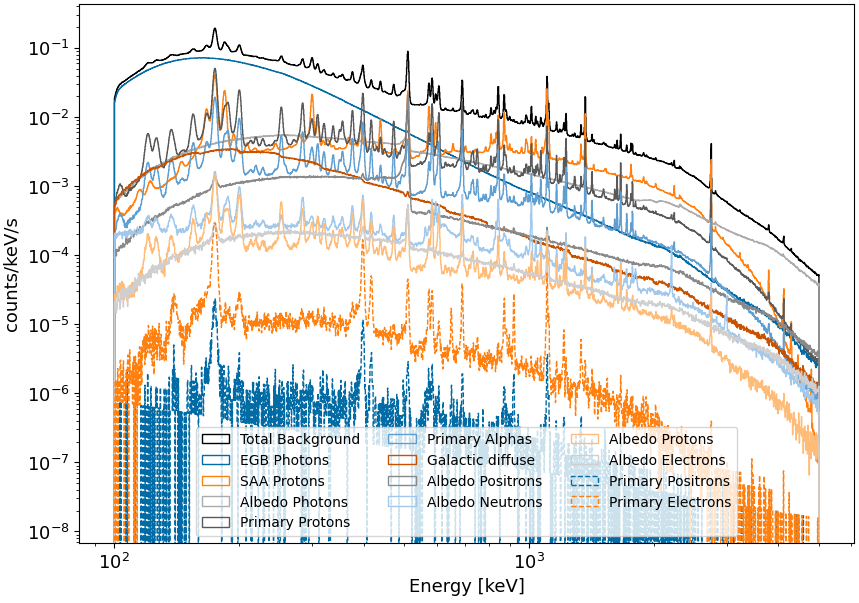
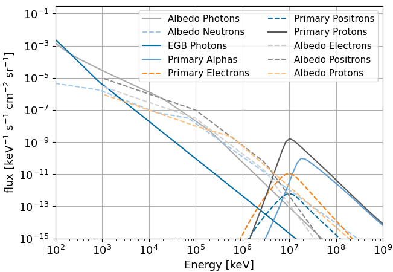
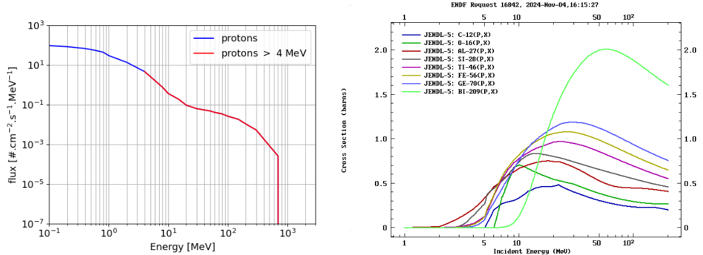

# Backgrounds

### Executive Summary
We employed MEGAlib to simululate 3 months of instrumental and astrophysical backgrounds (BGs), using an equatorial orbit at 530 km with a rocking of 22 degree every 12 hours. The astrophysical BGs include albedo emission, cosmic photons (i.e. the extragalactic gamma-ray background), and the Galactic diffuse continuum emission. The instrumental backgrounds arise from cosmic rays bombarding the instrument, and there is both a prompt component and a delayed component. The former is due to cosmic ray particles directly triggering the instrument. The latter is due to activation of the irradiated materials, which subsequently decay and emit photons that contribute to the BG emission. The instrumental BGs arise mainly from primary protons, primary alpha particles, atmospheric neutrons, primary electrons, primary positrons, and secondary protons electrons and positrons, all of which are included in DC3. In order to simulate the activation, MEGAlib keeps in memory each isotope created during the simulation until it decays (the expected decay time is computed according to the isotope lifetime and the event is rejected if this time is longer than the simulation time). This method accurately simulates the build-up of the activation during the 3 months of orbit. Our background simulations account for the time-dependent flux variation due to the changing geomagnetic cutoff along the orbit. Another important BG for COSI will be due to passage through the Southern Atlantic Anomoly (SAA). The SAA component is included in DC3 and will be describe below. Spectra and lightcurves for the DC3 BG components are shown below. Further details about the BG simulations are provided in the sections that follow. 

 

## Input Models

### Spectra and Source Files 
The input spectra are generated using the model from [Cumani](https://link.springer.com/article/10.1007/s10686-019-09624-0). This is implemented using the code **CreateBackgroundSpectrumMEGAlib.py**, available in the **DC3** branch of the [cosi-background](https://github.com/cositools/cosi-background/tree/DC3) repository. The user can choose the main parameters, including altitude, inclination, geomagnetic cutoff, etc. For DC3 we simulated an equatorial orbit at 530 km. Correspondingly, for the BGs we used the average rigidity cutoff for this orbit (10 GV) as the nominal value. Solar modulation is accounted for using the force field approximation, for which we use 520 MV, extrapolation of the expected solar activity in 2027. The resulting spectra are shown below. All of the input files used for the DC3 simulations can be found [here](https://github.com/cositools/cosi-sim/tree/main/cosi_sim/Source_Library/DC3). 

### South Atlantic Anomaly (SAA)
The spectrum and light curve of the trapped protons are generated using the model [IRENE AP9 v1.57.004](https://www.vdl.afrl.af.mil/programs/ae9ap9/) . The expected differential flux is computed for every 15s of DC3 orbit and then integrated over the energy to get the light curve. Since COSI will not take data during SAA passages, we did not simulate the trapped electrons component. In order to improve the simulation time, the spectrum is truncated at 4 Mev. This is motivated by the fact we are only interested into activation induced by the trapped protons during a SAA passage. As shown in the figures below, the proton cross-section with commun materials found in the spacecraft is negligible below 4 MeV. A 24h orbit test has been done for a cut at 2 MeV, showing no significant variation with a cut at 4 MeV.      

The corresponding light curve for a few days of orbit is shown in the figure below: 

### Galactic Diffuse Continuum Emission

 

The Galactic diffuse continuum emission is modeled using the v57 release of the GALPROP cosmic ray (CR) propagation and interstellar emissions framework [(Porter+22)](https://iopscience.iop.org/article/10.3847/1538-4365/ac80f6). GALPROP self-consistently calculates spectra and abundances of Galactic CR species and associated diffuse emissions (gamma rays, X-rays, and radio) in 2D and 3D. The v57 release includes a set of steady-state emission model examples that reproduce the latest CR data. There are six models in total, categorized according to the CR source and interstellar radiation field (ISRF) model used for the prediction. There are 3 CR source models (SA0, SA50, SA100) and two ISRF models (R12, F98). The CR source density models are based on the distribution of injected CR power, with SA0 describing an axisymmetric disk (following the radial distribution of pulsars), SA50 describing a 50/50% split of the injected CR luminosity between disk-like and spiral arms, and SA100 describing pure spiral arms. All models have the same exponential scale height of 200 pc. The two ISRF models employ different spatial densities for both the stars and the dust but produce intensities very similar to those of the data for near- to far-infrared wavelengths at the location of the solar system (see [Porter+17](https://iopscience.iop.org/article/10.3847/1538-4357/aa844d) and references therein). For the neutral gas distributions (atomic and molecular), a 3D model from [Johannesson+18](https://iopscience.iop.org/article/10.3847/1538-4357/aab26e) is employed. These GALPROP models include the total emission, which is dominated by inverse Compton radiation, but also has a small contribution from Bremsstrahlung towards the upper energy bound. As our representative case, for DC3 we simulate the SA100-F98 model. Spectra for the 6 models are shown with the grey band in the upper left plot, along with the measured from the 2016 COSI balloon flight, as described in [Karwin+23](https://iopscience.iop.org/article/10.3847/1538-4357/ad04df)

### Observing Strategy and Geomagnetic Cutoff Dependencies
The spacecraft coordinates have been generated with [SPENVIS](https://www.spenvis.oma.be/intro.php), as shown below. In addition, we added a +-22° rocking angle, with the northern sky observed for 12 hours, followed by a 8 minute slewing time, and then the southern sky observed for 12 hours. An example of the instrument's zenith pointing for 4 days of observation is shown below.

Based on these coordinates, the average geomagnetic cutoff (in GV) is calculated as in [Smart and Shea (2005)](https://www.sciencedirect.com/science/article/pii/S0273117705001997?via%3Dihub):

$$ R_{\mathrm{cutoff}} = \frac{g^1_0\cdot R_{\mathrm{Earth}}}{4}\cdot \left( 1+\frac{h}{R_{\mathrm{Earth}}}\right)^{-2}\cos^4({\lambda}), $$

with $h$ the altitude in km, $R_{\mathrm{Earth}}$ the radius of Earth, $\lambda$ the geomagnetic latitude, and $g^1_0$ a coefficient computed by the International Geomagnetic Reference Field [IGRF](https://www.ncei.noaa.gov/products/international-geomagnetic-reference-field). The geomagnetic latitude for each orbit is computed with the python package [aacgmv2](https://pypi.org/project/aacgmv2/). The IGRF results are released every 5 years. For the DC3 simulations we used the extrapolated value for the year 2027: $g^1_0 =$ 29147.79 nT.        

We calculate the geomagnetic cutoff for 15 second time intervals of the 3 month orientation file, and use this to obtain the integrated spectrum for each instrumental BG component. The geomagnetic cutoff dependencies are described in [Cumani+19](https://link.springer.com/article/10.1007/s10686-019-09624-0). This results in a light curve for each instrumental BG component, which is used as input for the simulations, in order to take into account the geomagnetic cutoff dependencies in the expected BG flux. Note that cosima only takes the light curve shape into account, and the overall flux normalization is set by the spectrum. We make the simplifying approximation that the spectral shape is constant with time. This is a reasonable assumption, considering that the geomagnetic cutoff only varies from 9-11.5 GV, and correspondingly, the change in spectral shape is minor.

## Simulations

The BG simulations have been ran on the [MOGON](https://mogonwiki.zdv.uni-mainz.de/docs/introduction/what_is_mogon) cluster in Mainz. They employ [MEGAlib](https://github.com/zoglauer/megalib) (*develop-cosi* branch) via the COSI simulation pipepline ([cosi-sim](https://github.com/cositools/cosi-sim)), using [DC3 COSI-SMEX mass model](https://github.com/cositools/massmodel-cosi-dc3). More specifically, for the source simulations (with *cosima*) we use the COSISMEX.sim.geo.setup version of the mass model. This uses a 2048-strip detector, which allows for the simulations to track the photon and particle interactions with very high precision, thus resulting in an idealized depth and energy resolution. For the event reconstruction (with *revan*) we use the COSISMEX.analysis.geo.setup version of the mass model. This employs a 64-strip detector that reflects actual hardware performance, incorporating measured energy and depth resolution. Since detector effects and hit clustering are applied in revan, using the analysis model ensures that the detector response is accurately represented. The three main steps of the simulations are summarized below.

### Cosima
The first step of the simulations is done with *cosima*. The *develop-cosi* branch is used with the mass model file **COSISMEX.sim.geo.setup**. In order to use multiple CPUs, the initial flux is divided by 1000. The full 3 months orbit is then run on 1000 CPUs in parallel. 

### Revan 

The second step is the event reconstruction done by *revan*. This part still use the *develop-cosi* branch of MEGAlib with the mass-model file **COSISMEX.analysis.geo.setup** and the configuration file **SMEXv12.Continuum.HEALPixO3.binnedimaging.revan.cfg**. 

### Mimrec

The last step is the event selection done by *mimrec* using the configuration file **SMEXv12.Continuum.HEALPixO3.binnedimaging.mimrec.cfg**. Here, all the tra files from the individual simulation are collected into a single extracted file that is then converted into a fits file (using cosipy).  

## Results

### Spectra and Light Curves 
The resulting spectra for each component are shown in the second figure at the top of this page. Note that here we are only considering the reconstructed Compton events, using the DC3 event selection. We can observe a dominance of the cosmic photons up to ~1 MeV,  The rates for each component are shown in the top figure at the top of the page. As expected, the rate is dominated by the cosmic photons and the proton/alpha delayed components.

### Time Variation

On a daily scale, it is difficult to see the variation due to the geomagnetic cutoff (GC). However, on the minute scale we can observe the rate variation which is opposite to the geomagnetic variation, as shown below. However, due to SAA passages that are removed from the data, the maximum peak of GC is also removed.

This validates the light curve models we used as input for the simulations.

### Activation Backgrounds

We can observe several lines in the cosmic ray components due to the activation of materials present in the mass model. The fact that a majority of the lines are common for all components suggests that these isotopes are produced by spallation reactions at high energy, where the type of particle does not matter. As a first approach, the line energies in the total spectrum are determined manually using matplotlib. A more robust method for the future will be to fit each line with a Gaussian, with its width constrained at the instrumental resolution. Almost all the lines are identified also thanks to the identification of SPI/INTEGRAL BG lines in [Weidenspointner+03](https://hal.in2p3.fr/in2p3-00022236v1/file/in2p3-00022236.pdf) and [Diehl+18](https://ui.adsabs.harvard.edu/abs/2018A%26A...611A..12D/abstract). The table below summarizes most of the lines we can identify in the total spectrum. 

