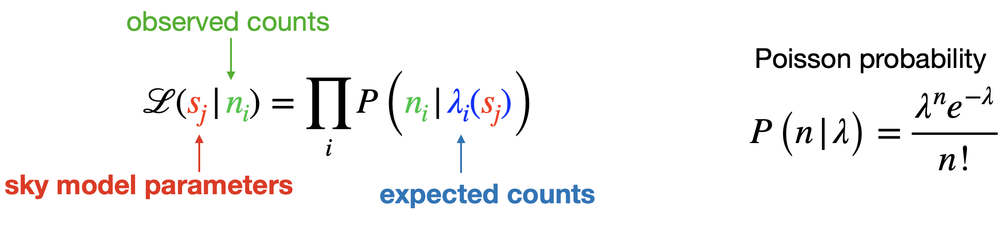
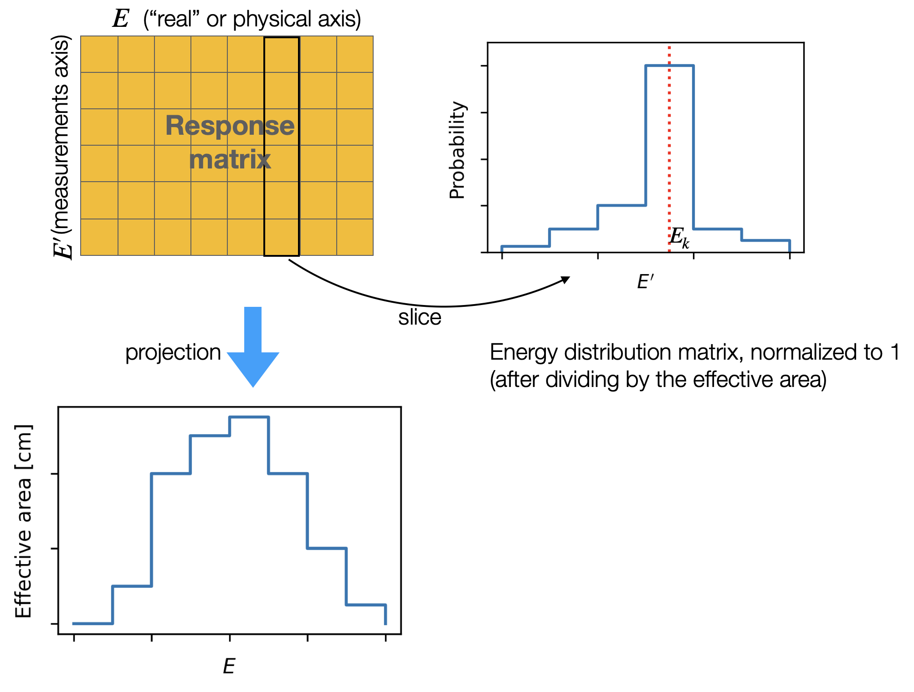
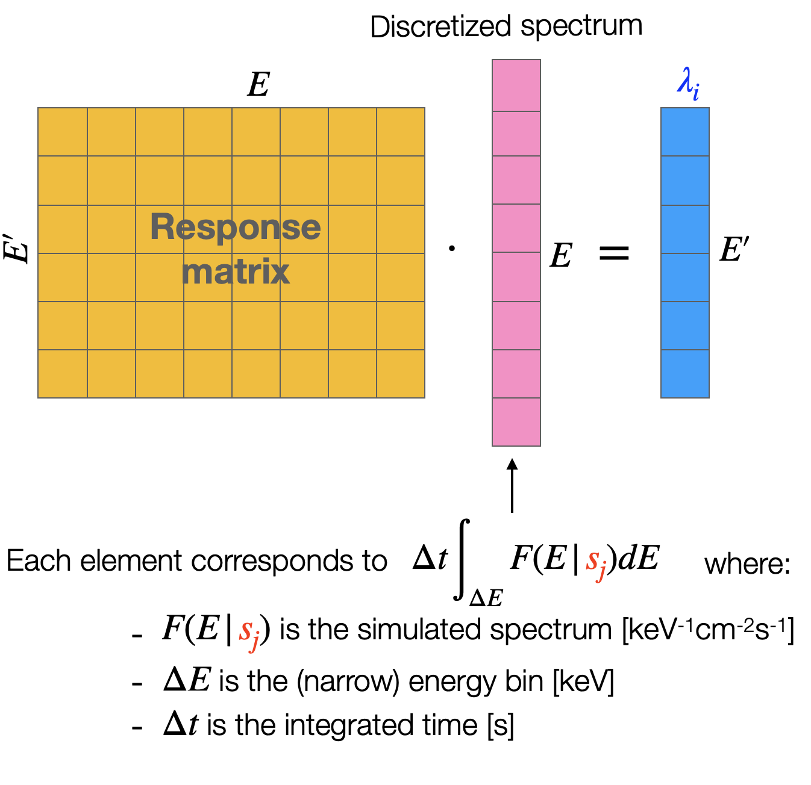
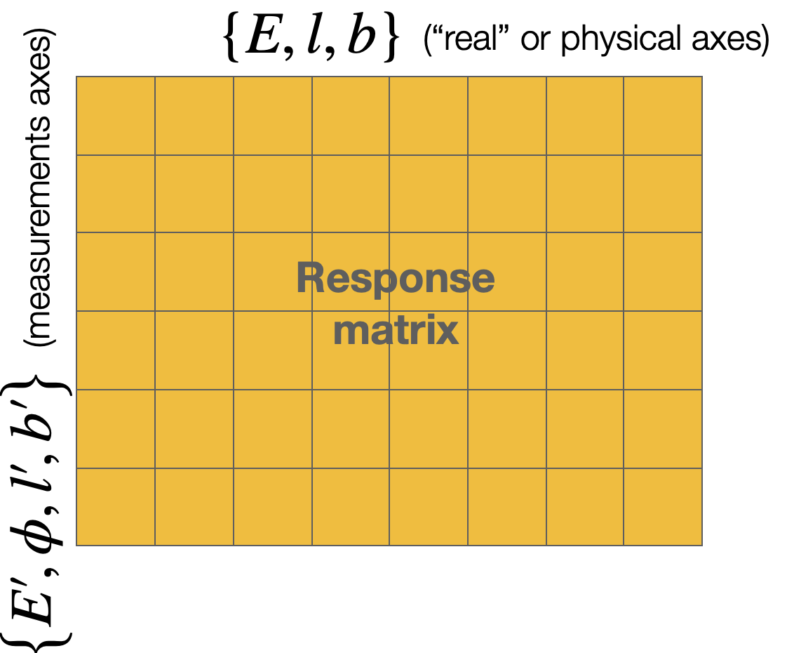
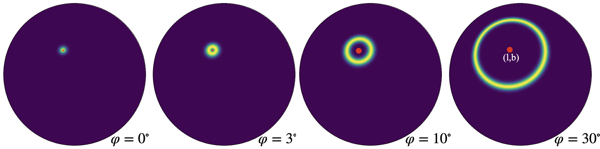
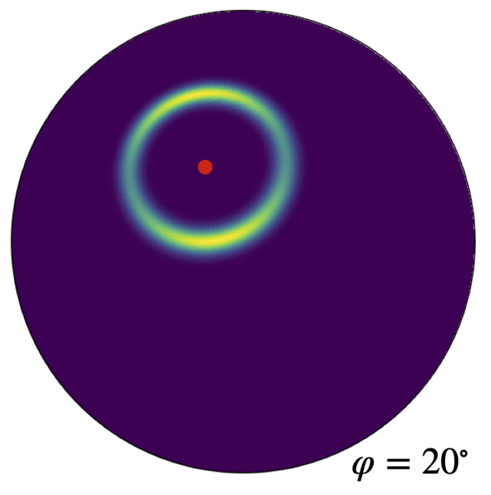
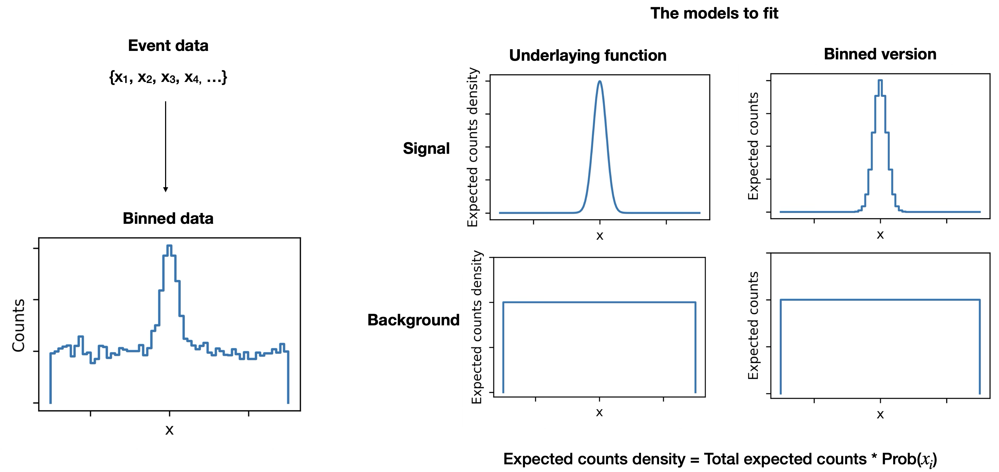
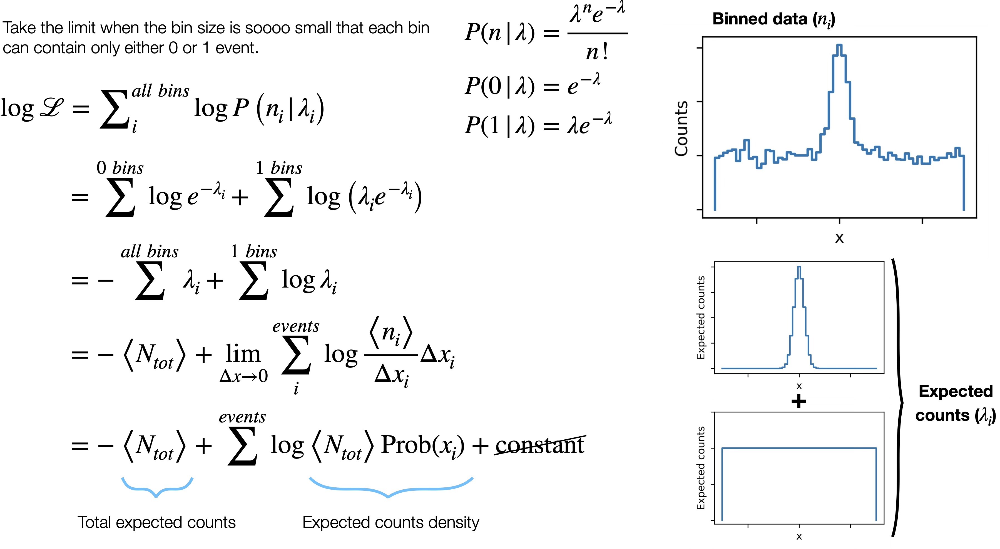
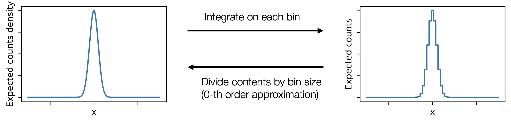
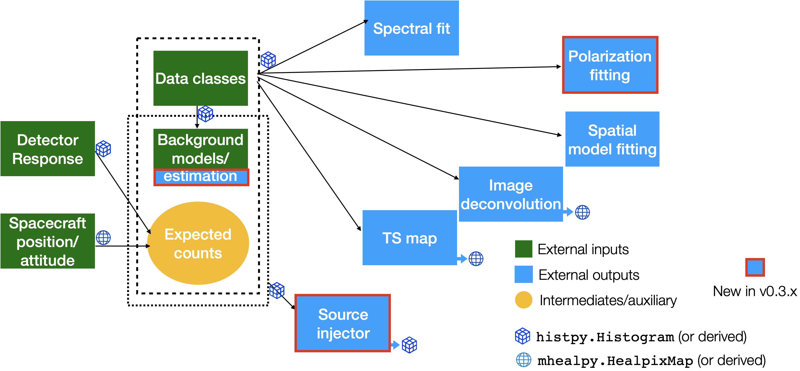

# Introduction to cosipy

The cosipy library is [COSI](https://cosi.ssl.berkeley.edu)'s high-level analysis software. It allows you to extract imaging and spectral information from the data, as well as to perform statistical model comparisons. The cosipy products are meant to be ready for interpretation.

The main repository is hosted at https://github.com/cositools/cosipy

Here we explain how cosipy works internally, including the statistical analysis. We also end with a note on the next steps for cosipy.

For the cosipy installation and usage instructions please refer to the main [cosipy documentation](https://cositools.github.io/cosipy/).

## cosipy and COSITools

COSItools is the collection of all COSI data-analysis tools, including raw data formatting, calibration, reconstructions, and simulations. The cosipy library is the final of all the steps in the pipeline, shown in the following diagram as the "High-level Data Analysis" block


The cosipy inputs are the calibrated and reconstructed data, the spacecraft orientation history, and MEGAlib's event-by-event simulations. Cosipy combines these data using statistical tools to infer physical information, such as spectra and images, and obtain model comparison statistics. These then need to be interpreted by the user.

The cosipy library is open-source and written in Python.

## The cosipy analysis

Cosipy uses a likelihood-based forward-folding technique. This means that different source hypotheses are convolved with the instrument response in order to obtain the expected data. The expectation is directly compared to the observed data to evaluate the likelihood that the source hypothesis explains the observations, and therefore find the best model. In the following section, we explain what we actually mean by all of this! 

You can also explore how the analysis works through a series of [tutorials](https://github.com/israelmcmc/gammaraytoys/tree/main/docs/tutorials) in a simplified 2D world in the [gamma-ray toys](https://github.com/israelmcmc/gammaraytoys) repository. 

### Likelihood analysis

Every analysis in cosipy is based on the following likelihood function:



A way to interpret it is that the likelihood of a given physical model given the observed data equals the probability of obtaining the particular observed data sample given the physical model.

In our case, the physical sky model is composed of all the source parameters considered by the user. For example, the flux of various sources, their spectral index, sky location, background level, etc. The parameters can also be flux values on each location of the discretized sphere, as is the case when we do imaging.

The observed data corresponds to the measured counts in each bin. In COSI we bin the data in measured energy, and the Compton Data Space (see [below](#anchor_CDS)). These are integer values, are are typically sparse ---i.e. most bins are empty.

The expected counts are the number of observed counts you would expect from simulation given a set of sky model parameters. This allows us to compare directly to the data, apples with apples. As opposed to the observed counts, these are not integers but floating point numbers, since they correspond to the _average_ number of counts you would observe. There is one such number per bin in the data space, and typically it is not sparse --i.e. you can expect something close to 0, but not exactly 0, unless the bin is actually unphysical. In the next [section](#anchor_rsp_intro) we will see how to obtain them.

The probability of observing a given number of counts based on the expectation is described by a Poisson distribution. In other words, we are assuming that the photons are totally independent of each other

Although there are multiple ways to use the likelihood to perform inference analysis, so far we have only performed maximum likelihood estimations (MLE). Our goal is to obtain the best estimates for the real values of the sky model parameters given the data, and those correspond to the parameters that maximize the likelihood --i.e. those that maximize the probability of obtaining our data sample. The corresponding equation is:


$$\mathcal{L}(\hat{\color{red}s_j }|{\color{PineGreen}n_i}) = \max \mathcal{L}({\color{red}s_j }|{\color{PineGreen}n_i})$$

<a name="anchor_rsp_intro"></a>
### The detector response: an introduction

In principle, for each set of sky model parameters, we could run the MEGAlib simulations and see how many events we obtain on average, which corresponds to the expected counts. This is not feasible since we need to run this multiple times while we sample the parameters space. Instead, we build a detector response matrix that encodes the information that we need. 

In order to understand the mechanics, let's forget for a moment about imaging and assume the only measured value is the energy. For this case, we simulate multiple photons at various _real_ energies ($E$) and record how many we detect in total ($N_{det}$), and how their _measured_ energies are distributed ($E'$). Since we know the events per unit area (flux) used in the simulations, we can compute the effective area as:

$$A_{eff} = \frac{N_{det}}{flux}$$

The effective area is a function of the energy, so we choose multiple values. The effective area of each sampled energy point, distributed based on the _measured_ energies observed in the simulations, is the detector response matrix:



The response matrix then related physical value -e.g. the real energy $E$- to measured quantities -e.g. number of counts in a measured energy $E'$ bin. This is achieved by discretizing the spectrum of a given source model and performing a matrix multiplication or "convolution":



Note that while now we can obtain the expected excess relatively quickly, we paid a penalty by discretizing the effective area and the spectrum. This introduces an error, which is why it is important to use narrow energy bins. On the other hand, a coarse _measured_ energy axis will not introduce an error, but it can severely degrade the sensitivity of the analysis. 

<a name="anchor_CDS"></a>
### The Compton Data Space

In addition to the measured energy, COSI can also obtain imaging and polarization information encoded in the Compton Data Space (CDS) (see diagram below):

- (l',b'): The direction of the scattered gamma after the first interaction. Typically in galactic coordinates.
- $\phi$: The polar scattering angle. Although we don't know the direction of the incoming gamma ray, we do know the scattering angle due to kinematics.


This is key to performing imaging since the photons from a source form a clearly identified cone in the CDS. This is what allows us to disentangle the different sources in our field of view at any given time! The following shows an example for two sources: if we only had (l',b'), we could not resolve the different sources:


### The detector response: full version

As we saw in the previous section, in order to do spectral *and* imaging we need to bin the data into both the measured energy and the full CDS (four dimensions). Respectively, the total expected counts and their distribution depend on the real photon energy and the source location (three dimensions). The full response is then a 7-dimensional matrix, composed of both physical and measured axes:



Although this might look more complicated, the mechanics are exactly the same as for the simplified spectral analysis with a 2D response that we saw in the [previous section](#anchor_rsp_intro). The expected number of counts is still a matrix multiplication. The projection onto the physical axes is still the effective area. A slice for a given combination of energy, measured energy, and direction (red dot) looks like this in the Compton Data Space: 



This is the point spread function (PSF) of a Compton instrument.

For polarized sources, the PSF shows a modulation in the azimuth direction:



This allow us to fit the polarization degree and polarization angle. The modulation fraction is both the energy and the scattering angle, which is why can gain fitting leverage by keeping the measured data space intact (Ei + CDS), as opposed to projecting in into the azimuthal angle. In addition, this allows us to simultanously fit the spectrum and the location, as well as multiple sources.

For simplicity, we have assumed that the spacecraft is fixed in an inertial reference frame –galactic coordinates, in this case. In reality, the spacecraft is always moving, and the response of the instrument –a function of the local spacecraft coordinates– needs to be convolved with the orientation history of the spacecraft. During this convolution, the algorithm computed the portion of the field of view blocked by the Earth at any given time, and sets to zero the contribution to the signal from sources in that region.

## Unbinned analysis

In version 0.4, cosipy added the ability to perform an unbinned analysis, i.e., using event-by-event information rather than first binning events into a counts histogram. While this method applies to the full Compton data space, we illustrate the key ideas here using a simple toy model: a Gaussian signal on top of a flat background.



The variable x can represent any measured quantity (e.g., energy, time).

The key point is that the unbinned analysis is exactly equivalent to the Poisson-likelihood binned analysis in the limit where the bin size goes to zero. The derivation of the “unbinned likelihood” from a binned Poisson likelihood follows from the observation that the Poisson probability remains valid in the arbitrarily low-count regime, and that infinitesimally small bins can contain either 1 event or 0 events:


  
Since only likelihood differences matter, the constant term at the end of the equation can be ignored. 

For this to work, we need a way to estimate the expected counts density, which is the total expected number of counts multiplied by the probability density of observing the measurements recorded in a particular event. In other words, this probability term is a probability density function (PDF). There are multiple ways to estimate this PDF, but the simplest (and most intuitive) is to divide the expected-counts histogram by the bin size:

  

More generally, by “bin size” we mean the phase-space "volume" contained in a bin. For example, if the relevant measured quantity is a direction on the sky, then the corresponding phase space has units of solid angle, and the bin size is an area element in solid angle. The PDF is therefore not unitless. Instead, it is a probability density per unit phase space (e.g., per unit energy, per unit time, per radians, and/or per unit solid angle).

This applies both to the expected counts density from a signal source and from a background source. An “unbinned” response or background model is therefore an estimate of the underlying PDF. Note that the data used to build this estimate does not itself need to be unbinned.
Some remarks about unbinned analyses that sometimes cause confusion:

* A finely binned analysis is equivalent to an unbinned analysis (and vice versa). It is the same calculation.
    - Both approaches are equally susceptible to systematics from mismodeling of the response or background.
* Whether to use a binned or unbinned analysis is a matter of computational resources:
    - An unbinned analysis can be more computationally efficient than a finely binned analysis when the number of bins is comparable to the number of events.
    - Our current binned analysis is considerably coarser than it should be --compared to COSI's resolution-- which directly leads to known systematics.
    - Although the cost of the unbinned analysis is significantly higher than our current coarse analysis, it should be compared to a hypothetical finely binned analysis.

## The cosipy modules, inputs and outputs

In cosipy, different modules are combined to perform the implementation of the likelihood computation described above.

- The DataIO module performs the binning of the data ($n_i$). 
- The Spacecraft File module keeps track of the spacecraft orientation, so we can transform galactic coordinates to detector coordinates.
- The Detector Response module reads the response matrix obtained from MEGAlib and produces the expected signal counts.

We add the expected background counts to obtain the total expectation. The shaped of the background (in Ei+CDS) can be based on a simulated template, or estimated based on data. In addition, the normalization can be let free parameter of the model. 

The likelihood is then maximized by other modules, which have different goals:

- Spectral fit: the sky model parameters are the source(s) spectral shape and normalization parameters. The source location can also be float, but the initial guess is nearby. 
- TS map: the sky model parameters are the source sky location. Is it designed to look for a source --e.g. a GRB-- in the whole sky.
- Image deconvolution: the sky model is discretized, effectively having one free parameter for every sky pixel and energy bin. The main advantage is that is it not model-dependent; the main disadvantage is that it is hard to estimate errors due to the high correlation between the different parameters.
- Polarization: fit the polarization angle and polarization degree.

Cosipy provides a "source injector" which packages the expected excess into a standard data format, which effectively be used to simulate a source without running the event-by-event Monte Carlo in MEGALib.

Internally, all modules handle the data using the objects:

- [histpy.Histogram](https://histpy.readthedocs.io/en/latest/): labeled axes in a matrix, support sparse matrices, perform projections and slice operations, etc.
- [mhealpy.HealpixMap](https://mhealpy.readthedocs.io/): sphere discretized using the [HEALPix](https://healpix.sourceforge.io/) standard.  



## Interfaces and protocols

With the intention of allowing developers and users to easily try different versions of every component needed to compute the likelihood, ``cosipy`` defines a series of interfaces. These are protocol classes with well-defined inputs and outputs. A description of each interface is available in the [cosipy documentation](https://cositools-cosipy.readthedocs.io/en/latest/api/interfaces.html).

Many current implementations of these interfaces are wrappers around classes from the modules above, which predate the interfaces refactor. However, any code that accepts an interface is agnostic to the underlying implementation, so you can swap in your own implementation—for testing, experimentation, or extending cosipy—without modifying cosipy itself. That is, at least, the goal. If you find that an interface definition is not sufficient for your needs, please open an issue to discuss it.

## Integration with 3ML and astromodels

The Multi-Mission Maximum Likelihood framework ([3ML](https://threeml.readthedocs.io/en/stable/)) is a common interface to perform a likelihood-based analysis across multiple instruments. Since all instruments observe the same source, their likelihoods for a common source model can be simply multiplied to obtain the global likelihood:

```math
\mathcal{L}(\mathrm{model}) = \mathcal{L}_{\mathrm{NuSTAR}}(\mathrm{model}) \cdot \mathcal{L}_{\mathrm{GBM}}(\mathrm{model}) \cdot \mathcal{L}_{\mathrm{COSI}}(\mathrm{model}) \cdot \mathcal{L}_{\mathrm{LAT}}(\mathrm{model}) \cdot \mathcal{L}_{\mathrm{HAWC}}(\mathrm{model})\ldots
```

All 3ML needs is a plugin for each instrument that accepts a common model in a predetermined format ([astromodels](https://astromodels.readthedocs.io/en/latest/)), convolves it with its particular instrument response, and returns a likelihood. This is precisely what COSILike does.

Once you have a global likelihood function, the analysis machinery is the same whether you have one detector or multiple. This is why we reuse directly the 3ML algorithms to perform our spectral analysis!

## Next steps and challenges

The cosipy library is under active development in preparation for the COSI launch scheduled in 2027. There are currently +70 open issues and/or desired features as of today!

There are three main development frontiers:

### Background estimation

In Data Challenge 2, we assumed that the shape of the background distribution was known. While the background normalization was treated as a free parameter, we used the same background distribution in measured energy and Compton Data Space as in the simulated dataset.

In DC3, we introduced methods to estimate the background directly from the data, but these resulted in large uncertainties.

In DC4, background estimation techniques improved relative to DC3, but they have not yet been tested on the full, realistic DC4 dataset. We expect these methods will need to be refined based on what we observe, and will likely require a combination of simulated and data-driven background templates, as well as dedicated strategies tailored to specific analyses. This is one of the main *challenges* of DC4.

### Improve performance and reduce compute costs

While the current version of `cosipy` can, in principle, extract all scientifically relevant measurements from COSI data, we expect that in practice some analyses will currently turn to be too computationally expensive.

There are several areas where we can likely make substantial improvements, including a number of low-hanging opportunities:

- Identify performance bottlenecks and improve code efficiency.
- For unbinned analyses, improve event selection so we do not spend time processing low-quality events.

Even with these improvements, some analyses (e.g., imaging the diffuse continuum emission) are expected to remain beyond the capabilities of a typical personal computer and will require execution on a large computing cluster. Setting up and running these analyses on a computing cluster is also one of the key DC4 *challenges*.

### Usability and maintenance

These tasks include:

- Improve parts of the documentation that might not be clear
- Standardize the API and coding style across all modules
- Develop yaml-configurable analysis scripts


