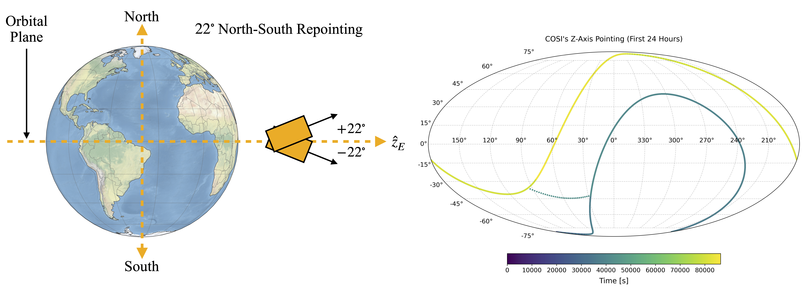
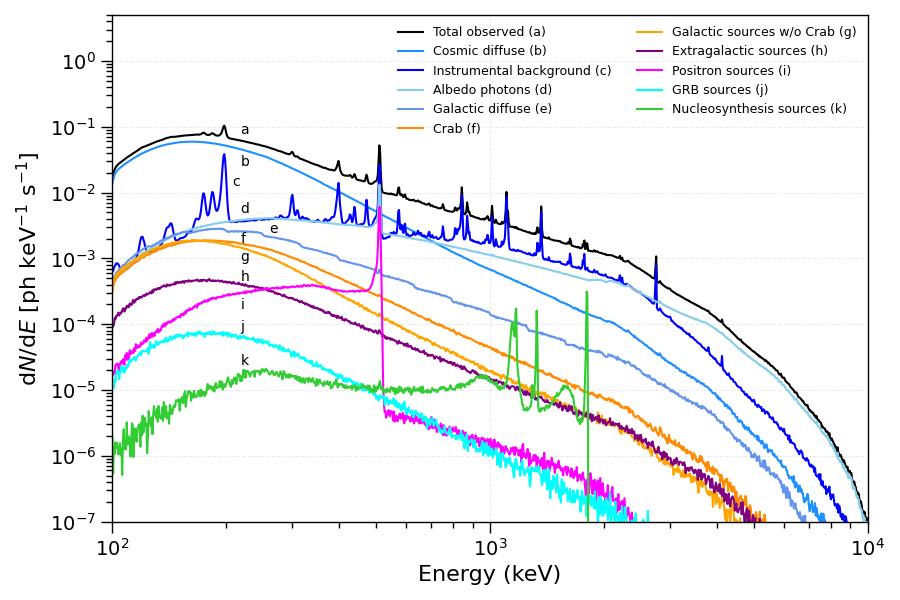
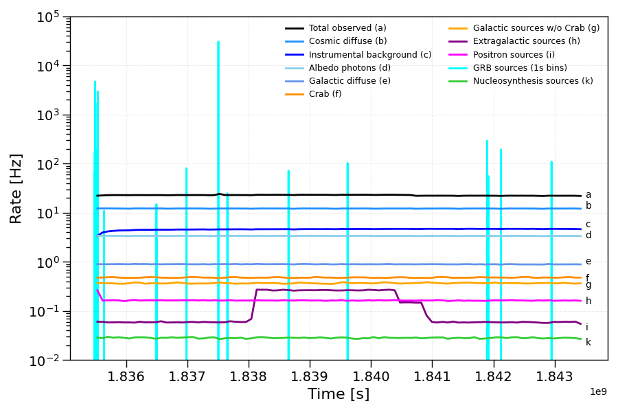

# Data Products

### Simulated Data

We simulated 3 months of exposure for an equatorial orbit at 530 km. The simulations mimic the actual time-dependence of the instrument's pointing on the sky. The instrument rocks between $\pm 22^\circ$ from the Earth zenith every 12 hours, with a slewing time of 8 minutes. This is similar to the pointing strategy for the actual satellite mission, with the exception that the solar panels may need to be rotated based on the exposure to the Sun, which will effect the slewing time (expected to be between $\sim 4 - 12$ minutes). The orbital period is 1.73 hrs. With this pointing strategy, COSI will observe the entire sky every day. The right panel in the figure below shows the pointing of the instrument's z-axis as a function of time for the first 24 hours, in Galactic coordinates. Note that the dotted curve corresponds to the slewing of the instrument.

The simulations employ [MEGAlib](https://github.com/zoglauer/megalib) (*develop-cosi* branch) via the COSI simulation pipepline ([cosi-sim](https://github.com/cositools/cosi-sim)), using version 21 of the COSI-SMEX mass model ([massmodel-cosi-dc3
](https://github.com/cositools/massmodel-cosi-dc3)). The far left image below shows the mass model plotted with MEGAlib's *geomega*. In addition to the payload, the satellite mass is also included, below the payload interface plate. For comparison, we also show a schematic of the payload (middle) from [Tomsick+23](https://ui.adsabs.harvard.edu/abs/2023arXiv230812362T/abstract) and a recent photo of the assembled flight model germanium detectors (right).

For the source simulations (with *cosima*) we use the COSISMEX.sim.geo.setup version of the mass model. For the event reconstruction (with *revan*) we use the COSISMEX.analysis.geo.setup version of the mass model. The primary difference between the two mass models is how they handle the detector resolution and response. The simulation model uses a 2048-strip detector, which allows for the simulations to track the photon and particle interactions with very high precision, thus resulting in an idealized depth and energy resolution. In contrast, the analysis model employs a 64-strip detector that reflects actual hardware performance, incorporating measured energy and depth resolution. Since detector effects and hit clustering are applied in *revan*, using the analysis model ensures that the detector response is accurately represented. 

We simulate energies between 100 keV - 10 MeV. Note that COSI's nominal energy range is 200 keV - 5 MeV, but we used an upper bound of 10 MeV in order to account for energy dispersion. Earth occultation is accounted for in the simulations by blocking all photons with arrival directions beyond $\mathrm{\sim 113^\circ}$ of the Earth zenith (see [here](https://github.com/cositools/cosi-data-challenges/tree/develop/earth-occultation) for more details). Events that occure during the passage of the Southern Atlantic Anomaly (SAA) are removed. We only select photons corresponding to Compton events. The full configuration files used for the event reconstruction (with *revan*) and extracting the data (with *mimrec*) can be found [here](https://github.com/cositools/cosi-sim/tree/main/cosi_sim/Input_Files/Configuration_Files/Data_Challenges/Data_Challenge_3). 

### Computing Resources

  
Simulations for the COSI Data Challenges are run on high performance computing clusters. We have made extensive use of the [Discover cluster](https://www.nccs.nasa.gov/systems/discover) at NASA Goddard Space Flight Center (part of the NASA Center for Climate Simulation - NCCS), the [MOGON](https://mogonwiki.zdv.uni-mainz.de/docs/introduction/what_is_mogon) cluster in Mainz, Clemson University's [Palmetto](https://docs.rcd.clemson.edu/palmetto/) cluster, and the NASA Advanced Supercomputing ([NAS](https://www.nas.nasa.gov/)) facility at Ames Research Center. We used 1000 parallel cores for most of the source simulations, which allowed us to simulate them in a fairly short time (typically less than ~10 minutes of total wall time per source). The background simulations are generally much more computationally intensive, with the extreme case being the SAA component, which required roughly 1.5M CPUh to simulate. The other background components required ~180k CPUh each.  

### Simulation Tools
The simulations employ [MEGAlib](https://github.com/zoglauer/megalib) via the Python-based COSI simulation pipepline, [cosi-sim](https://github.com/cositools/cosi-sim). Details regarding the specific MEGAlib version and configuration files are specified above. Model inputs for the simulations and the corresponding Data Challenges come from the COSI science team. All of the models used for past Data Challenges can be found in the source library of the cosi-sim tools ([link](https://github.com/cositools/cosi-sim/tree/main/cosi_sim/Source_Library)).  

### Data Format
The data is provided in FITS file format, which contains all of the photon information for each reconstructed event. If you are unfamiliar with analysis of Compton data, we highly recommend reading the introduction page [here](https://github.com/cositools/cosi-data-challenges/tree/develop/Compton-telescope-data-analysis-intro), which covers some of the fundamental topics. In short, the data for each reconstructed photon event is decribed in terms of four axes: energy, time, Compton scattering angle (&phi;), and event circle axis (&psi; &chi;). For Compton data, photons occupy what is known as the Compton data space, which is a 3-dimensional space defined by the axes &phi;, &psi;, and &chi;, where &psi; and &chi; are the angles defining the vector that points from the location of the second detector hit to the location of the first detector hit. A reconstructed photon event corresponds to a so-called event circle on the sky, where the axis of the circle is given by the &psi; &chi; vector, and the radius of the circle is given by the Compton scattering angle &phi;. For the actual data analysis, &psi; and &chi; are defined using a healpix grid, allowing us to reduce this to a single dimension (&psi; &chi;), i.e. the healpix pixel number.  

### Accessing the Data

The data is hosted on [wasabi](https://console.wasabisys.com/file_manager/cosi-pipeline-public?region=us-west-1), and it can be downloaded using the command line prompt below:
<pre>
AWS_ACCESS_KEY_ID=GBAL6XATQZNRV3GFH9Y4 AWS_SECRET_ACCESS_KEY=GToOczY5hGX3sketNO2fUwiq4DJoewzIgvTCHoOv aws s3api get-object  --bucket cosi-pipeline-public --key full/path/your_file --endpoint-url=https://s3.us-west-1.wasabisys.com your_file
</pre>
Note that you must replace 'full/path/your_file' (after '--key') and 'your_file' (at the end) with the actual path and file. All the needed paths and file names are given below. 

Alternatively, cosipy has a utility function that can be used for downloading files. The usage is as follows:
<pre>
from cosipy.util import fetch_wasabi_file
  
fetch_wasabi_file('full/path/wasabi/file')
</pre>
Note that an error will be thrown if the file already exists. To overwrite the existing file, the keyword ``override=True`` can be passed.   

### Mock Dataset

For DC4 we have produced a single mock dataset intended to mimick the real flight data for 3 months of observations. The mock dataset includes 64 sources plus total background. The data is provided in weekly files, and it can be downloaded from wasabi: 

wasabi path: COSI-SMEX/DC4/Data/Mock_Dataset  
weekly file names: dc4_mock_dataset_week_i_unbinned_data_filtered_with_SAAcut.fits.gz, for i between 1-14.

Below are plots showing the total observed counts spectrum and light curve, along with contributions from individual components. The total background is divided into cosmic diffuse, instrumental, albedo photons, and Galactic diffuse continuum. We refer to these as “backgrounds” because they constitute background emission for many astrophysical analyses, although each component is scientifically interesting in its own right. For the sources, the total contributions from each of COSI's five primary science groups are shown (Galactic, Extragalactic, Positrons, GRBs, and Nucleosynthesis). In addition, the Crab is plotted separately, since it's an important calibration source. The bin size for the light curve is 1 week, except for the GRBs which have 1 second bins (otherwise their flux is washed out by the large bin size).

 

The data analysis also requires spacecraft orientation files and response files. Information for these files is provided in the tabs below. For reference, the individual simulation files that make up the mock dataset are also available, as specified in the *Background Files* and *Source Files* tabs. Note that the DC4 mock dataset is comprised of a combination of sources from DC3 and new simulations for DC4. 

  
Orientation Files

  
DC4 uses the same orientation file from DC3.   
  
wasabi path: COSI-SMEX/DC3/Data/Orientation  

files:  
DC3_final_530km_3_month_with_slew_1sbins_GalacticEarth_SAA.ori  
DC3_final_530km_3_month_with_slew_15sbins_GalacticEarth_SAA.ori   

  
Response Files

  
**Detector Response Files:**  
wasabi path: COSI-SMEX/DC4/Data/Responses  
Response26Al.o4.e1805_1812.s10036231691364.m1045.filtered.nonsparse.binnedimaging.imagingresponse.h5  
Response44Ti.o4.e1154_1160.s9607532021290.m1215.filtered.nonsparse.binnedimaging.imagingresponse.h5  
Response511.o4.e509_513.s20881894470591.m2555.filtered.nonsparse.binnedimaging.imagingresponse.h5  
Response60FeHigh.o4.e1329_1336.s10201526728102.m1287.filtered.nonsparse.binnedimaging.imagingresponse.h5  
Response60FeLow.o4.e1170_1176.s9552269354945.m1188.filtered.nonsparse.binnedimaging.imagingresponse.h5  
ResponseContinuum.o3.e100_10000.b10log.s10396905069491.m2284.filtered.nonsparse.binnedimaging.imagingresponse.h5  
ResponseContinuum.o3.pol.e200_10000.b4.p12.relx.s10396905069491.m420.filtered.binnedpolarization.11D.h5  
Response44Ti_high_res.h5 (pending)  
ResponseContinuum_pol_high_res.h5 (pending)  
Response511Line_and_Continuum.h5 (pending)  
ResponseLineDM.h5 (pending)  

**Extended Source Response Files:**  
wasabi path: COSI-SMEX/DC3/Data/Responses/extended_source_response  
extended_source_response_511_merged.h5.gz  
extended_source_response_continuum_merged.h5.gz  
extended_source_response_Al26_merged.h5.gz  
extended_source_response_Ti44_merged.h5.gz  
extended_source_response_Fe60_low_merged.h5.gz  
extended_source_response_Fe60_high_merged.h5.gz  

  
Background Files

  
Details for the background simulations can be found [here](https://github.com/cositools/cosi-data-challenges/tree/develop/backgrounds). The backgrounds for the DC4 mock dataset are similar to the backgrounds used for DC3, although some components have been updated. All individual components for both DC3 and DC4 are listed below. For convenience, we also provide the total background file.  

Note: Not all background components from DC3 are included in the mock dataset, as many were re-simulated for DC4. The distinction between included and excluded sources is indicated below.

DC4 background files:  
wasabi path: COSI-SMEX/DC4/Data/Backgrounds  

Unbinned Files (**included in mock dataset**):  
Total_DC4_BG_3months_unbinned_data_filtered_with_SAAcut_withSAAbck.fits.gz  
SecondaryPositrons_3months_unbinned_data_filtered_with_SAAcut.fits.gz  
SAA_3months_unbinned_data_filtered_with_SAAcut_statreduced_akaHEPD01result.fits.gz  
AlbedoPhotons_WithDetCstunbinned_data_filtered_with_SAAcut.fits.gz  
SecondaryProtons_WithDetCstunbinned_data_filtered_with_SAAcut.fits.gz  
AlbedoNeutrons_WithDetCstunbinned_data_filtered_with_SAAcut.fits.gz  
PrimaryPositrons_WithDetCstunbinned_data_filtered_with_SAAcut.fits.gz  
PrimaryElectrons_WithDetCstunbinned_data_filtered_with_SAAcut.fits.gz  
PrimaryAlphas_WithDetCstunbinned_data_filtered_with_SAAcut.fits.gz  
PrimaryProtons_WithDetCstunbinned_data_filtered_with_SAAcut.fits.gz  

DC3 background files:  
wasabi path: COSI-SMEX/DC3/Data/Backgrounds/Ge  

Unbinned Files (**included in mock dataset**):  
CosmicPhotons_3months_unbinned_data_filtered_with_SAAcut.fits.gz  
GalTotal_SA100_F98_3months_unbinned_data_filtered_with_SAAcut.fits.gz  
SecondaryElectrons_3months_unbinned_data_filtered_with_SAAcut.fits.gz  

Unbinned Files (**not included in mock dataset**):  
Total_BG_with_SAAcomponent_3months_unbinned_data_filtered_with_SAAcut.fits.gz  
Total_BG_without_SAAcomponent_3months_unbinned_data_filtered_with_SAAcut.fits.gz  
AlbedoNeutrons_3months_unbinned_data_filtered_with_SAAcut.fits.gz  
AlbedoPhotons_3months_unbinned_data_filtered_with_SAAcut.fits.gz  
SAA_3months_unbinned_data_filtered_with_SAAcut.fits.gz  
PrimaryProtons_3months_unbinned_data_filtered_with_SAAcut.fits.gz  
PrimaryAlphas_3months_unbinned_data_filtered_with_SAAcut.fits.gz  
PrimaryElectrons_3months_unbinned_data_filtered_with_SAAcut.fits.gz  
PrimaryPositrons_3months_unbinned_data_filtered_with_SAAcut.fits.gz  
SecondaryProtons_3months_unbinned_data_filtered_with_SAAcut.fits.gz  
SecondaryPositrons_3months_unbinned_data_filtered_with_SAAcut.fits.gz  

  
Source Files

  
The DC4 mock dataset is comprised of a combination of sources from DC3 and new simulations for DC4. All individual source files from both DC3 and DC4 are available and listed below. 

Note: Not all simulated sources are included in the mock dataset. The distinction between included and excluded sources is indicated below. 

DC4 Sources:  
For DC4 we simulated 24 unique sources. 

wasabi path: COSI-SMEX/DC4/Data/Sources  

Unbinned Files (**included in mock dataset**):  
CasAG16distribution_3months_unbinned_data_filtered_with_SAAcut.fits.gz  
cygX3_3months_unbinned_data_filtered_with_SAAcut.fits.gz  
GS1903_unbinned_data_filtered_with_SAAcut.fits.gz  
Kepler_3months_unbinned_data_filtered_with_SAAcut.fits.gz  
MgtBurst_bright_complex_unbinned_data_filtered_with_SAAcut.fits.gz  
OrEr_3months_unbinned_data_filtered_with_SAAcut.fits.gz  
positron_annihilation_in_flight_3months_unbinned_data_filtered_with_SAAcut.fits.gz  
Positrons_Central_Source_3months_unbinned_data_filtered_with_SAAcut.fits.gz  
positrons_thin_disk_cont_3months_unbinned_data_filtered_with_SAAcut.fits.gz  
positrons_thin_disk_line_3months_unbinned_data_filtered_with_SAAcut.fits.gz  
SN1987A_unbinned_data_filtered_with_SAAcut.fits.gz  
Tycho_3months_unbinned_data_filtered_with_SAAcut.fits.gz  
USco_3months_unbinned_data_filtered_with_SAAcut.fits.gz  
VelaJr_44Ti_3months_unbinned_data_filtered_with_SAAcut.fits.gz  
LMC_511_3months_unbinned_data_filtered_with_SAAcut.fits.gz  
M31_511_3months_unbinned_data_filtered_with_SAAcut.fits.gz  
Virgo_511_3months_unbinned_data_filtered_with_SAAcut.fits.gz  
NGC_1068_3months_unbinned_data_filtered_with_SAAcut.fits.gz  
NGC_4151_3months_unbinned_data_filtered_with_SAAcut.fits.gz  
1RXSJ170849_3months_unbinned_data_filtered_with_SAAcut.fits.gz  
magnetar2_3months_unbinned_data_filtered_with_SAAcut.fits.gz  
4C71p07_3months_unbinned_data_filtered_with_SAAcut.fits.gz  
3C454p3_low_3months_unbinned_data_filtered_with_SAAcut.fits.gz  
3C454p3_high_3months_unbinned_data_filtered_with_SAAcut.fits.gz  
CenA_3months_unbinned_data_filtered_with_SAAcut.fits.gz  
Crab_DC4_3months_unbinned_data_filtered_with_SAAcut.fits.gz  

Unbinned Files (**not included in mock dataset**):  
Decay_gg_NFW_3months_unbinned_data_filtered_with_SAAcut.fits.gz

DC3 Sources:  
For DC3 we simulated 45 unique sources, running 75 different simulations in total (using multiple models for some of the sources). 

wasabi path: COSI-SMEX/DC3/Data/Sources  

Unbinned Files (**included in mock dataset**):  
Globular_Cluster_Tuc_47_3months_unbinned_data_filtered_with_SAAcut.fits.gz  
Globular_Cluster_Omega_Cen_3months_unbinned_data_filtered_with_SAAcut.fits.gz  
Globular_Cluster_NGC_6397_3months_unbinned_data_filtered_with_SAAcut.fits.gz  
Globular_Cluster_NGC_6121_3months_unbinned_data_filtered_with_SAAcut.fits.gz  
Positrons_from_26Al_line_3months_unbinned_data_filtered_with_SAAcut.fits.gz  
Positrons_from_26Al_cont_3months_unbinned_data_filtered_with_SAAcut.fits.gz  
Positrons_from_44Ti_line_3months_unbinned_data_filtered_with_SAAcut.fits.gz  
Positrons_from_44Ti_cont_3months_unbinned_data_filtered_with_SAAcut.fits.gz  
Narrow_Bulge_511_3months_unbinned_data_filtered_with_SAAcut.fits.gz  
Broad_Bulge_511_3months_unbinned_data_filtered_with_SAAcut.fits.gz  
Vela_SNR_511_3months_unbinned_data_filtered_with_SAAcut.fits.gz  
nova_co_511keV_3months_unbinned_data_filtered_with_SAAcut.fits.gz  
nova_co_continuum_3months_unbinned_data_filtered_with_SAAcut.fits.gz  
nova_co_478keV_3months_unbinned_data_filtered_with_SAAcut.fits.gz  
4C21p35_noflare_3months_unbinned_data_filtered_with_SAAcut.fits.gz  
4C21p35_flare_3months_unbinned_data_filtered_with_SAAcut.fits.gz  
PSRB1259_3months_unbinned_data_filtered_with_SAAcut.fits.gz  
1E1740_compow_3months_unbinned_data_filtered_with_SAAcut.fits.gz  
cygX1_hard_3months_unbinned_data_filtered_with_SAAcut.fits.gz  
GRS1758_3months_unbinned_data_filtered_with_SAAcut.fits.gz  
LS5039_3months_unbinned_data_filtered_with_SAAcut.fits.gz  
PSRJ1846_3months_unbinned_data_filtered_with_SAAcut.fits.gz  
MAXIJ1820_3months_unbinned_data_filtered_with_SAAcut.fits.gz  
MAXIJ1348_3months_unbinned_data_filtered_with_SAAcut.fits.gz  
26Al_Cyg_Region_3months_unbinned_data_filtered_with_SAAcut.fits.gz  
26Al_NE2001_3months_unbinned_data_filtered_with_SAAcut.fits.gz  
60Fe_Cyg_Region_3months_unbinned_data_filtered_with_SAAcut.fits.gz  
60Fe_NE2001_3months_unbinned_data_filtered_with_SAAcut.fits.gz  
GRB_bn081207680_3months_unbinned_data_filtered_with_SAAcut.fits.gz  
GRB_bn090424592_3months_unbinned_data_filtered_with_SAAcut.fits.gz  
GRB_bn100612726_3months_unbinned_data_filtered_with_SAAcut.fits.gz  
GRB_bn110605183_3months_unbinned_data_filtered_with_SAAcut.fits.gz  
GRB_bn131122490_3months_unbinned_data_filtered_with_SAAcut.fits.gz  
GRB_bn140329295_3months_unbinned_data_filtered_with_SAAcut.fits.gz  
GRB_bn161004964_3months_unbinned_data_filtered_with_SAAcut.fits.gz  
GRB_bn170405777_3months_unbinned_data_filtered_with_SAAcut.fits.gz  
GRB_bn180504136_3months_unbinned_data_filtered_with_SAAcut.fits.gz  
GRB_bn180703876_3months_unbinned_data_filtered_with_SAAcut.fits.gz  
GRB_bn080802386_flux150_3months_unbinned_data_filtered_with_SAAcut.fits.gz  
GRB_MGF051103_3months_unbinned_data_filtered_with_SAAcut.fits.gz  
GRB_MGF070201_3months_unbinned_data_filtered_with_SAAcut.fits.gz  
GRB_MGF070222_3months_unbinned_data_filtered_with_SAAcut.fits.gz  
GRB_MGF180128A_3months_unbinned_data_filtered_with_SAAcut.fits.gz  
GRB_MGF200415A_3months_unbinned_data_filtered_with_SAAcut.fits.gz  
GRB_MGF231115A_3months_unbinned_data_filtered_with_SAAcut.fits.gz  

Unbinned Files (**not included in mock dataset**):  
511_testing_point_source_3months_unbinned_data_filtered_with_SAAcut.fits.gz   
511_testing_extended_3months_unbinned_data_filtered_with_SAAcut.fits.gz   
crab_standard_3months_unbinned_data_filtered_with_SAAcut.fits.gz  
Crab_Flat_Spectrum_3months_unbinned_data_filtered_with_SAAcut.fits.gz  
LMC_Gaussian_511_3months_unbinned_data_filtered_with_SAAcut.fits.gz  
LMC_Gaussian_511_x100_3months_unbinned_data_filtered_with_SAAcut.fits.gz  
M31_Gaussian_511_3months_unbinned_data_filtered_with_SAAcut.fits.gz  
M31_Gaussian_511_x100_3months_unbinned_data_filtered_with_SAAcut.fits.gz  
Virgo_Gaussian_511_3months_unbinned_data_filtered_with_SAAcut.fits.gz   
Virgo_Gaussian_511_x100_3months_unbinned_data_filtered_with_SAAcut.fits.gz  
NFW_511_3months_unbinned_data_filtered_with_SAAcut.fits.gz  
NGC_4151_bright_3months_unbinned_data_filtered_with_SAAcut.fits.gz  
NGC_4151_EC200_3months_unbinned_data_filtered_with_SAAcut.fits.gz  
NGC_4151_EC1000_3months_unbinned_data_filtered_with_SAAcut.fits.gz  
NGC_4151_faint_3months_unbinned_data_filtered_with_SAAcut.fits.gz  
NGC_1068_3months_unbinned_data_filtered_with_SAAcut.fits.gz  
3C279_3months_unbinned_data_filtered_with_SAAcut.fits.gz  
PSRB1259_10x_3months_unbinned_data_filtered_with_SAAcut.fits.gz  
1E1740_twocompt_3months_unbinned_data_filtered_with_SAAcut.fits.gz  
cygX1_soft_3months_unbinned_data_filtered_with_SAAcut.fits.gz  
cygX3_3months_unbinned_data_filtered_with_SAAcut.fits.gz  
LS5039_10x_3months_unbinned_data_filtered_with_SAAcut.fits.gz  
1RXSJ170849_3months_unbinned_data_filtered_with_SAAcut.fits.gz  
PSRJ1846_3months_unbinned_data_100x_filtered_with_SAAcut.fits.gz  
CasApartiallyresolved_3months_unbinned_data_filtered_with_SAAcut.fits.gz  
CasAfullyresolved_3months_unbinned_data_filtered_with_SAAcut.fits.gz  
CasAG16distribution_3months_unbinned_data_filtered_with_SAAcut.fits.gz  
CasAunresolved_3months_unbinned_data_filtered_with_SAAcut.fits.gz  
CasAsymmetric_3months_unbinned_data_filtered_with_SAAcut.fits.gz  
eeg_Bur_3months_unbinned_data_filtered_with_SAAcut.fits.gz  
eeg_NFW_3months_unbinned_data_filtered_with_SAAcut.fits.gz  
gg_Bur_3months_unbinned_data_filtered_with_SAAcut.fits.gz  
gg_NFW_3months_unbinned_data_filtered_with_SAAcut.fits.gz  
GRB_bn080802386_flux300_3months_unbinned_data_filtered_with_SAAcut.fits.gz  
MgtBurst_bright_complex_10x_3months_unbinned_data_filtered_with_SAAcut.fits.gz   

