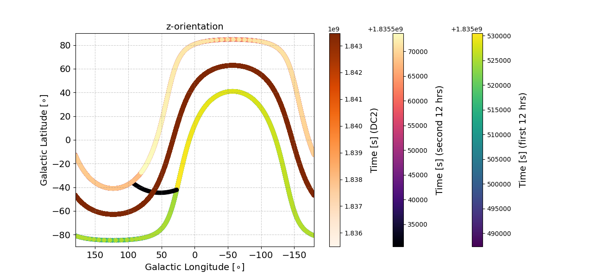

# Data Products

### Simulated Data

We simulated 3 months of exposure for an equatorial orbit at 530 km. The simulations mimic the actual time-dependence of the instrument's pointing on the sky. The instrument rocks between $\pm 22^\circ$ from the Earth zenith every 12 hours, with a slewing time of 8 minutes. This is similar to the pointing strategy for the actual satellite mission, with the exception that the solar panels may need to be rotated based on the exposure to the Sun, which will effect the slewing time (expected to be between $\sim 4 - 12$ minutes). With this pointing strategy COSI will observe the entire sky every day. The figure below shows the pointing of the instrument's z-axis as a function of time, in Galactic coordinates. Three different time periods are shown, corresponding to the three colorbars. The outermost colorbar shows the first 12 hours for the DC3 pointing, and the middle colorbar shows the second 12 hours. Note that the black curve connecting the two time periods corresponds to the slewing of the instrument. For reference, the innermost colorbar shows the zenith pointing that was used for DC2.    

The simulations employ [MEGAlib](https://github.com/zoglauer/megalib) (*develop-cosi* branch) via the COSI simulation pipepline ([cosi-sim](https://github.com/cositools/cosi-sim)), using version 21 of the COSI-SMEX mass model ([massmodel-cosi-dc3
](https://github.com/cositools/massmodel-cosi-dc3)). The far left image below shows the mass model plotted with MEGAlib's *geomega*. In addition to the payload, the satellite mass is also included, below the payload interface board. For comparison, we also show a schematic of the mass model (middle) and the prototype germanium detectors (right) from [Tomsick+23](https://ui.adsabs.harvard.edu/abs/2023arXiv230812362T/abstract).

For the source simulations (with *cosima*) we use the COSISMEX.sim.geo.setup version of the mass model. For the event reconstruction (with *revan*) we use the COSISMEX.analysis.geo.setup version of the mass model. The primary difference between the two mass models is how they handle the detector resolution and response. The simulation model uses a 2048-strip detector, which allows for the simulations to track the photon and particle interactions with very high precision, thus resulting in an idealized depth and energy resolution. In contrast, the analysis model employs a 64-strip detector that reflects actual hardware performance, incorporating measured energy and depth resolution. Since detector effects and hit clustering are applied in revan, using the analysis model ensures that the detector response is accurately represented. 

We simulate energies between 100 keV - 10 MeV. Note that COSI's nominal energy range is 200 keV - 5 MeV, but we used an upper bound of 10 MeV in order to account for energy dispersion. Earth occultation is accounted for in the simulations by blocking all photons with arrival directions beyond $\mathrm{\sim 113^\circ}$ of the zenith (see [here](https://github.com/cositools/cosi-data-challenges/tree/develop/earth-occultation) for more details). Events that occure during the passage of the Southern Atlantic Anomaly (SAA) are removed. We only select photons corresponding to Compton events. The full configuration files used for the event reconstruction (with *revan*) and extracting the data (with *mimrec*) can be found [here](https://github.com/cositools/cosi-sim/tree/main/cosi_sim/Input_Files/Configuration_Files/Data_Challenges/Data_Challenge_3). 

### Data Format
The data is provided in fits file format, which contains all of the photon information for each reconstructed event. If you are unfamiliar with analysis of Compton data, we highly recommend reading the introduction page [here](https://github.com/cositools/cosi-data-challenges/tree/develop/Compton-telescope-data-analysis-intro), which covers some of the fundamental topics. In short, the data for each reconstructed photon event is decribed in terms of four axes: energy, time, Compton scattering angle (&phi;), and event circle axis (&psi; &chi;). For Compton data, photons occupy what is known as the Compton data space, which is a 3-dimensional space defined by the axes &phi;, &psi;, and &chi;, where &psi; and &chi; are the angles defining the vector that points from the location of the second detector hit to the location of the first detector hit. A reconstructed photon event corresponds to a so-called event circle on the sky, where the axis of the circle is given by the &psi; &chi; vector, and the radius of the circle is given by the Compton scattering angle &phi;. For the actual data analysis, &psi; and &chi; are defined using a healpix grid, allowing us to reduce this to a single dimension (&psi; &chi;), i.e. the healpix pixel number.  

There are fits files for each individual component, for both sources and backgrounds. Each data challenge specifies the specific source files that you'll need. In order to create the dataset for a given data challenge, you will need to combine the source data with the background data. Instructions on how to do this are provided in the [DataIO example](https://github.com/cositools/cosipy/tree/main/docs/tutorials/DataIO) in cosipy, as well as some of the jupyter notebooks in cosipy. There are 13 individual background components that need to be combined in order to obtain the total background. Alternatively, a file with the total background already combined is also available. 

**Important Note:** Combining the data and binning the data can be memory intensive. If you are running into memory limitations at these steps, then workarounds are described in the dataIO example. Alternatively, we have also provided binned data products for some of the larger files, which can be loaded directly.  

### Computing Resources 

The source simulations were ran on NASA's [Discover cluster](https://www.nccs.nasa.gov/systems/discover). We used 1000 parallel CPUs for most of the source simulations, which allowed us to simulate them in a fairly short time (typically less than ~10 minutes of total wall time per source). The source models were provided by the COSI science teams, and more information about them can be found in the respective **Data Challenges** section on the main page. The Background simulations were mostly run on the [MOGON](https://mogonwiki.zdv.uni-mainz.de/docs/introduction/what_is_mogon) cluster in Mainz. More details about the background simulations can be found in the [backgrounds](https://github.com/cositools/cosi-data-challenges/tree/develop/backgrounds) directory.

### Accessing the Data

The data is hosted on [wasabi](https://console.wasabisys.com/file_manager/cosi-pipeline-public?region=us-west-1), and it can be downloaded using the command line prompt below:
<pre>
AWS_ACCESS_KEY_ID=GBAL6XATQZNRV3GFH9Y4 AWS_SECRET_ACCESS_KEY=GToOczY5hGX3sketNO2fUwiq4DJoewzIgvTCHoOv aws s3api get-object  --bucket cosi-pipeline-public --key full/path/your_file --endpoint-url=https://s3.us-west-1.wasabisys.com your_file
</pre>
Note that you must replace 'full/path/your_file' (after '--key') and 'your_file' (at the end) with the actual path and file. All the needed paths and file names are given below. The specific files needed for each respective data challenge are given in the **Data Challenges** section on the main page.

Alternatively, cosipy has a utility function that can be used for downloading files. The usage is as follows:
<pre>
from cosipy.util import fetch_wasabi_file
  
fetch_wasabi_file('full/path/wasabi/file')
</pre>
Note that an error will be thrown if the file already exists. To overwrite the existing file, the keyword ``override=True`` can be passed.   

**Orientation File:**  
wasabi path: COSI-SMEX/DC3/Data/Orientation  

files:  
DC3_final_530km_3_month_with_slew_1sbins_GalacticEarth_SAA.ori  
DC3_final_530km_3_month_with_slew_15sbins_GalacticEarth_SAA.ori  

**Response Files:**  
wasabi path: COSI-SMEX/DC3/Responses  
NB: Response files must be unzipped before using in analysis.   

Detector Response Files:  
Response26Al.o4.e1805_1812.s10036231691364.m1045.filtered.nonsparse.binnedimaging.imagingresponse_nside16.area.h5.gz  
Response44Ti.o4.e1154_1160.s9607532021290.m1215.filtered.nonsparse.binnedimaging.imagingresponse_nside16.area.h5.gz  
Response511.o4.e509_513.s20881894470591.m2555.filtered.nonsparse.binnedimaging.imagingresponse_nside16.area.h5.gz  
Response60FeHigh.o4.e1329_1336.s10201526728102.m1287.filtered.nonsparse.binnedimaging.imagingresponse_nside16.area.h5.gz  
Response60FeLow.o4.e1170_1176.s9552269354945.m1188.filtered.nonsparse.binnedimaging.imagingresponse_nside16.area.h5.gz  
ResponseContinuum.o3.e100_10000.b10log.s5383095312085.m1190.filtered.nonsparse.binnedimaging.imagingresponse_nside8.area.h5.gz  

Extended Source Response Files (in Responses/extended_source_response):  
extended_source_response_511_merged.h5.gz  
extended_source_response_continuum_merged.h5.gz  

**Background Files:**  

wasabi path: COSI-SMEX/DC3/Data/Backgrounds/Ge  

Unbinned Files:  
GalTotal_SA100_F98_3months_unbinned_data_filtered_with_SAAcut.fits.gz  
CosmicPhotons_3months_unbinned_data_filtered_with_SAAcut.fits.gz  
AlbedoNeutrons_3months_unbinned_data_filtered_with_SAAcut.fits.gz  
AlbedoPhotons_3months_unbinned_data_filtered_with_SAAcut.fits.gz  
PrimaryAlphas_3months_unbinned_data_filtered_with_SAAcut.fits.gz  
PrimaryElectrons_3months_unbinned_data_filtered_with_SAAcut.fits.gz  
PrimaryPositrons_3months_unbinned_data_filtered_with_SAAcut.fits.gz  
SecondaryElectrons_3months_unbinned_data_filtered_with_SAAcut.fits.gz  
SecondaryProtons_3months_unbinned_data_filtered_with_SAAcut.fits.gz  
SecondaryPositrons_3months_unbinned_data_filtered_with_SAAcut.fits.gz  

Binned Files:  

**Source Files:**  

wasabi path: COSI-SMEX/DC3/Data/Sources  

Sources:  
For DC2 we simulated 40 unique sources, running 59 different simulations in total (using multiple models for some of the sources). 

Unbinned Files:  
511_testing_point_src_3months_unbinned_data_filtered_with_SAAcut.fits.gz  
511_extended_3months_unbinned_data_filtered_with_SAAcut.fits.gz  
crab_standard_3months_unbinned_data_filtered_with_SAAcut.fits.gz  
Crab_Flat_Spectrum_3months_unbinned_data_filtered_with_SAAcut.fits.gz  
LMC_Gaussian_511_3months_unbinned_data_filtered_with_SAAcut.fits.gz  
LMC_Gaussian_511_x100_3months_unbinned_data_filtered_with_SAAcut.fits.gz  
M31_Gaussian_511_3months_unbinned_data_filtered_with_SAAcut.fits.gz  
M31_Gaussian_511_x100_3months_unbinned_data_filtered_with_SAAcut.fits.gz  
Virgo_Gaussian_511_3months_unbinned_data_filtered_with_SAAcut.fits.gz   
Virgo_Gaussian_511_x100_3months_unbinned_data_filtered_with_SAAcut.fits.gz  
Globular_Cluster_Tuc_47_3months_unbinned_data_filtered_with_SAAcut.fits.gz  
Globular_Cluster_Omega_Cen_3months_unbinned_data_filtered_with_SAAcut.fits.gz  
Globular_Cluster_NGC_6397_3months_unbinned_data_filtered_with_SAAcut.fits.gz  
Globular_Cluster_NGC_6121_3months_unbinned_data_filtered_with_SAAcut.fits.gz  
Positrons_from_26Al_line_3months_unbinned_data_filtered_with_SAAcut.fits.gz  
Positrons_from_26Al_cont_3months_unbinned_data_filtered_with_SAAcut.fits.gz  
Positrons_from_44Ti_line_3months_unbinned_data_filtered_with_SAAcut.fits.gz  
Positrons_from_44Ti_cont_3months_unbinned_data_filtered_with_SAAcut.fits.gz  
NGC_4151_bright_3months_unbinned_data_filtered_with_SAAcut.fits.gz  
NGC_4151_EC200_3months_unbinned_data_filtered_with_SAAcut.fits.gz  
NGC_4151_EC1000_3months_unbinned_data_filtered_with_SAAcut.fits.gz  
NGC_4151_faint_3months_unbinned_data_filtered_with_SAAcut.fits.gz  
NGC_1068_3months_unbinned_data_filtered_with_SAAcut.fits.gz  
4C21p35_noflare_3months_unbinned_data_filtered_with_SAAcut.fits.gz  
4C21p35_flare_3months_unbinned_data_filtered_with_SAAcut.fits.gz  
3C279_3months_unbinned_data_filtered_with_SAAcut.fits.gz  
GalTotal_SA100_F98_3months_unbinned_data_filtered_with_SAAcut.fits.gz  
PSRB1259_3months_unbinned_data_filtered_with_SAAcut.fits.gz  
PSRB1259_10x_3months_unbinned_data_filtered_with_SAAcut.fits.gz  
1E1740_compow_3months_unbinned_data_filtered_with_SAAcut.fits.gz  
1E1740_twocompt_3months_unbinned_data_filtered_with_SAAcut.fits.gz  
cygX1_soft_3months_unbinned_data_filtered_with_SAAcut.fits.gz  
cygX1_hard_3months_unbinned_data_filtered_with_SAAcut.fits.gz  
GRS175_3months_unbinned_data_filtered_with_SAAcut.fits.gz  
26Al_Cyg_Region_3months_unbinned_data_filtered_with_SAAcut.fits.gz  
26Al_NE2001_3months_unbinned_data_filtered_with_SAAcut.fits.gz  
60Fe_Cyg_Region_3months_unbinned_data_filtered_with_SAAcut.fits.gz  
60Fe_NE2001_3months_unbinned_data_filtered_with_SAAcut.fits.gz  
CasApartiallyresolved_3months_unbinned_data_filtered_with_SAAcut.fits.gz  
CasAfullyresolved_3months_unbinned_data_filtered_with_SAAcut.fits.gz  
CasAG16distribution_3months_unbinned_data_filtered_with_SAAcut.fits.gz  
CasAunresolved_3months_unbinned_data_filtered_with_SAAcut.fits.gz  
CasAsymmetric_3months_unbinned_data_filtered_with_SAAcut.fits.gz  
eeg_ISO_3months_unbinned_data_filtered_with_SAAcut.fits.gz  
eeg_Bur_3months_unbinned_data_filtered_with_SAAcut.fits.gz  
eeg_NFW_3months_unbinned_data_filtered_with_SAAcut.fits.gz  
gg_ISO_3months_unbinned_data_filtered_with_SAAcut.fits.gz  
gg_Bur_3months_unbinned_data_filtered_with_SAAcut.fits.gz  
gg_NFW_3months_unbinned_data_filtered_with_SAAcut.fits.gz  
GRB_bn081207680_3months_unbinned_data_filtered_with_SAAcut.fits.gz  
GRB_bn090424592_3months_unbinned_data_filtered_with_SAAcut.fits.gz  
GRB_bn100612726_3months_unbinned_data_filtered_with_SAAcut.fits.gz  
GRB_bn110605183_3months_unbinned_data_filtered_with_SAAcut.fits.gz  
GRB_bn131122490_3months_unbinned_data_filtered_with_SAAcut.fits.gz  
GRB_MGF051103_3months_unbinned_data_filtered_with_SAAcut.fits.gz  
GRB_MGF070201_3months_unbinned_data_filtered_with_SAAcut.fits.gz  
GRB_MGF070222_3months_unbinned_data_filtered_with_SAAcut.fits.gz  
GRB_MGF180128A_3months_unbinned_data_filtered_with_SAAcut.fits.gz  

Binned Files:  

