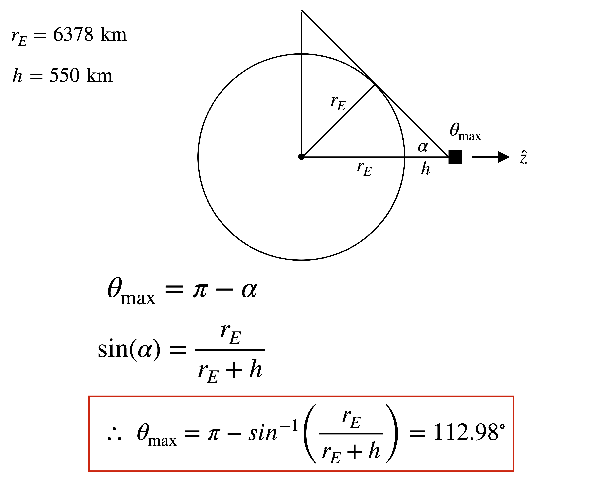
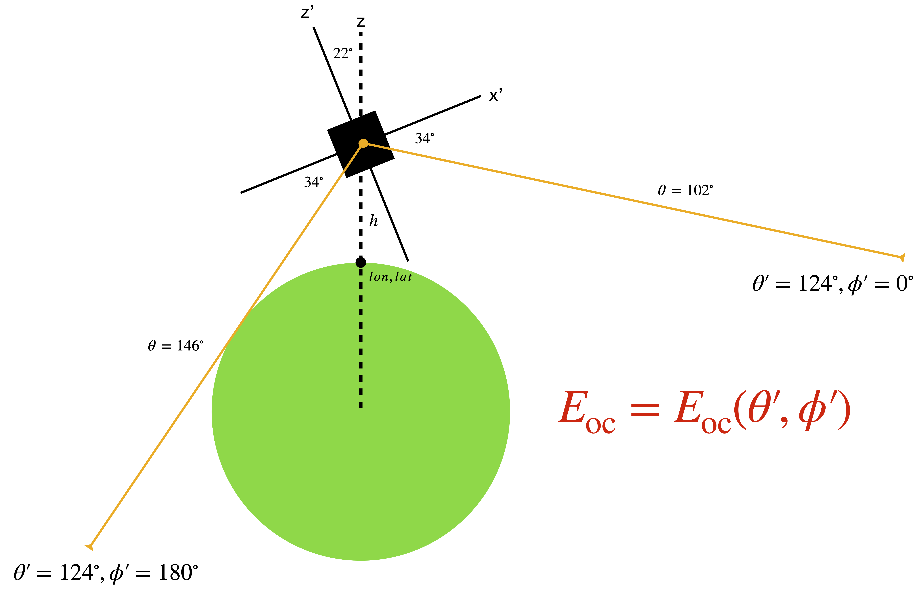

# Earth Occultation  

Satellites in low-Earth orbit are occulted by Earth. This must be accounted for when simulating observations and performing data analysis. For zenith pointing observations—as was simulated for DC2—the Earth occultation is simply a function of the off-axis angle in detector coordinates, and it can be determined geometrically, as depicted in the schematic below:

<p align="center">

</p>

This can be implemented in the MEGAlib simulations in two different ways. For simulating astrophysical sources, a binary transmission probability file can be used, where the transmission probability is 1 for angles less than $\theta_{\text{max}}$ or 0 otherwise. Examples of this can be found in the `.source` files for the DC2 *sources* ([here](https://github.com/cositools/cosi-sim/tree/main/cosi_sim/Source_Library/DC2/sources)). The other option is to use a beam function, as is used for simulating backgrounds. Examples of this can be found in the `.source` files for the DC2 *backgrounds* ([here](https://github.com/cositools/cosi-sim/tree/main/cosi_sim/Source_Library/DC2/backgrounds)).

For the case above, the off-axis angle in detector coordinates is equivalent to the Earth zenith angle, and this makes it easy to account for Earth occultation. However, for DC3 we implemented the instrument rocking angle, where COSI rocks between $\pm 22^\circ$ from the Earth zenith. In detector coordinates, the Earth occultation now has an azimuthal dependence, in addition to the off-axis angle, as depicted in the schematic below. The yellow beams represent two incoming photons from opposite directions. In the detector coordinate system, both photons have the same incident angle ($\theta' = 124^\circ$), however, in the Earth reference frame the incident angles are different, with the left beam at the limit of being occulted by Earth, and the right beam far from being blocked.

<p align="center">

</p>

In order to account for Earth occultation in DC3 we needed to add new functionality to MEGAlib. The reason for this is that MEGAlib uses detector coordinates for defining the transmission probability and beam functions, and so Earth occultation cannot be accounted for when simulating non-zenith pointings. We therefore added the capability to read in an orientation file with columns defining the Earth zenith in Galactic coordinates, as well as the altitude. Using this, we defined the `EarthOccultation` method, which can be envoked in a source file as follows:

```
MySource.EarthOccultation false max_angle
```

Specifying `false` here indicates that you want to reject all events that are occulted by Earth. This is determined internally by calculating the angle between the incident photon and the Earth zenith in Galactic coordinates, and rejecting all events with an incident angle $>$ the maximum angle, as specified by the `max_angle` keyword (given in km). Passing the `max_angle` keyword is optional, and if not given it will be calculated for each event based on the corresponding altitude from the orientation file. Specifying `true` here indicates that you want to reject all events with an incident angle $\leq$ the maximum angle. This can be used for a source coming from Earth's direction like albedo emission. 

In addition to the method described above, we also added a second method for implementing Earth occultation with non-zenith pointings. For this we defined a new beam profile `FarFieldEarthOccultation` to use for background simulations. This is defined similar to other beam profiles in MEGAlib, with the difference that the angle is defined with respect to the Earth zenith in Galactic coordinates, as opposed to detector coordinates. The advantage of this approach compared to the first method is that the simulation time is much less. This is accomplished internally by only generating photons for directions that are not occulted by Earth, whereas the first method first generates a photon in a random direction, and then sets the energy to zero after checking the incident angle. Our first method is useful for simulating astrophysical sources, and our second method is useful for simulating backgrounds.  

Both methods have been validated to ensure that they are behaving as expected. Details of the code for the first method can be found in the MEGAlib pull request ([100](https://github.com/zoglauer/megalib/pull/100)), and the code for the second method can be found in the MEGAlib pull request ([104](https://github.com/zoglauer/megalib/pull/104)). An example of using the Earth occultation is available in the MEGAlib resource directory ([here](https://github.com/zoglauer/megalib/tree/develop-cosi/resource/examples/advanced/EarthOccultation)), which also specifies the needed format for the orientation file. Note that these tools are only available in the `develop-cosi` branch. 

