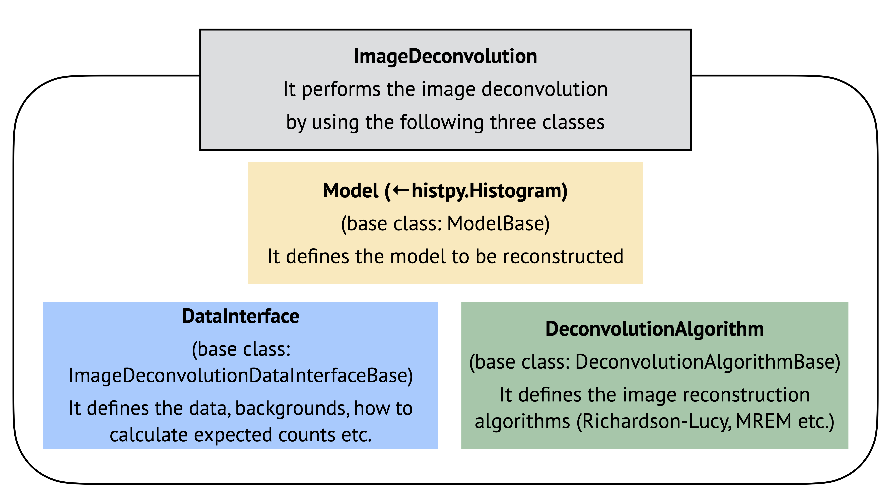

# Image Deconvolution with COSIpy

This guide describes the image deconvolution framework in COSIpy, including its design, available algorithms, and step-by-step usage. It accompanies the following tutorial notebooks:

- [511 keV imaging (extended source, Galactic CDS)](https://github.com/cositools/cosipy/tree/main/docs/tutorials/image_deconvolution/511keV-Galactic-ImageDeconvolution.ipynb)

For the scientific and algorithmic background, please refer to:

- Yoneda et al. 2025a, *A&A*, 697, A117 — MAP-RL algorithm paper: [doi:10.1051/0004-6361/202453528](https://doi.org/10.1051/0004-6361/202453528)
- Yoneda et al. 2025b, *ICRC2025*, PoS 501, 891 — Application to COSI: [doi:10.22323/1.501.0891](https://doi.org/10.22323/1.501.0891)
- Yoneda et al. 2025c, *A&A*, 702, A220 — 20-year INTEGRAL/SPI 511 keV all-sky imaging: [10.1051/0004-6361/202555895](https://www.aanda.org/articles/aa/abs/2025/10/aa55895-25/aa55895-25.html)

---

## 1. Overview

COSI is a Compton telescope, which measures Compton scattering events in its detector. 
Each gamma-ray event is characterized not by a single sky direction but by a multi-dimensional vector in **Compton Data Space (CDS)**:

$$
(E_m, \varphi, \psi\chi)
$$

where $E_m$ is the measured energy, $\varphi$ is the Compton scattering angle, and $\psi\chi$ is the scattered gamma-ray direction.
Because each CDS bin has contributions from a broad region of the sky (as determined by the Compton kinematics and the instrument response), CDS data cannot be directly inverted into a sky image.

**Image deconvolution** recovers the sky image $\boldsymbol{\lambda}$ from the observed CDS histogram $\mathbf{D}$ by maximizing defined statistics.
The standard algorithm is **Maximum-Likelihood Expectation Maximization (ML-EM)**, also known as the Richardson–Lucy (RL) algorithm. 
It derives a sky image that maximizes a Poisson log-likelihood:

$$
\log L = \sum_i D_i \log \epsilon_i - \sum_i \epsilon_i,~\mathrm{where}~\epsilon_i = \sum_j R_{ij}\,\lambda_j + b_i~,
$$

where $R_{ij}$ is the response matrix, $b_i$ is the background model, and $\epsilon_i$ is the expected count in CDS bin $i$.

With the RL algorithm, usually starting from a flat initial image, each iteration updates the sky model so that the expected counts better match the observed data, according to a Poisson log-likelihood.

---

## 2. Module Design

The `cosipy.image_deconvolution` module is organized into some sub-packages plus a top-level orchestration class.

The top-level class `ImageDeconvolution` performs the image deconvolution by coordinating three components: algorithm, model, and data interface.
Since the three components are separately implemented, `cosipy.image_deconvolution` allows the framework to be extended flexibly.
For example, adding a new image deconvolution algorithm only requires implementing a new algorithm class — the model and data classes do not need to be modified.
Also, this module allows using multiple observation dataset and perform joint analysis.
It should be useful when the response changes during the satellite operation or when we want to analyze several instrument data simultaneously.
Finally, it also allows to optimize the normalizations of several background models in the CDS simultaneously.



```Current structure of the image deconvolution module
cosipy/image_deconvolution/
├── image_deconvolution.py          # ImageDeconvolution (top class)
│
├── algorithms/
│   ├── deconvolution_algorithm_base.py   # (base class)
│   ├── RichardsonLucyBasic.py            # RichardsonLucyBasic
│   ├── RichardsonLucy.py                 # RichardsonLucy
│   ├── RichardsonLucyAdvanced.py         # RichardsonLucyAdvanced
│   ├── MAP_RichardsonLucy.py             # MAP_RichardsonLucy
│   ├── prior_tsv.py                      # PriorTSV, prior for MAP-RL
│   ├── prior_entropy.py                  # PriorEntropy, prior for MAP-RL
│   ├── response_weighting_filter.py
│   └── accelerators/                     # acceleration methods to boost RL calculation
│       ├── max_step_accelerator.py       # MaxStepAccelerator
│       └── line_search_accelerator.py    # LineSearchAccelerator
│
├── models/
│   ├── model_base.py                     # (base class)
│   └── allskyimage.py                    # AllSkyImageModel
│
├── data_interfaces/
│   ├── image_deconvolution_data_interface_base.py  # (base class)
│   ├── dataIF_COSI_DC2.py                          # DataIF_COSI_DC2
│   ├── dataIF_Parallel.py
│   └── data_interface_collection.py                # DataInterfaceCollection
│
└── exposure_tables/                                # The classes in this directory are used only for the image deconvolution 
    │                                                 with the CDS in the local coordinates
    ├── scatt_exposure_table.py
    ├── time_binned_exposure_table.py
    └── coordsys_conversion_matrix.py               # CoordsysConversionMatrix
```

### How the pieces fit together

`ImageDeconvolution` is the single entry point for users. It holds:

- a **dataset** (`DataInterfaceCollection` wrapping one or more data interfaces),
- an **initial model** (`AllSkyImageModel`),
- a **deconvolution algorithm** (one of the RL variants above).

> **Note on `exposure_tables/`:** The classes in this sub-package (`CoordsysConversionMatrix`, `TimeBinnedExposureTable`, etc.) are used only when the CDS is binned in **detector (local) coordinates** (the `ScAttBinning` case), where the spacecraft attitude changes over time and must be tracked to convert between detector and Galactic coordinates on the fly. If you are using a pre-computed point-source response in Galactic coordinates (`GalacticCDS` case), these classes are not needed and `coordsys_conv_matrix=None` can be passed to `DataIF_COSI_DC2`.

---

## 3. Available Algorithms

The algorithm is selected by the `deconvolution:algorithm` key in the YAML parameter file.

| YAML key | Class | When to use |
|---|---|---|
| `RLbasic` | `RichardsonLucyBasic` | Educational / mainly for tests |
| `RL` | `RichardsonLucy` | Simple tests with background optimization |
| `RLadvanced` | `RichardsonLucyAdvanced` | RL with several filters |
| `MAP_RL` | `MAP_RichardsonLucy` | When Bayesian regularization is desired |

### RLbasic

Minimal implementation of ML-EM: Useful for understanding the algorithm or running quick synthetic-data tests.

### RL

Extends `RLbasic` with **background normalization optimization**: the scalar background scale factor $b_k$ (one per named background component) is updated jointly with the sky image at each iteration.

### RLadvanced

Extends `RL` with three optional enhancements:

| Feature | YAML key | Purpose |
|---|---|---|
| Acceleration | `acceleration` | Speeds convergence by multiplying $\delta\boldsymbol{\lambda}$ by $\alpha > 1$ |
| Response-weighting | `response_weighting` | Suppresses artifacts in low-exposure regions |
| Gaussian smoothing | `smoothing` | Damps high-frequency noise in the delta map |

Also implements an **early-stopping** criterion based on the change in log-likelihood between iterations.

### MAP_RL

Extends `RL` with **Bayesian priors** to regularize the reconstruction. The prior modifies the M-step update (see [Section 5](#5-algorithm-details)). Available priors:

| YAML key | Class | Effect |
|---|---|---|
| `gamma` | *(built-in)* | Gamma-distribution prior on pixel fluxes and background norms |
| `TSV` | `PriorTSV` | Total Squared Variation - penalizes pixel-to-pixel differences; promotes spatial smoothness |
| `entropy` | `PriorEntropy` | Maximum Entropy - penalizes deviation from a reference map |

Priors can be combined (e.g., gamma + TSV). The stopping criterion can be based on either the log-likelihood or the log-posterior.

---

## 4. Step-by-Step Usage

### 4.1 Prepare binned data and response

Here an example with a binned CDS histogram is shown. Note that the unbinned analysis, often referred to as the list-mode EM algorithm, is also an option in cosipy.

> **Note:** The `BinnedData` API shown below reflects the data challenge setup and may change in future cosipy releases. If you encounter any discrepancies, please refer to the [dataIO tutorial](https://github.com/cositools/cosipy/tree/main/docs/tutorials/DataIO) for the latest usage.

Bin your event and background files into CDS histograms using `BinnedData`. For the standard Data Challenge setup (Galactic CDS, 511 keV line):


```python
from cosipy.data_io import BinnedData
from histpy import Histogram

# --- bin source + background ---
binned_event = BinnedData(input_yaml="inputs_511keV_DC2.yaml")
binned_event.get_binned_data(unbinned_data="511_thin_disk_3months_unbinned_data.fits.gz",
                             psichi_binning="galactic")

binned_bkg = BinnedData(input_yaml="inputs_511keV_DC2.yaml")
binned_bkg.get_binned_data(unbinned_data="albedo_photons_3months_unbinned_data.fits.gz",
                           psichi_binning="galactic")

# --- combine signal + background into a single event histogram ---
event = binned_event.binned_data.to_dense() + binned_bkg.binned_data.to_dense()
bkg   = binned_bkg.binned_data.to_dense()

# --- load pre-computed point-source response (Galactic CDS) ---
image_response = Histogram.open("psr_gal_511_DC2.h5")
```

### 4.2 Create a DataInterface object

```python
from cosipy.image_deconvolution import DataIF_COSI_DC2

data_interface = DataIF_COSI_DC2.load(
    name="511keV",
    event_binned_data=event.project(['Em', 'Phi', 'PsiChi']),
    dict_bkg_binned_data={"albedo": bkg.project(['Em', 'Phi', 'PsiChi'])},
    rsp=image_response,
    coordsys_conv_matrix=None,   # None for pre-computed Galactic CDS response
)
```

`dict_bkg_binned_data` is a dictionary of background model histograms keyed by component name. 
The same key (here `"albedo"`) is used in the YAML to set the allowed normalization range.
If the same key is used across several different data, a common background normalization will be used.

If you are working with **detector-coordinate CDS** data, pass a `CoordsysConversionMatrix` object as `coordsys_conv_matrix`. See the optional tutorial notebooks for details.

### 4.3 Write the YAML parameter file

All algorithm settings are described in a single YAML file. Below is a complete, annotated example for `RLadvanced`:

```yaml
# imagedeconvolution_parfile.yml

model_definition:
  class: "AllSkyImage"           # only supported model class

  property:
    coordinate: "galactic"       # coordinate system of the reconstructed image
    nside: 16                    # HEALPix NSIDE (must match the response)
    scheme: "ring"               # HEALPix ordering scheme
    energy_edges:
      value: [509.0, 513.0]      # energy bin edges (must match the response)
      unit: "keV"
    unit: "cm-2 s-1 sr-1"        # flux unit (do not change)

  initialization:
    algorithm: "flat"            # initialize with a uniform flux map
    parameter:
      value: [1.0e-4]            # one value per energy bin
      unit: "cm-2 s-1 sr-1"

deconvolution:
  algorithm: "RLadvanced"        # RLbasic | RL | RLadvanced | MAP_RL

  parameter:
    iteration_max: 100           # hard upper limit on iterations

    minimum_flux:
      value: 0.0                 # enforce non-negativity
      unit: "cm-2 s-1 sr-1"

    acceleration:
      activate: true
      algorithm: "MaxStep"       # MaxStep (default) or LineSearch
      accel_factor_max: 10.0     # maximum allowed acceleration factor α
      accel_bkg_norm: false      # whether to also accelerate background norms

    response_weighting:
      activate: true
      index: 0.5                 # power-law index β for exposure weighting

    smoothing:
      activate: true
      FWHM:
        value: 2.0               # Gaussian FWHM applied to the delta map
        unit: "deg"

    stopping_criteria:
      statistics: "log-likelihood"
      threshold: 0.01            # stop when ΔlogL < threshold

    background_normalization_optimization:
      activate: true
      range: {"albedo": [0.01, 10.0]}   # allowed range per background component

    save_results:
      activate: false
      directory: "./results"
      only_final_result: true    # if false, save every iteration
```

For `MAP_RL`, replace the `deconvolution:parameter` block with:

```yaml
    iteration_max: 100

    response_weighting:
      activate: true
      index: 0.5

    background_normalization_optimization:
      activate: true
      range: {"albedo": [0.01, 10.0]}

    stopping_criteria:
      statistics: "log-posterior"   # can also be "log-likelihood"
      threshold: 0.01

    prior:
      TSV:
        coefficient: 1.0e+6         # regularization strength (tune for your data)
      gamma:
        model:
          theta:
            value: .inf             # .inf → effectively no upper cut-off
            unit: "cm-2 s-1 sr-1"
          k:
            value: 0.9              # shape parameter (< 1 → sparsity-promoting)
        background:
          theta:
            value: .inf
          k:
            value: 1.0

    save_results:
      activate: false
      directory: "./results"
      only_final_result: true
```

### 4.4 Initialize and run

```python
from cosipy.image_deconvolution import ImageDeconvolution

image_deconvolution = ImageDeconvolution()

# register data
image_deconvolution.set_dataset([data_interface])

# read parameter file
image_deconvolution.read_parameterfile("imagedeconvolution_parfile.yml")

# (optional) override individual parameters without editing the file
image_deconvolution.override_parameter("deconvolution:parameter:iteration_max = 50")
image_deconvolution.override_parameter("deconvolution:parameter:smoothing:activate = False")

# initialize model and algorithm
image_deconvolution.initialize()

# run
image_deconvolution.run_deconvolution()
```

`initialize()` must be called (or re-called after any `override_parameter` call) before `run_deconvolution()`.

### 4.5 Access and visualize results

`image_deconvolution.results` is a list of dictionaries, one per completed iteration. The keys differ slightly by algorithm:

| Key | `RLadvanced` | `MAP_RL` | Description |
|---|:---:|:---:|---|
| `iteration` | ✓ | ✓ | Iteration number |
| `model` | ✓ | ✓ | Reconstructed image at this iteration |
| `background_normalization` | ✓ | ✓ | Dict of background scale factors |
| `log-likelihood` | ✓ | ✓ | Per-dataset Poisson log-likelihood |
| `accel_factor` | ✓ (if acceleration is enabled) | — | Acceleration factor $\alpha$ |
| `log-prior` | — | ✓ | Dict of log-prior contributions |
| `log-posterior` | — | ✓ | Total log-posterior |
| `prior_filter` | — | ✓ | Prior filter map applied in M-step |

```python
import matplotlib.pyplot as plt
from mhealpy import HealpixMap
import astropy.units as u

# --- convergence plot ---
iterations = [r['iteration'] for r in image_deconvolution.results]
logL       = [sum(r['log-likelihood']) for r in image_deconvolution.results]

plt.figure()
plt.plot(iterations, logL)
plt.xlabel("Iteration")
plt.ylabel("Log-likelihood")
plt.grid(True)
plt.show()

# --- final reconstructed image ---
final = image_deconvolution.results[-1]['model']

for ei in range(final.axes['Ei'].nbins):
    sky_map = HealpixMap(data=final[:, ei], unit=final.unit)
    _, ax = sky_map.plot('mollview')
    plt.title(f"Energy bin {ei}: "
              f"{final.axes['Ei'].bounds[ei][0]:.0f}–"
              f"{final.axes['Ei'].bounds[ei][1]:.0f} keV")
    plt.show()
```

To save results to disk, set `save_results:activate: true` in the YAML. Each iteration's model is written to `model.hdf5` (as named datasets `iteration1`, `iteration2`, …, plus a `result` alias for the last one), and scalar quantities (log-likelihood, background normalizations, acceleration factor, etc.) are saved to `results.fits`.

---

## 5. Algorithm Details

### 5.1 Richardson–Lucy (ML-EM) — `RLbasic` / `RL`

**E-step** — compute expected counts:

$$
\epsilon_i = \sum_j R_{ij} \lambda_j + \sum_k B_{ik} b_k~.
$$

**M-step** — compute the update $\delta\boldsymbol{\lambda}$:

$$
\delta\lambda_j = \frac{\lambda_j}{\displaystyle\sum_i R_{ij}}
  \sum_i \left(\frac{D_i}{\epsilon_i} - 1\right) R_{ij}
$$

**Update:**

$$
\lambda_j \leftarrow \lambda_j + \delta\lambda_j
$$

The background normalization $b_k$ (a factor for each background component) is updated simultaneously (`RL` and above):

$$
\delta b_k = \frac{b_k}{\displaystyle\sum_i B_{ik}} \sum_i \left(\frac{D_i}{\epsilon_i} - 1\right) B_{ik},\\
\qquad b_k \leftarrow b_k + \delta b_k
$$

### 5.2 RLadvanced enhancements

#### Response-weighting filter (Knoedlseder+05)

A pixel-dependent weight $w_j$ is applied to the delta map before the update:

$$
w_j = \left(\frac{T_j}{T_{\max}}\right)^\beta, \qquad T_j = \sum_i R_{ij}
$$

where $\beta$ is `response_weighting:index` (default 0.5). Pixels with low exposure receive a smaller delta, suppressing noise amplification close to the edge of non-zero exposure region.

#### Gaussian smoothing (Knoedlseder+05, Siegert+20)

After response-weighting, the delta map is convolved with a Gaussian kernel on the sphere:

$$
\delta\tilde\lambda_j = \left[w_j \delta\lambda_j\right]_{\mathrm{Gauss}(\sigma)}
$$

where $\sigma$ is controlled by `smoothing:FWHM`. This is the primary noise-damping mechanism and is crucial for obtaining smooth, artifact-suppressed images in practice.

#### Acceleration MaxStep

The `MaxStepAccelerator` finds the largest scalar $\alpha$ such that the updated image remains non-negative:

$$
\alpha = \min\left(\alpha_{\max}, \min_{j, \delta\tilde\lambda_j < 0}\left(-\frac{\lambda_j}{\delta\tilde\lambda_j}\right)\right)
$$

The update is then:

$$
\lambda_j \leftarrow \lambda_j + \alpha \delta\tilde\lambda_j
$$

If the accelerated step does not improve the log-likelihood, $\alpha$ falls back to 1.


The `LineSearchAccelerator` finds the largest scalar $\alpha$ that maximize the log-likelihood.

$$
\alpha = \mathrm{arg max}_{\alpha} \sum_i D_i \log \epsilon_i - \sum_i \epsilon_i,~\mathrm{where}~\epsilon_i = \sum_j R_{ij} (\lambda_j + \alpha \delta\tilde\lambda_j) + \sum_k B_{ik} b_k\,
$$

There are options so that $\alpha$ is applied to the background normalizations or a separated acceleration factor is prepared for the background components.

### 5.3 MAP_RichardsonLucy

`MAP_RL` maximizes the log-posterior $\log P(\boldsymbol{\lambda} | \mathbf{D}) = \log L(\mathbf{D}|\boldsymbol{\lambda}) + \log \pi(\boldsymbol{\lambda})$.

**M-step with gamma prior:**

$$
\lambda_j^{\mathrm{EM}} =
  \frac{\displaystyle\lambda_j\sum_i \frac{D_i R_{ij}}{\epsilon_i} + (k_{\lambda} - 1)}
       {\displaystyle\sum_i R_{ij} + 1/\theta_{\lambda}}
$$

where $k_\lambda$ (shape) and $\theta_\lambda$ (scale) are the gamma-prior hyperparameters for the sky model (`prior:gamma:model:k` and `prior:gamma:model:theta`). Setting $\theta_\lambda \to \infty$ and $k_\lambda = 1$ recovers the standard ML-EM update.

**Prior filter** (for TSV, entropy, and similar priors):

$$
P_j = \exp\left(\frac{\nabla_{\lambda_j} \log \pi(\boldsymbol{\lambda}^{\mathrm{EM}})}
                              {\displaystyle\sum_i R_{ij} + 1/\theta_{\lambda}}\right)
$$

**Full MAP update:**

$$
\lambda_j \leftarrow P_j\cdot\lambda_j^{\mathrm{EM}}
$$

**TSV prior:**

$$
\log P_{\mathrm{TSV}}(\boldsymbol{\lambda}) =
  -c_{\mathrm{TSV}} \sum_j \sum_{j' \in \mathcal{N}(j)} (\lambda_j - \lambda_{j'})^2
$$

$$
\frac{\partial \log P_{\mathrm{TSV}}}{\partial \lambda_j} =
  -4 c_{\mathrm{TSV}} \sum_{j' \in \mathcal{N}(j)} (\lambda_j - \lambda_{j'})
$$

**Maximum-Entropy prior:**

$$
\log P_{\mathrm{ME}}(\boldsymbol{\lambda}) =
  c_{\mathrm{ME}} \sum_j \lambda_j \left(1 - \log\frac{\lambda_j}{m_j}\right)
$$

$$
\frac{\partial \log P_{\mathrm{ME}}}{\partial \lambda_j} =
  -c_{\mathrm{ME}} \log\frac{\lambda_j}{m_j}
$$

where $m_j$ is a reference (default) map set by `prior:entropy:reference_map`.


**Effect of prior coefficients on the reconstructed 511 keV image:**
 

 
*Figure: Reconstructed 511 keV all-sky images as a function of the TSV smoothness coefficient $c^\mathrm{TSV}$ (vertical axis) and the sparseness coefficient $c^\mathrm{SP}$ (horizontal axis) for MAP-RL, based on simulated three-month COSI observations. Small $c^\mathrm{TSV}$ values produce noisy images dominated by reconstruction artifacts, while large values over-smooth and suppress real extended structure. The solid red box marks a well-balanced reconstruction; the dashed red box indicates the onset of over-smoothing. For a full discussion of how to select optimal prior coefficients, see [Yoneda et al. 2025a](https://doi.org/10.1051/0004-6361/202453528).*

---

## 6. Tips and Caveats

### Choosing the number of iterations

ML-EM is known to overfit at large iteration counts: point sources sharpen and become spiky, while the noise is amplified. The built-in stopping criterion (change in log-likelihood < `threshold`) mitigates this automatically, but the threshold requires tuning.

**Practical guidance:**

- Start with `iteration_max: 30–50` and inspect convergence plots.
- With Gaussian smoothing enabled (`smoothing:activate: true`), the reconstructed image is less sensitive to the number of iterations, so more iterations can be tolerated.
- For `MAP_RL`, the stronger the regularization coefficient, the smoother the final image and the faster the effective convergence; however, point sources may be over-broadened.

### Smoothing FWHM selection

There is no universal optimal FWHM. As a starting point, use a value close to the instrument angular resolution at the energy of interest (a few degrees for COSI at 511 keV). Larger FWHM produces smoother maps but may suppress real structure.

### Response-weighting index

The default `response_weighting:index: 0.5` (square-root weighting) is generally robust. Values closer to 1.0 weight more aggressively toward well-exposed pixels; values closer to 0.0 approach equal weighting.

### Multiple background components

Pass all background components together in `dict_bkg_binned_data`. Each key becomes an independent normalization factor optimized during deconvolution:

```python
data_interface = DataIF_COSI_DC2.load(
    name="511keV",
    event_binned_data=event.project(['Em', 'Phi', 'PsiChi']),
    dict_bkg_binned_data={
        "albedo":     bkg_albedo.project(['Em', 'Phi', 'PsiChi']),
        "activation": bkg_activation.project(['Em', 'Phi', 'PsiChi']),
    },
    rsp=image_response,
)
```

Set the allowed range for each component in the YAML:

```yaml
background_normalization_optimization:
  activate: true
  range: {"albedo": [0.5, 2.0], "activation": [0.5, 2.0]}
```

### Adjusting parameters without re-loading data

Individual parameters can be overridden after loading the parameter file using colon-separated key paths:

```python
image_deconvolution.override_parameter("deconvolution:parameter:iteration_max = 100")
image_deconvolution.override_parameter("deconvolution:parameter:smoothing:FWHM:value = 3.0")
```

Always call `image_deconvolution.initialize()` again after overriding parameters; the method reinitializes the model and the algorithm object.

### MPI parallelization

For large-scale runs, replace `ImageDeconvolution` with `ParallelImageDeconvolution`:

```python
from mpi4py import MPI
from cosipy.image_deconvolution import ParallelImageDeconvolution

comm = MPI.COMM_WORLD
image_deconvolution = ParallelImageDeconvolution(comm)
```

The parallel variant distributes the response convolution across MPI ranks; result saving is performed only on rank 0.
