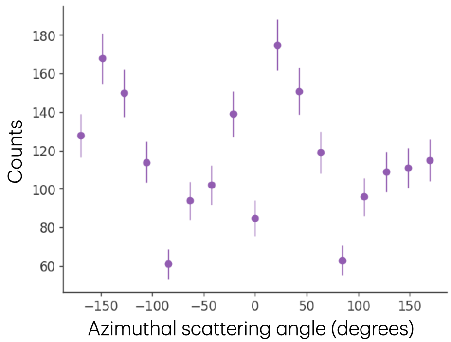
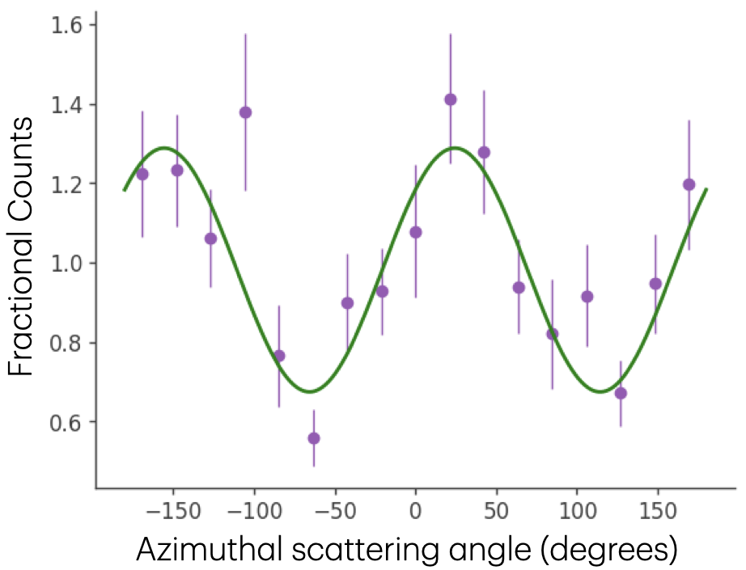

# Polarization       

Polarization, which describes the alignment of photons' electric field vectors, can be used to probe the emission processes of astrophysical sources. As a Compton telescope, *COSI* is inherently sensitive to gamma-ray polarization. Data Challenge 3 includes a first version of *COSI*'s polarization analysis software, including two approaches: the azimuthal scattering angle distribution (ASAD) method and the Stokes parameters method.        

The polarization analysis tools will be made more sensitive and comprehensive in future Data Challenges, including a maximum likelihood method using forward-folding.        

## Compton Polarimetry       

Compton telescopes are inherently sensitive to polarization because photons are more likely to Compton scatter in a direction perpendicular to their electric field vector. Therefore, measuring the scattering direction of photons probes the orientation of their electric field vectors. The Klein-Nishina equation, which describes the differential cross-section, or likelihood, of photons scattering with free electrons               
$$\frac{d\sigma}{d\Omega} = \frac{r_0^2}{2} \left( \frac{E^\prime}{E_\gamma} \right)^2 \left( \frac{E_\gamma}{E^\prime} + \frac{E^\prime}{E_\gamma} - 2\sin^2{\phi}cos^2{\eta} \right)$$        
demonstrates this, where $r_0$ is the classical electron radius, $E_\gamma$ is the energy of the incoming photon, $E^\prime$ is the energy of the Compton-scattered photon, $\phi$ is the Compton scattering angle, and $\eta$ is the azimuthal scattering angle, or the angle at which the photon scatters measured with respect to the incoming photon's electric field vector. The cross-section is maximized when the azimuthal scattering angle is perpendicular to the photon's electric field vector ($\eta=90^\circ$) and minimized when the azimuthal scattering angle is parallel to the electric field vector ($\eta=0^\circ$).   

        
*The Compton scattering angle, ϕ, is the angle between the incoming and scattered photon directions. The azimuthal scattering angle, η, is measured with respect to a reference axis, ξ, in a plane perpendicular to the incoming photon direction. In the Klein-Nishina equation, the reference axis is the direction of the photon's electric field vector.*          

This makes it possible to determine the polarization using the measured distribution of azimuthal scattering angles. The probability distribution function that follows from the Klein-Nishina equation is of the form       
$$f(x) = A - B \cos{(2 (\eta - C))}$$         
where $\frac{B}{A}$ is proportional to the polarization fraction and $C$ is the polarization angle. When a source is polarized, the distribution of azimuthal scattering angles is expected to be sinusoidal, with the peaks corresponding to directions perpendicular to the incoming photon's electric field vector. For an unpolarized source, the azimuthal scattering directions are random, producing a uniform distribution. This allows the polarization to be determined by fitting $A$, $B$, and $C$ to the distribution of azimuthal scattering angles. However, a realistic detector is not perfectly symmetric, and some scattering directions are suppressed or enhanced due to the instrument geometry. Therefore, the distributions of azimuthal scattering angle for polarized and unpolarized sources will not be perfectly sinusoidal and uniform, respectively. This makes it important to have a very good understanding of the instrument response in order to accurately measure polarization.        

A polarization measurement is defined by the polarization fraction, which is sometimes called polarization level or polarization degree, and the polarization angle. The polarization fraction is the fraction of photons from a source that are polarized, where 100% polarization corresponds to all photons having their electric field vectors aligned in the same direction. The polarization angle describes the direction of the photons' electric field vector, and we typically use the standard [IAU convention](https://lambda.gsfc.nasa.gov/product/about/pol_convention.html) to define this angle. *cosipy*'s polarization tools include methods for transforming between different conventions, including the spacecraft frame conventions used in MEGAlib.         

The minimum detectable polarization (MDP) describes the minimum polarization fraction for which significant detection can be made by a particular instrument for a given source. The 99% confidence MDP is given by       
$$x = \frac{4.29}{\mu_{100}} \frac{\sqrt{N_s + N_b}}{N_s}$$      
where 4.29 is the coefficient corresponding to 99% confidence, and $N_s$ and $N_b$ are the number of source and background counts, respectively. A source with a fitted polarization fraction greater than its MDP has measurable polarization. However, only an upper limit can be placed on the polarization of a source with a fitted polarization fraction smaller than its MDP, and its polarization angle cannot be constrained. 

## Azimuthal Scattering Angle Distribution Method       

The simplest, and most intuitive, way to measure polarization is directly through the distribution of azimuthal scattering angles. *COSI* measures the scattered photon direction of each photon it detects. Because the direction of the incoming photon's electric field vector isn't known, a reference axis in the plane of the electric field vector is chosen. The angle between the scattered photon direction and reference axis is calculated for each photon. This measured azimuthal scattering angle ($\eta'$) relates to the azmimuthal scattering angle in the Klein-Nishina equation above via $\eta' = \eta + D$, where $D$, which is unknown, is the angle between the chosen reference axis and photon's electric field vector. The azimuthal scattering angles of the data are binned to produce a raw azimuthal scattering angle distribution (ASAD).      

To find the polarization fraction and angle, the effects of the background and detector geometry need to be taken into account, and we rely heavily on simulations to do this. We create a background-subtracted ASAD, and then scale the distribution with a simulation of an unpolarized source to correct for detector effects. Then, this corrected ASAD is fit with the probability distribution function above to determine the polarization.           

To produce the background-subtracted ASAD, an ASAD for a model of the background is created, and subtracted from the total measured ASAD. 

       
*Raw background-subtracted ASAD*        

ASADs are then created for simulations of unpolarized and 100% polarized versions of the source being analyzed, with the same flux, sky position, and spectrum. These are used to account for instrumental effects and characterize the instrument's sensitivity to the source's polarization. 

       
*ASAD of unpolarized source*       

       
*ASAD of 100% polarized source*       

The measured source ASAD and simulated 100% polarized ASAD are both divided by the simulated unpolarized ASAD to correct for effects of the detector geometry.        

      
*ASAD of 100% polarized source divided by ASAD of unpolarized source with sinusoidal fit*       

         
*Background-subtracted ASAD divided by ASAD of unpolarized source with sinusoidal fit*       

Both corrected ASADs are fit with the above probability distribution function. The modulation of the 100% polarized ASAD, which is used to convert the amplitude of the sinusoidal fit of the source's ASAD to a polarization fraction, is given by        
$$\mu_{100} = \frac{\hat{B_{100}}}{\hat{A_{100}}}$$               
where $\hat{A_{100}}$ and $\hat{B_{100}}$ are the fitted values of the parameters for the 100% polarized ASAD. Then, the polarization fraction of the source is        
$$\Pi = \frac{1}{\mu_{100}} \frac{\hat{B}}{\hat{A}}$$        
and the polarization angle is         
$$\eta_0 = \hat{C}$$       
where $\hat{A}$, $\hat{B}$, and $\hat{C}$ are the fitted values of the parameters for the measured source ASAD.     

The sensitivity of the ASAD method is limited because only the scattered photon direction is used, and it is projected down onto only one axis, the azimuthal scattering angle. However, *COSI* also measures the energy and Compton scattering angle of each photon, and the scattered photon direction is described by two parameters, making up the Compton data space. As can be seen in the Klein-Nishina equation above, the scattering direction is dependent on the photon's energy and Compton scattering angle, not only the azimuthal scattering angle. By only fitting the azimuthal scattering angle, we are losing information, making the fit less sensitive than *COSI*'s measurements allow. The analysis can be made more sensitive by performing a maximum likelihood polarization fit in the Compton data space ([Krawczynski, 2011](https://ui.adsabs.harvard.edu/abs/2011APh....34..784K/abstract), [Lowell et al., 2017](https://ui.adsabs.harvard.edu/abs/2017ApJ...848..120L/abstract)). In Data Challenge 4, *cosipy* will include a forward-folding polarization fitting method, using *threeML*. 

## Stokes Parameters Method      

